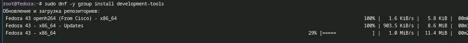
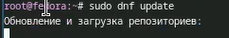
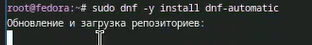
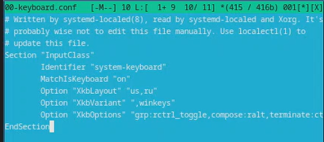
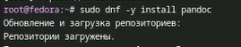
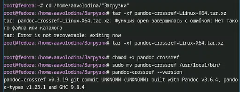
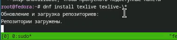
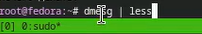
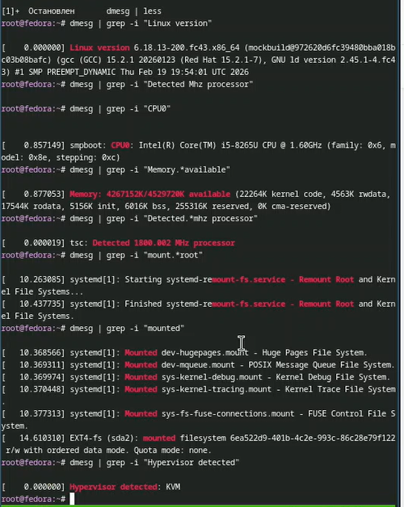

---
## Front matter
lang: ru-RU
title: Отчет по лабораторной работе №1
subtitle: Операционные системы
author:
  - Володина Алиса Алексеевна
institute:
  - Российский университет дружбы народов, Москва, Россия

## i18n babel
babel-lang: russian
babel-otherlangs: english

## Formatting pdf
toc: false
toc-title: Содержание
slide_level: 2
aspectratio: 169
section-titles: true
theme: metropolis
header-includes:
 - \metroset{progressbar=frametitle,sectionpage=progressbar,numbering=fraction}
---

# Информация

## Докладчик

  * Володина Алиса Алексеевна
  * НКАбд-01-25, Студенческий билет: 1032253521
  * Российский университет дружбы народов

## Цель работы

Приобретение практических навыков установки операционной системы на виртуальную машину.

## Задание

1. Установка VirtualBox
2. Установка необходимого ПО
3. Первоначальная настройка ОС

---

## Создание виртуальной машины

Установка системы (рис. 1).

{width=60%}

##
 
Настройка пользователя и часового пояса (рис. 2).

{width=60%}

##

Отключение оптического привода после установки (рис. 3).

{#fig-003 width=70%}

##

Установим средства разработки: (рис. 4).

{#fig-005 width=70%}

##

Обновим все пакеты(рис. 5).

{#fig-006 width=70%}

##

Программы для удобства работы в консоли: (рис. 6).

{#fig-007 width=70%}

##

Установим программное обеспечение:
 
{#fig-009 width=70%}
 
##

Отключение SELinux (рис. 7)

{#fig-012 width=70%}

##

Отредактируем конфигурационный файл ~/.config/sway/config.d/95-system-keyboard-config.conf: (рис. 8)

{#fig-018 width=70%}

##

Отредактируем конфигурационный файл /etc/X11/xorg.conf.d/00-keyboard.conf: (рис. 9)

{#fig-020 width=70%}

##

Средство pandoc для работы с языком разметки Markdown (рис. 10)

{#fig-023 width=70%}

##

Для работы с перекрёстными ссылками мы используем пакет pandoc-crossref. (рис. 11)

{#fig-024 width=70%}

##

Установим дистрибутив TeXlive: (рис. 12)

{#fig-025 width=70%}

# Выполнение домашнего задания

Дождемся загрузки графического окружения и откроем терминал. В окне терминала проанализируем последовательность загрузки системы, выполнив команду dmesg. (рис. 13).

{#fig-026 width=70%}

## 

Можно использовать поиск с помощью grep: (рис. 13)

{#fig-0027 width=70%}

## Выводы

В ходе выполнения лабораторной работы я приборела навыки установки виртуальной машины на VirtualBox, установила ряд пакетов и настроила ОС для дальнейшей работы

:::
