# Цель работы

Целью данной работы является приобретение практических навыков установки операционной системы на виртуальную машину, настройки минимально необходимых для дальнейшей работы сервисов

# Задание

Установка VirtualBox, Установка необходимого ПО, Первоначальная настройка ОС для дальнейшей работы

# Теоретическое введение

Oracle VM VirtualBox — мощная и бесплатная программа с открытым исходным кодом (GPL) для виртуализации операционных систем . Позволяет запускать несколько гостевых ОС на одном физическом компьютере.
Поддерживает виртуализацию (с использованием Intel VT-x и AMD-V) для процессоров архитектуры x86, AMD64/Intel64, а также Arm64 на соответствующих хостах . В качестве гостевых систем может работать с огромным спектром ОС: различными версиями Windows (от 95 до 11), дистрибутивами Linux, Solaris, FreeBSD, OpenBSD, macOS (экспериментально на Intel) и другими .
Работает на хост-системах Windows, Linux, macOS и Solaris . Включает в себя набор драйверов и утилит Guest Additions для тесной интеграции гостевой системы с хостом (общие папки, буфер обмена, адаптация разрешения экрана) 

# Выполнение лабораторной работы

1)В терминале запустим liveinst. ([рис. @fig-001]).

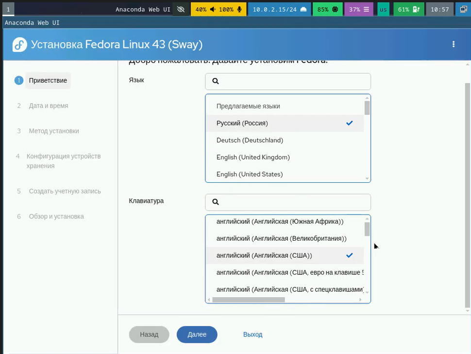{#fig-001 width=70%}

2) Выберем язык интерфейса и перейдем к настройкам установки операционной системы. 
скорректируем часовой пояс, раскладку клавиатуры, место установки ОС оставим без изменения, установите имя и пароль для пользователя root, установим имя и пароль для пользователя, зададим сетевое имя компьютера. ([рис. @fig-002]).

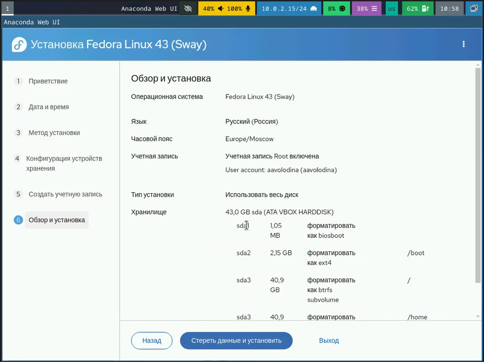{#fig-002 width=70%}

3) После завершения установки операционной системы корректно перезапустим виртуальную машину. Отключим носитель информации с образом. ([рис. @fig-003]).

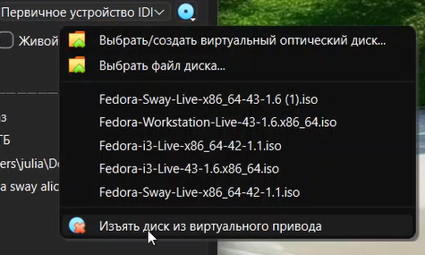{#fig-003 width=70%}

4) Переключимся на роль супер-пользователя: ([рис. @fig-004]).

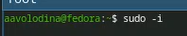{#fig-004 width=70%}

5) Установим средства разработки: ([рис. @fig-005]).

{#fig-005 width=70%}

6) Обновим все пакеты  ([рис. @fig-006]).

{#fig-006 width=70%}

7) Программы для удобства работы в консоли: ([рис. @fig-007]).

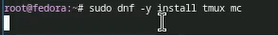{#fig-007 width=70%}

8) Другой вариант консоли: ([рис. @fig-008]).

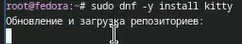{#fig-008 width=70%}

9) Установим программное обеспечение: ([рис. @fig-009]).

{#fig-009 width=70%}

10) Зададим необходимую конфигурацию в файле /etc/dnf/automatic.conf 

11) Запустим таймер: ([рис. @fig-011]).

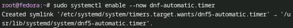{#fig-011 width=70%}

12) Отключение SELinux ([рис. @fig-012]).
В файле /etc/selinux/config заменим значение

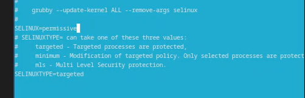{#fig-012 width=70%}

13) Перегрузим виртуальную машину: ([рис. @fig-014]).

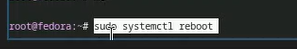{#fig-014 width=70%}

14) Запустим терминальный мультиплексор tmux: ([рис. @fig-015]).

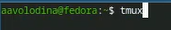{#fig-015 width=70%}

15) Создадим конфигурационный файл ~/.config/sway/config.d/95-system-keyboard-config.conf: ([рис. @fig-016]).

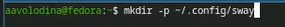{#fig-016 width=70%}

16) Отредактируем конфигурационный файл ~/.config/sway/config.d/95-system-keyboard-config.conf: ([рис. @fig-017]). ([рис. @fig-018]).

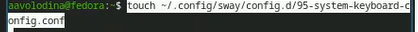{#fig-017 width=70%}

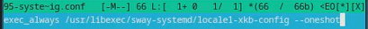{#fig-018 width=70%}

17) Переключимся на роль супер-пользователя: ([рис. @fig-019]).

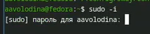{#fig-019 width=70%}

18) Отредактируем конфигурационный файл /etc/X11/xorg.conf.d/00-keyboard.conf: ([рис. @fig-020]).

{#fig-020 width=70%}

19) Перегрузим виртуальную машину ([рис. @fig-021]).

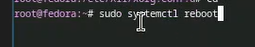{#fig-021 width=70%}

20) Переключимся на роль супер-пользователя: ([рис. @fig-022]).

{#fig-022 width=70%}

21) Средство pandoc для работы с языком разметки Markdown ([рис. @fig-023]).

{#fig-023 width=70%}

22) Для работы с перекрёстными ссылками мы используем пакет pandoc-crossref. ([рис. @fig-024]).

{#fig-024 width=70%}

23) Установим дистрибутив TeXlive: ([рис. @fig-025]).

{#fig-025 width=70%}

24) Дождемся загрузки графического окружения и откроем терминал. В окне терминала проанализируем последовательность загрузки системы, выполнив команду dmesg. ([рис. @fig-026]).

{#fig-026 width=70%}

25) Можно использовать поиск с помощью grep: ([рис. @fig-025]).

{#fig-0027 width=70%}

# Выводы

В ходе выполнения лабораторной работы я приборела навыки установки виртуальной машины на VirtualBox, установила ряд пакетов и настроила ОС для дальнейшей работы

# Список литературы

