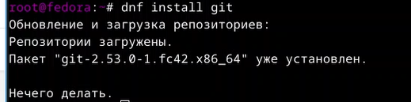
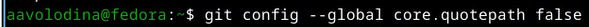
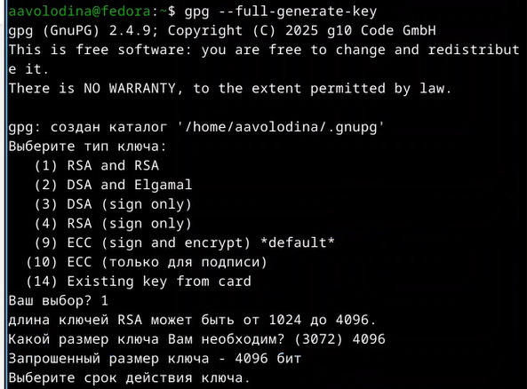
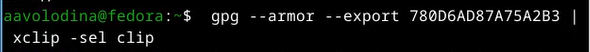
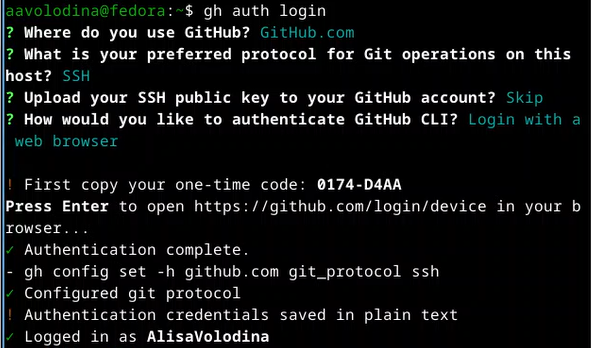
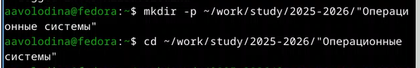
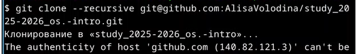
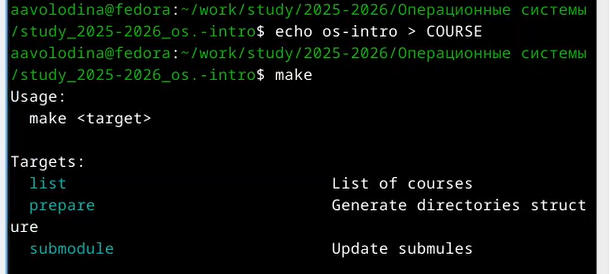
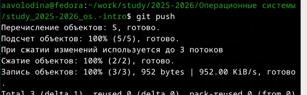

---
## Front matter
lang: ru-RU
title: Отчет по лабораторной работе №2
subtitle: Операционные системы
author:
  - Володина Алиса Алексеевна
institute:
  - Российский университет дружбы народов, Москва, Россия

## i18n babel
babel-lang: russian
babel-otherlangs: english

## Formatting pdf
toc: false
toc-title: Содержание
slide_level: 2
aspectratio: 169
section-titles: true
theme: metropolis
header-includes:
 - \metroset{progressbar=frametitle,sectionpage=progressbar,numbering=fraction}
---

# Информация

## Докладчик

  * Володина Алиса Алексеевна
  * НКАбд-01-25, Студенческий билет: 1032253521
  * Российский университет дружбы народов

## Цель работы

Целью работы является изучение работы и применения средств контроля версий и освоение умения по работе с git.

## Задание

1. Создать базовую конфигурацию для работы с git, ключ ssh, ключ pgp, подписи git, локальный каталог для выполнения и прикрепления заданий по предмету.

---

## Теоретическое введение

Системы контроля версий (Version Control System, VCS) используются для организации совместной работы коллектива над общим проектом. Как правило, основная ветка разработки хранится в репозитории — локальном или удаленном, — к которому организован доступ всех участников. Когда разработчики вносят правки, VCS позволяет регистрировать эти изменения, объединять результаты работы разных специалистов, а при необходимости — выполнять возврат к любой из более ранних версий проекта.

## Выполнение лабораторной работы

Установим git при помощи команды `dnf install git` (рис. 1).

{#fig-002 width=70%}

##
 
Установим gh при помощи команды `dnf install gh` (рис. 2).

{#fig-003 width=70%}

##

Зададим имя и email владельца репозитория с помощью команд `git config --global user.name` и `git config --global user.email` (рис. 3).

{#fig-004 width=70%}

##

Настроим utf-8 в выводе сообщений в git командой `git config --global core.quotepath false` (рис. 4).

{#fig-005 width=70%}

##

Зададим имя начальной ветки (master) командой `git config --global init.defaultBranch master` (рис. 5).

{#fig-006 width=70%}

##

Настроим параметры autocrlf и safecrlf для корректной работы с окончаниями строк (рис. 6).

{#fig-007 width=70%}

##

Сгенерируем ssh ключ

##

Теперь сгенерируем PGP ключ для подписи коммитов 
 
{#fig-010 width=70%}
 
##

Скопируем сгенерированный PGP ключ в буфер обмена (рис. 7)

{#fig-012 width=70%}

##

Авторизуемся в GitHub через gh командой `gh auth login` (рис. 8)

{#fig-014 width=70%}

##

Создадим каталог для работы и перейдем в него (рис. 9)

{#fig-015 width=70%}

##

Создадим репозиторий на основе шаблона (рис. 10)

{#fig-016 width=70%}

##

Выполним клонирование репозитория (рис. 11)

{#fig-017 width=70%}

##

Удалим лишние файлы, Создадим необходимые каталоги для лабораторных работ, Продолжим создание необходимых каталогов,  (рис. 12)

{#fig-020 width=70%}

##

Отправим созданные файлы на сервер. Для этого сначала выполним `git add .`, чтобы добавить все изменения в индекс ([рис. @fig-021]). (рис. 13) 

{#fig-021 width=70%}

##

Затем выполним коммит с сообщением о проделанной работе, Отправим изменения в удаленный репозиторий (рис. 14) 

{#fig-023 width=70%}

## Выводы

В результате выполнения данной лабораторной работы я приобрела навыки, необходимые для работы с git, настроила каталоги курса для дальнейшей работы, создала ssh и gpg ключи и авторизовалась в gh.

