# Цель работы

Целью работы является изучение работы и применения средств контроля версий и освоение умения по работе с git.

# Задание

Создать базовую конфигурацию для работы с git, ключ ssh, ключ pgp, подписи git, локальный каталог для выполнения и прикрепления заданий по предмету.

# Теоретическое введение

Системы контроля версий (Version Control System, VCS) используются для организации совместной работы коллектива над общим проектом. Как правило, основная ветка разработки хранится в репозитории — локальном или удаленном, — к которому организован доступ всех участников. Когда разработчики вносят правки, VCS позволяет регистрировать эти изменения, объединять результаты работы разных специалистов, а при необходимости — выполнять возврат к любой из более ранних версий проекта.

В классической модели контроля версий применяется централизованный подход: все файлы хранятся в едином репозитории, а управление версиями обеспечивается выделенным сервером. Участник проекта перед началом работы с помощью специальных команд запрашивает актуальную или нужную ему версию файлов. Завершив внесение правок, он отправляет обновлённую версию обратно в хранилище. При этом все предыдущие версии сохраняются в центральном репозитории, и к ним можно обратиться в любой момент. Чтобы экономить дисковое пространство, сервер может не сохранять полностью каждый изменённый файл, а применять дельта-компрессию — записывать только различия между последовательными версиями.

# Выполнение лабораторной работы

1) Для начала работы переключимся на суперпользователя при помощи команды `sudo -i` ([рис. @fig-001]).

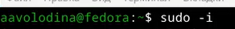{#fig-001 width=70%}

2) Установим git при помощи команды `dnf install git` ([рис. @fig-002]).

{#fig-002 width=70%}

3) Установим gh при помощи команды `dnf install gh` ([рис. @fig-003]).

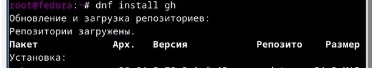{#fig-003 width=70%}

4) Зададим имя и email владельца репозитория с помощью команд `git config --global user.name` и `git config --global user.email` ([рис. @fig-004]).

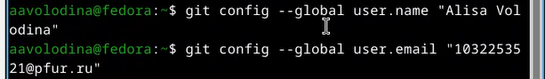{#fig-004 width=70%}

5) Настроим utf-8 в выводе сообщений в git командой `git config --global core.quotepath false` ([рис. @fig-005]).

{#fig-005 width=70%}

6) Зададим имя начальной ветки (master) командой `git config --global init.defaultBranch master` ([рис. @fig-006]).

{#fig-006 width=70%}

7) Настроим параметры autocrlf и safecrlf для корректной работы с окончаниями строк ([рис. @fig-007]).

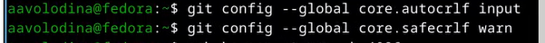{#fig-007 width=70%}

8) Сгенерируем ssh ключ по алгоритму rsa с ключом размером 4096 бит ([рис. @fig-008]).

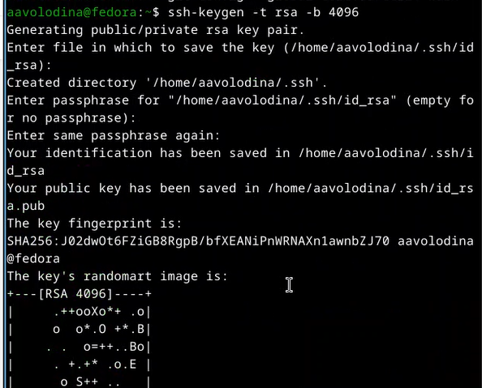{#fig-008 width=70%}

9) Сгенерируем ssh ключ по алгоритму ed25519 ([рис. @fig-009]).

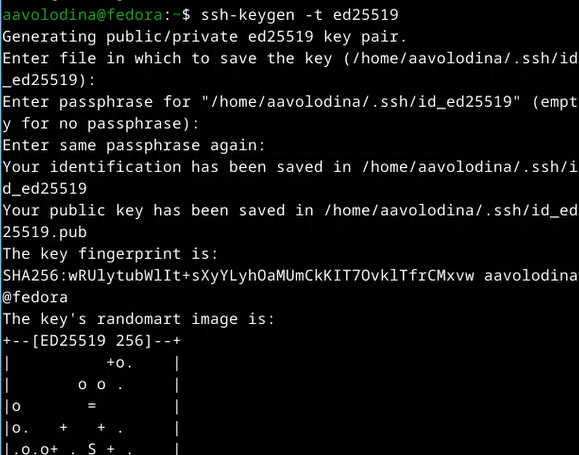{#fig-009 width=70%}

10) Теперь сгенерируем PGP ключ для подписи коммитов ([рис. @fig-010]).

{#fig-010 width=70%}

11) Выведем список ключей и скопируем отпечаток приватного ключа ([рис. @fig-011]).

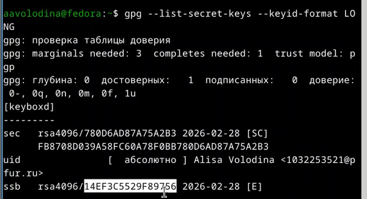{#fig-011 width=70%}

12) Скопируем сгенерированный PGP ключ в буфер обмена ([рис. @fig-012]).

{#fig-012 width=70%}

13) Используя введенный email, укажем git применять его при подписи коммитов ([рис. @fig-013]).

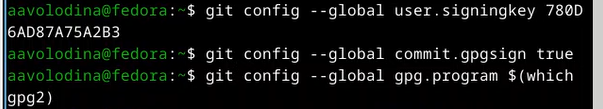{#fig-013 width=70%}

14) Авторизуемся в GitHub через gh командой `gh auth login` ([рис. @fig-014]).

{#fig-014 width=70%}

15) Создадим каталог для работы и перейдем в него ([рис. @fig-015]).

{#fig-015 width=70%}

16) Создадим репозиторий на основе шаблона ([рис. @fig-016]).

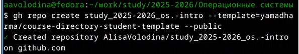{#fig-016 width=70%}

17) Выполним клонирование репозитория ([рис. @fig-017]).

{#fig-017 width=70%}

18) Перейдем в каталог курса ([рис. @fig-018]).

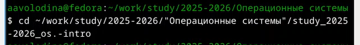{#fig-018 width=70%}

19) Удалим лишние файлы ([рис. @fig-019]).

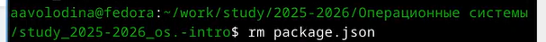{#fig-019 width=70%}

20) Создадим необходимые каталоги для лабораторных работ ([рис. @fig-020]).

{#fig-020 width=70%}

21) Продолжим создание необходимых каталогов ([рис. @fig-024]).

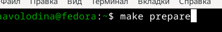{#fig-024 width=70%}

22) Отправим созданные файлы на сервер. Для этого сначала выполним `git add .`, чтобы добавить все изменения в индекс ([рис. @fig-021]).

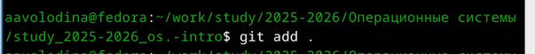{#fig-021 width=70%}

23) Затем выполним коммит с сообщением о проделанной работе ([рис. @fig-022]).

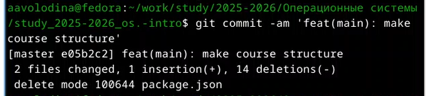{#fig-022 width=70%}

24) Отправим изменения в удаленный репозиторий ([рис. @fig-023]).

{#fig-023 width=70%}

# Выводы

В результате выполнения данной лабораторной работы я приобрела навыки, необходимые для работы с git, настроила каталоги курса для дальнейшей работы, создала ssh и gpg ключи и авторизовалась в gh.

# Список литературы

