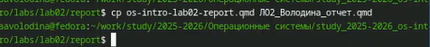
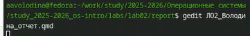
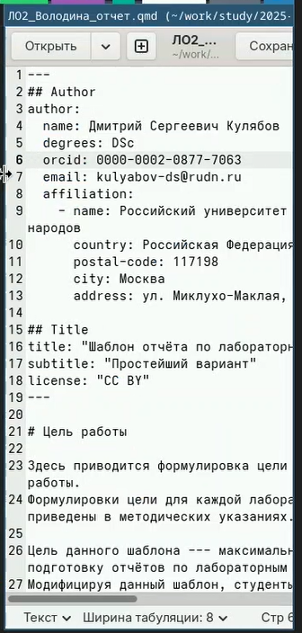

---
## Front matter
lang: ru-RU
title: Отчет по лабораторной работе №3
subtitle: Операционные системы
author:
  - Володина Алиса Алексеевна
institute:
  - Российский университет дружбы народов, Москва, Россия

## i18n babel
babel-lang: russian
babel-otherlangs: english

## Formatting pdf
toc: false
toc-title: Содержание
slide_level: 2
aspectratio: 169
section-titles: true
theme: metropolis
header-includes:
 - \metroset{progressbar=frametitle,sectionpage=progressbar,numbering=fraction}
---

# Информация

## Докладчик

  * Володина Алиса Алексеевна
  * НКАбд-01-25, Студенческий билет: 1032253521
  * Российский университет дружбы народов

## Цель работы

Научиться оформлять отчёты с помощью легковесного языка разметки Markdown.

## Задание

Сделать отчёт по предыдущей лабораторной работе в формате Markdown

---

## Теоретическое введение

Чтобы создать заголовок, используйте знак( #). Чтобы задать для текста полужирное начертание, заключите его в двойные звездочки. Чтобы задать для текста курсивное начертание, заключите его в одинарные звездочки. Чтобы задать для текста полужирное и курсивное начертание, заключите его в тройные звездочки. Блоки цитирования создаются с помощью символа>. Неупорядоченный (маркированный) список можно отформатировать с помощью звездочек или тире. Чтобы вложить один список в другой, добавьте отступ для элементов дочернего списка. Упорядоченный список можно отформатировать с помощью соответствующих цифр. 

## Выполнение лабораторной работы

Перейдем в каталог, где находится шаблон для отчета (рис. 1).

{#fig-001 width=70%}

##
 
Копируем шаблон и даем другое название (рис. 2).

{#fig-002 width=70%}

##

Откроем шаблон с помощью команды gedit (рис. 3).

{#fig-003 width=70%}

##

Открываем шаблон (рис. 4).

{#fig-004 width=70%}

##

Редактируем шаблон (рис. 5).

{#fig-005 width=70%}

##

Компилируем файл в форматы docx и  pdf (рис. 6).

{#fig-006 width=70%}

## Выводы

В ходе выполнения данной лабораторной работы я научилась оформлять отчёты с помощью легковесного языка разметки Markdown.

