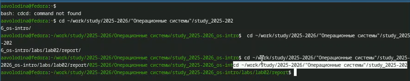
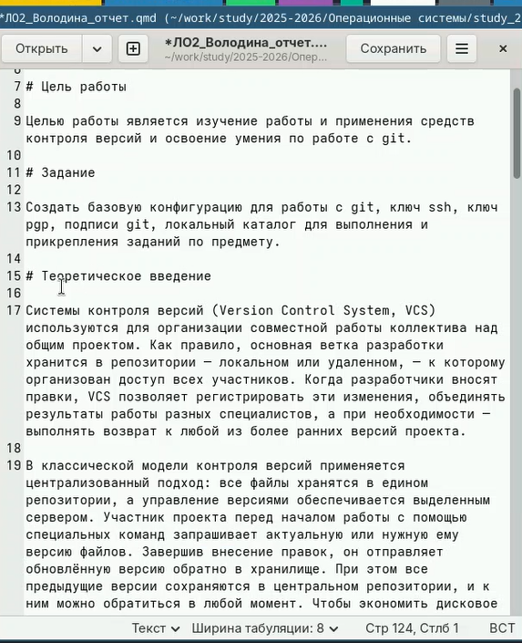
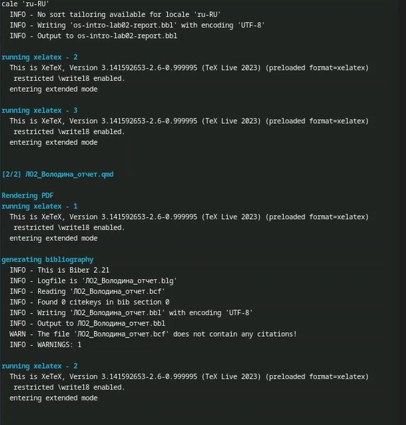

# Цель работы

Научиться оформлять отчёты с помощью легковесного языка разметки Markdown.

# Задание

Сделать отчёт по предыдущей лабораторной работе в формате Markdown

# Теоретическое введение

Чтобы создать заголовок, используйте знак( #). Чтобы задать для текста полужирное начертание, заключите его в двойные звездочки. Чтобы задать для текста курсивное начертание, заключите его в одинарные звездочки. Чтобы задать для текста полужирное и курсивное начертание, заключите его в тройные звездочки. Блоки цитирования создаются с помощью символа>. Неупорядоченный (маркированный) список можно отформатировать с помощью звездочек или тире. Чтобы вложить один список в другой, добавьте отступ для элементов дочернего списка. Упорядоченный список можно отформатировать с помощью соответствующих цифр. Чтобы вложить один список вдругой, добавьте отступ для элементов дочернегосписка. Синтаксис Markdown для встроенной  ссылки состоит из части [link text] , представляющей текст гиперссылки, и части (file-name.md)– URL адреса или имени файла, на который дается ссылка. Markdown поддерживает как встраивание фрагментов кода в предложение, так и их размещение между предложениями в виде отдельных огражденных блоков. Огражденные блоки кода —это простой способ выделить синтаксис для фрагментов кода. Внутри текстовые формулы делаются аналогично формулам LaTeX. Для обработки файлов в формате Markdown будем использовать Pandoc. Конкретно, нам понадобится программа pandoc, pandoc-citeproc https://github.com/jgm/pandoc/releases, pandoc crossref https://github.com/lierdakil/pandoc-crossref/releases. Преобразовать файл README.md можно следующим образом: 1pandoc README.md -o README.pdf или так 1pandocREADME.md - oREADME.docx Можно использовать следующий Makefile 1 FILES=$(patsubst%.md,%.docx,$(wildcard.md))2FILES+=$(patsubst%.md, 7 %.pdf, $(wildcard .md)

# Выполнение лабораторной работы

1) Перейдем в каталог, где находится шаблон для отчета ([рис. @fig-001]).

{#fig-001 width=70%}

2) Копируем шаблон и даем другое название ([рис. @fig-002]).

{#fig-002 width=70%}

3) Откроем шаблон с помощью команды gedit([рис. @fig-003]).

{#fig-003 width=70%}

4) Открываем шаблон([рис. @fig-004]).

{#fig-004 width=70%}

5) Редактируем шаблон ([рис. @fig-005]).

{#fig-005 width=70%}

6) Компилируем файл в форматы docx и  pdf  ([рис. @fig-006]).

{#fig-006 width=70%}

# Выводы

В ходе выполнения данной лабораторной работы я научилась оформлять отчёты с помощью легковесного языка разметки Markdown.

# Список литературы
