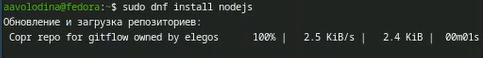
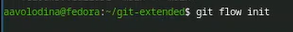
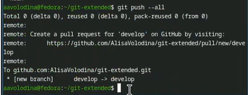
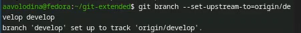
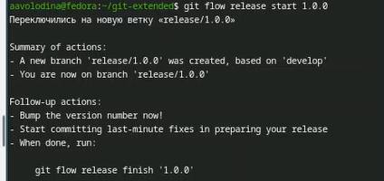
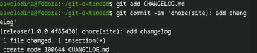
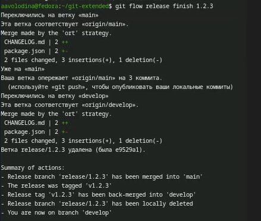
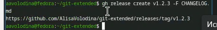

---
## Front matter
lang: ru-RU
title: Отчет по лабораторной работе №4
subtitle: Операционные системы
author:
  - Володина Алиса Алексеевна
institute:
  - Российский университет дружбы народов, Москва, Россия

## i18n babel
babel-lang: russian
babel-otherlangs: english

## Formatting pdf
toc: false
toc-title: Содержание
slide_level: 2
aspectratio: 169
section-titles: true
theme: metropolis
header-includes:
 - \metroset{progressbar=frametitle,sectionpage=progressbar,numbering=fraction}
---

# Информация

## Докладчик

  * Володина Алиса Алексеевна
  * НКАбд-01-25, Студенческий билет: 1032253521
  * Российский университет дружбы народов

## Цель работы

Получение навыков продвинутой работы с репозиторием git и релизами.

## Задание

Выполнить работу для тестового репозитория и преобразовать рабочий репозиторий в репозиторий с git-flow и conventional commits

---

## Теоретическое введение

Системы контроля версий (Version Control System, VCS) используются для организации совместной работы коллектива над общим проектом. Как правило, основная ветка разработки хранится в репозитории — локальном или удаленном, — к которому организован доступ всех участников. Когда разработчики вносят правки, VCS позволяет регистрировать эти изменения, объединять результаты работы разных специалистов, а при необходимости — выполнять возврат к любой из более ранних версий проекта.

## Выполнение лабораторной работы

Установка из коллекции репозиториев Copr (рис. 1).

{#fig-002 width=70%}

##
 
Установка Node.js. (рис. 2).

{#fig-004 width=70%}

##

Настройка Node.js Запустим pnpm setup (рис. 3).

{#fig-006 width=70%}

##

Выполним source ~/.bashrc (рис. 4).

{#fig-007 width=70%}

##

Выполним данную программу для помощи в форматировании коммитов. (рис. 5).

{#fig-008 width=70%}

##

Выполним команды для помощи в создании логов.(рис. 6).

{#fig-009 width=70%}

##

Создадим репозиторий на GitHub. Для примера назовём его git-extended. (рис. 7)

{#fig-010 width=70%}

##

Делаем первый коммит и выкладываем на github:  (рис. 8)

{#fig-011 width=70%}

##

Конфигурация общепринятых коммитов. (рис. 9)

{#fig-014 width=70%}

##

Добавим новые файлы, Выполним коммит, Отправим на github (рис. 10)

{#fig-018 width=70%}

##

Инициализируем git-flow (рис. 11)

{#fig-019 width=70%}

##

Загрузите весь репозиторий в хранилище: (рис. 12)

{#fig-020 width=70%}

##

Установите внешнюю ветку как вышестоящую для этой ветки: (рис. 13) 

{#fig-021 width=70%}

##

Создадим релиз с версией 1.0.0 (рис. 14) 

{#fig-022 width=70%}

##

Создадим журнал изменений, Добавим журнал изменений в индекс (рис. 15) 

{#fig-024 width=70%}

##

Зальём релизную ветку в основную ветку и отправим данные на github (рис. 16) 

{#fig-038 width=70%}

##

Создадим релиз на github с комментарием из журнала изменений (рис. 17) 

{#fig-041 width=70%}

## Выводы

В ходе выполнения лабораторной работы я получила навыки работы с репозиториями git.

