# Цель работы

Получение навыков продвинутой работы с репозиторием git и релизами.

# Задание

Выполнить работу для тестового репозитория и преобразовать рабочий репозиторий в репозиторий с git-flow и conventional commits

# Теоретическое введение

Системы контроля версий (Version Control System, VCS) используются для организации совместной работы коллектива над общим проектом. Как правило, основная ветка разработки хранится в репозитории — локальном или удаленном, — к которому организован доступ всех участников. Когда разработчики вносят правки, VCS позволяет регистрировать эти изменения, объединять результаты работы разных специалистов, а при необходимости — выполнять возврат к любой из более ранних версий проекта.
В классической модели контроля версий применяется централизованный подход: все файлы хранятся в едином репозитории, а управление версиями обеспечивается выделенным сервером. Участник проекта перед началом работы с помощью специальных команд запрашивает актуальную или нужную ему версию файлов. Завершив внесение правок, он отправляет обновлённую версию обратно в хранилище. При этом все предыдущие версии сохраняются в центральном репозитории, и к ним можно обратиться в любой момент. Чтобы экономить дисковое пространство, сервер может не сохранять полностью каждый изменённый файл, а применять дельта-компрессию — записывать только различия между последовательными версиями.Gitflow Workflow, семантическое версионирование и Conventional Commits
Gitflow Workflow — это модель ветвления для Git, которая была опубликована и популяризована Винсентом Дриссеном. Данная модель предполагает выстраивание строгой структуры веток с учётом выпуска версий проекта. Gitflow Workflow отлично подходит для организации рабочего процесса, основанного на регулярных релизах. Работа по этой модели включает создание отдельных веток для разработки новых функций, подготовки релизов, а также для срочного исправления ошибок в рабочей среде, что позволяет поддерживать стабильность основной ветки проекта на всех этапах разработки.
Семантическое версионирование, или SemVer, описывается в одноимённом манифесте и представляет собой систему правил для присвоения номеров версий. Кратко его можно описать следующим образом: версия задаётся в виде кортежа МАЖОРНАЯ_ВЕРСИЯ.МИНОРНАЯ_ВЕРСИЯ.ПАТЧ. Номер версии следует увеличивать по определённым правилам. МАЖОРНУЮ версию увеличивают в том случае, когда в проект вносятся обратно несовместимые изменения API. МИНОРНУЮ версию увеличивают при добавлении новой функциональности, которая не нарушает обратной совместимости. ПАТЧ-версию увеличивают, когда выполняются обратно совместимые исправления ошибок. Дополнительные обозначения для предрелизных версий и билд-метаданных могут быть добавлены как расширение к основному формату МАЖОРНАЯ.МИНОРНАЯ.ПАТЧ, например, в виде суффиксов -alpha, -beta или +build.15.
Спецификация Conventional Commits представляет собой соглашение о том, как нужно писать сообщения коммитов. Данная спецификация полностью совместима с семантическим версионированием и даже более того — она тесно с ним связана. Conventional Commits регламентирует структуру сообщения коммита и определяет основные типы изменений, такие как feat для новой функциональности, fix для исправления ошибок, BREAKING CHANGE для изменений, нарушающих обратную совместимость, а также вспомогательные типы вроде docs, style, refactor и другие. Соблюдение этой спецификации позволяет автоматически определять следующую версию проекта в соответствии с правилами SemVer, а также генерировать changelog на основе истории коммитов, что значительно упрощает управление версиями и выпуск релизов.

# Выполнение лабораторной работы

1) Установка из коллекции репозиториев Copr (https://copr.fedorainfracloud.org/coprs/elegos/gitflow/): ([рис. @fig-002]).  ([рис. @fig-003]).

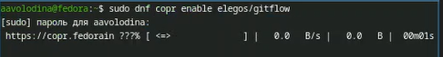{#fig-002 width=70%}

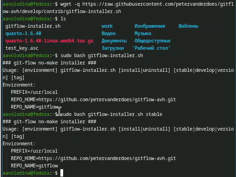{#fig-003 width=70%}

2) Установка Node.js. ([рис. @fig-004]).

{#fig-004 width=70%}

3) Настройка Node.js Запустим pnpm setup ([рис. @fig-006]).

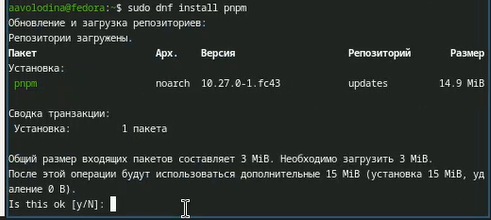{#fig-006 width=70%}

6)Выполним source ~/.bashrc ([рис. @fig-007]).

{#fig-007 width=70%}

4) Общепринятые коммиты 

5)Выполним данную программу для помощи в форматировании коммитов. ([рис. @fig-008]).

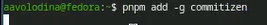{#fig-008 width=70%}

6)Выполним команды для помощи в создании логов. ([рис. @fig-009]).

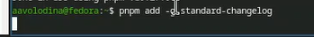{#fig-009 width=70%}

7) Создание репозитория git

Создадим репозиторий на GitHub. Для примера назовём его git-extended. ([рис. @fig-010]).

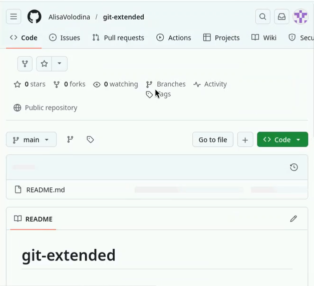{#fig-010 width=70%}

8)Делаем первый коммит и выкладываем на github: ([рис. @fig-011]) 

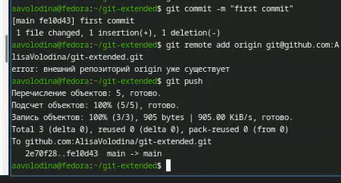{#fig-011 width=70%}

9) Конфигурация общепринятых коммитов. ([рис. @fig-014]).

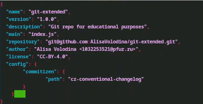{#fig-014 width=70%}

10) Добавим новые файлы: ([рис. @fig-016]).

{#fig-016 width=70%}

11) Выполним коммит: ([рис. @fig-017]).

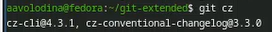{#fig-017 width=70%}

12) Отправим на github: ([рис. @fig-018]).

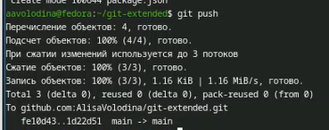{#fig-018 width=70%}

13) Конфигурация git-flow

Инициализируем git-flow ([рис. @fig-019]).

{#fig-019 width=70%}

14) Проверьте, что Вы на ветке develop: ([рис. @fig-050]).

{#fig-050 width=70%}

15) Загрузите весь репозиторий в хранилище: ([рис. @fig-020]).

{#fig-020 width=70%}

16) Установите внешнюю ветку как вышестоящую для этой ветки: ([рис. @fig-021]).

{#fig-021 width=70%}

17) Создадим релиз с версией 1.0.0 ([рис. @fig-022]).

{#fig-022 width=70%}

18) Создадим журнал изменений ([рис. @fig-023]).

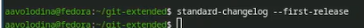{#fig-023 width=70%}

19) Добавим журнал изменений в индекс ([рис. @fig-024]) ([рис. @fig-025]).

{#fig-024 width=70%}

20) Зальём релизную ветку в основную ветку ([рис. @fig-026]).

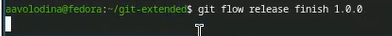{#fig-026 width=70%}

21) Отправим данные на github ([рис. @fig-027]) ([рис. @fig-028]).

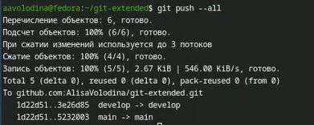{#fig-027 width=70%}

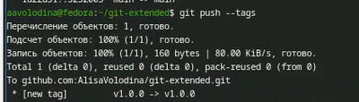{#fig-028 width=70%}

22) Создадим релиз на github. Для этого будем использовать утилиты работы с github: ([рис. @fig-029]).

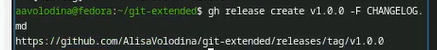{#fig-029 width=70%}

23) Работа с репозиторием git

Создадим ветку для новой функциональности: ([рис. @fig-030]).

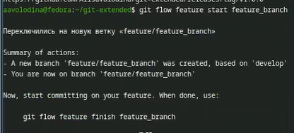{#fig-030 width=70%}

24) Далее, продолжаем работу c git как обычно.([рис. @fig-031]).

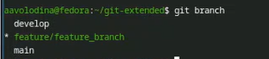{#fig-031 width=70%}

25) По окончании разработки новой функциональности следующим шагом следует объединить ветку feature_branch c develop: ([рис. @fig-032]).

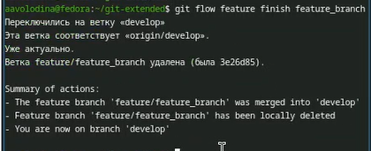{#fig-032 width=70%}

26) Создадим релиз с версией 1.2.3: ([рис. @fig-033]).

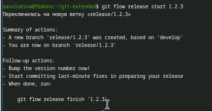{#fig-033 width=70%}

27) Обновите номер версии в файле package.json. Установите её в 1.2.3. ([рис. @fig-034]).

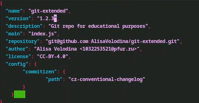{#fig-034 width=70%}

28) Создадим журнал изменений ([рис. @fig-035]).

{#fig-035 width=70%}

29) Добавим журнал изменений в индекс ([рис. @fig-036]).

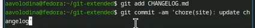{#fig-036 width=70%}

30) Зальём релизную ветку в основную ветку ([рис. @fig-038]).

{#fig-038 width=70%}

31) Отправим данные на github ([рис. @fig-039]). ([рис. @fig-040]).

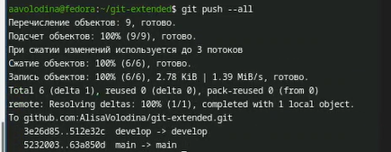{#fig-039 width=70%}

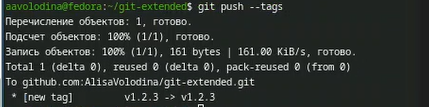{#fig-040 width=70%}

32) Создадим релиз на github с комментарием из журнала изменений: ([рис. @fig-041]).

{#fig-041 width=70%}

# Выводы

В ходе выполнения лабораторной работы я получила навыки работы с репозиториями git.

# Список литературы
