# Цель работы

Ознакомиться с pass, gopass, native messaging, chezmoi, а также научиться пользоваться утилитами, синхронизовать их с гит

# Задания

Установить дополнительное ПО, установить и настроить pass, настроить интерфейс с браузером, сохранить пароли, установить и настроить chezmoi, выполнить chezmoi на новой машине и выполнить ежедневные операции с chezmoi

# Теоретическое введение

pass — стандартный Unix-менеджер паролей: данные хранятся в ФС в виде файлов, каждый зашифрован GPG-ключом. Структура хранилища произвольна (семантика в голове), но для интеграции со сторонним ПО её нужно закладывать явно.

chezmoi управляет dotfiles. Исходники лежат в ~/.local/share/chezmoi (клон репозитория), локальный конфиг — в ~/.config/chezmoi/chezmoi.toml. Одинаковые на всех машинах файлы копируются без изменений; различающиеся обрабатываются как шаблоны с подстановкой данных из локального конфига.

# Выполнение лабораторной работы

1) Установим pass ([рис. @fig-001]).  

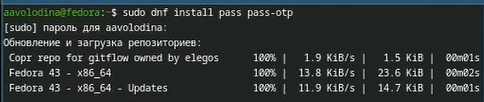{#fig-001 width=70%}

2) Установим gopass ([рис. @fig-002]).

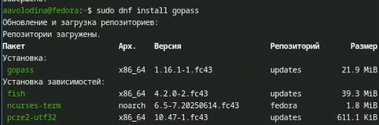{#fig-002 width=70%}

3) Просмотрим список ключей: ([рис. @fig-003]).

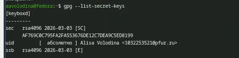{#fig-003 width=70%}

4)Инициализируем хранилище: ([рис. @fig-004]).

{#fig-004 width=70%}

5)Создадим структуру git:([рис. @fig-005]).

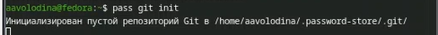{#fig-005 width=70%}

6)Создаем репозиторий ([рис. @fig-006]).

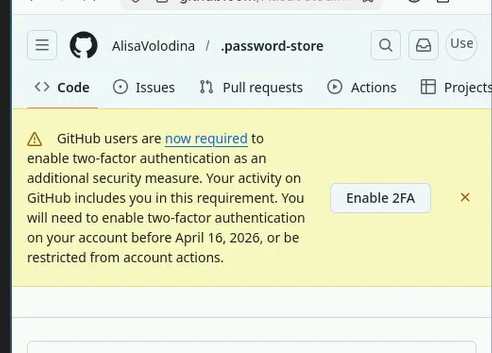{#fig-006 width=70%}

7)Зададим адрес репозитория на хостинге ([рис. @fig-007]).

{#fig-007 width=70%}

8)Сделаем прямые изменения ([рис. @fig-008]) 

{#fig-008 width=70%}

9)Настроим интерфейс с броузером ([рис. @fig-009]). ([рис. @fig-010]).

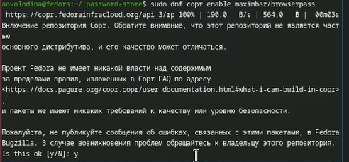{#fig-009 width=70%}

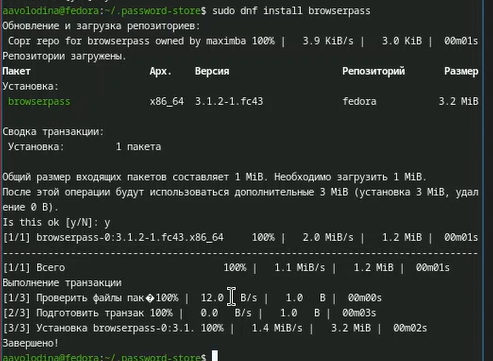{#fig-010 width=70%}

10)Добавим новый пароль([рис. @fig-011]).

![pass insert [OPTIONAL DIR]/[FILENAME]](image/11.png){#fig-011 width=70%}

11)Отобразим пароль для указанного имени файла:([рис. @fig-012]).

![pass [OPTIONAL DIR]/[FILENAME]](image/12.png){#fig-012 width=70%}

12)Заменим существующий пароль:([рис. @fig-013]).

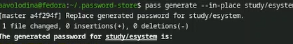{#fig-013 width=70%}

13)Установим дополнительное программное обеспечение:([рис. @fig-014]). ([рис. @fig-015]).

{#fig-014 width=70%}

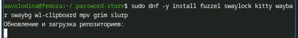{#fig-015 width=70%}

14)Установим шрифты: ([рис. @fig-016]). ([рис. @fig-017]). ([рис. @fig-018]).

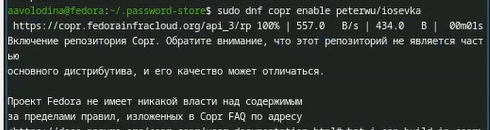{#fig-016 width=70%}

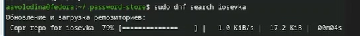{#fig-017 width=70%}

{#fig-018 width=70%}

15)Установим бинарный файл ([рис. @fig-019]).

{#fig-019 width=70%}

16)Создадим свой репозиторий для конфигурационных файлов на основе шаблона:([рис. @fig-020]).

{#fig-020 width=70%}

17)Инициализируем chezmoi с нашим репозиторием dotfiles:([рис. @fig-021]).

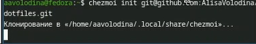{#fig-021 width=70%}

18)chezmoi init git@github.com:<username>/dotfiles.git ([рис. @fig-022]).

{#fig-022 width=70%}

19)Запустим:([рис. @fig-023])

{#fig-023 width=70%}

20)На второй машине инициализируем chezmoi с нашим репозиторием dotfiles:([рис. @fig-024]).

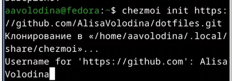{#fig-024 width=70%}

21)Проверим, какие изменения внесёт chezmoi в домашний каталог, запустив:([рис. @fig-025])

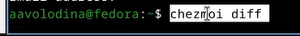{#fig-025 width=70%}

22)Запустим: ([рис. @fig-026]).

{#fig-026 width=70%}

23)Получим и применим последние изменения из вашего репозитория: ([рис. @fig-027]).

{#fig-027 width=70%}

24)Можно установить свои dotfiles на новый компьютер с помощью одной команды:([рис. @fig-028]).

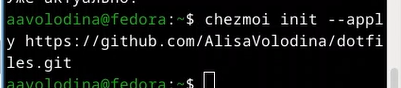{#fig-028 width=70%}

25)Извлечем изменения из репозитория и применим их одной командой: ([рис. @fig-029]).

{#fig-029 width=70%}

26)Извлечем последние изменения из своего репозитория и посмотрим, что изменится, фактически не применяя изменения ([рис. @fig-030]).

{#fig-030 width=70%}

27)Применим изменения ([рис. @fig-031]).

{#fig-031 width=70%}

28)добавим в файл конфигурации ~/.config/chezmoi/chezmoi.toml следующее:([рис. @fig-032]).

![[git]autoCommit = true autoPush = true](image/32.png){#fig-032 width=70%}

# Выводы

Мы ознакомились с pass, gopass, native messaging, chezmoi, научились использовать утилиты, синхронизировать их с git

# Список литературы
