# Цель работы

Приобретение практических навыков взаимодействия пользователя с системой посредством командной строки.

# Задания

1. Определите полное имя вашего домашнего каталога. Далее относительно этого ката-
лога будут выполняться последующие упражнения.
2. Выполните следующие действия:
2.1. Перейдите в каталог /tmp.
2.2. Выведите на экран содержимое каталога /tmp. Для этого используйте команду ls
с различными опциями. Поясните разницу в выводимой на экран информации.
2.3. Определите, есть ли в каталоге /var/spool подкаталог с именем cron?
2.4. Перейдите в Ваш домашний каталог и выведите на экран его содержимое. Опре-
делите, кто является владельцем файлов и подкаталогов?
3. Выполните следующие действия:
3.1. В домашнем каталоге создайте новый каталог с именем newdir.
3.2. В каталоге ~/newdir создайте новый каталог с именем morefun.
3.3. В домашнем каталоге создайте одной командой три новых каталога с именами
letters, memos, misk. Затем удалите эти каталоги одной командой.
3.4. Попробуйте удалить ранее созданный каталог ~/newdir командой rm. Проверьте,
был ли каталог удалён.
3.5. Удалите каталог ~/newdir/morefun из домашнего каталога. Проверьте, был ли
каталог удалён.
4. С помощью команды man определите, какую опцию команды ls нужно использо-
вать для просмотра содержимое не только указанного каталога, но и подкаталогов,
входящих в него.
5. С помощью команды man определите набор опций команды ls, позволяющий отсорти-
ровать по времени последнего изменения выводимый список содержимого каталога
с развёрнутым описанием файлов.
6. Используйте команду man для просмотра описания следующих команд: cd, pwd, mkdir,
rmdir, rm. Поясните основные опции этих команд.
7. Используя информацию, полученную при помощи команды history, выполните мо-
дификацию и исполнение нескольких команд из буфера команд

# Теоретическое введение

В операционных системах семейства Linux взаимодействие пользователя с системой происходит через командную строку, где команды вводятся построчно. Для этого используются командные интерпретаторы (shell), например, /bin/sh, /bin/csh, /bin/ksh.
Команда — это текст, записанный по определённым правилам, который может содержать аргументы и служит указанием системе выполнить то или иное действие. Обычно команда состоит из имени (первое слово) и следующих за ним опций или аргументов, уточняющих её действие.
Общий формат команды можно представить так:
имя_команды [опции] [аргументы] 

# Выполнение лабораторной работы

1)Определим полное имя домашнего каталога.([рис. @fig-001]).  

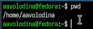{#fig-001 width=70%}

2)Перейдем в каталог /tmp ([рис. @fig-002]).

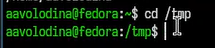{#fig-002 width=70%}

3)Выведем на экран содержимое каталога /tmp. ([рис. @fig-003]).

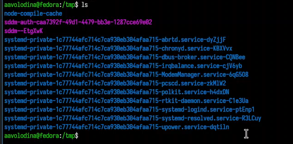{#fig-003 width=70%}

4)Выполним команду ls -l, которая показывает права доступа, кол-во ссылок, владельца, группу, размер, дату и время последнего изменения, имя файла ([рис. @fig-004]).

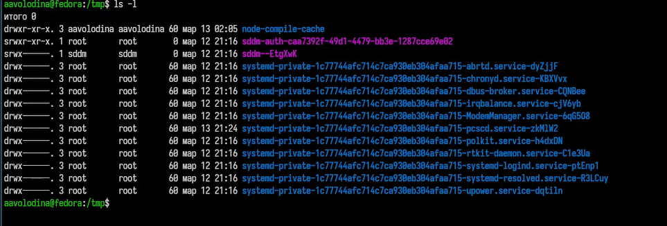{#fig-004 width=70%}

5)Выполним команду ls -a, которая показывает все файлы, включая скрытые ([рис. @fig-005]).

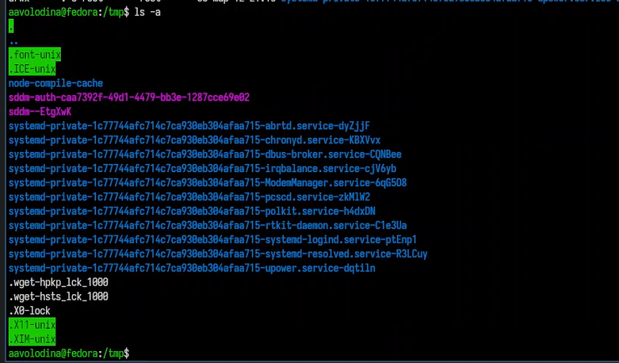{#fig-005 width=70%}

6)Выполним команду ls -lh, которая выводит размеры файла в килобайтах/мегабайтах([рис. @fig-006]).

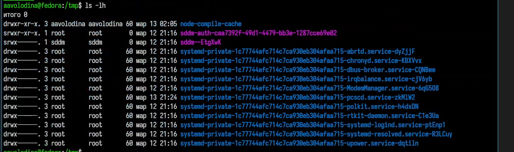{#fig-006 width=70%}

7)Выполним команду ls -F, которая добавляет символы-индикаторы ([рис. @fig-007]).

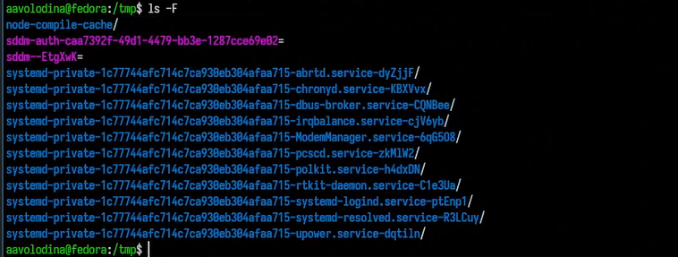{#fig-007 width=70%}

8)Выполим команду ls -i, которая выводит inode номер каждого файла ([рис. @fig-008]) 

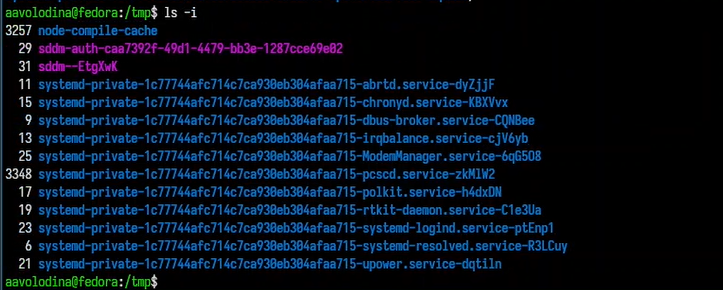{#fig-008 width=70%}

9)Выполним команду ls -t, которая сортирует файлы по времени последнего изменения ([рис. @fig-009]).

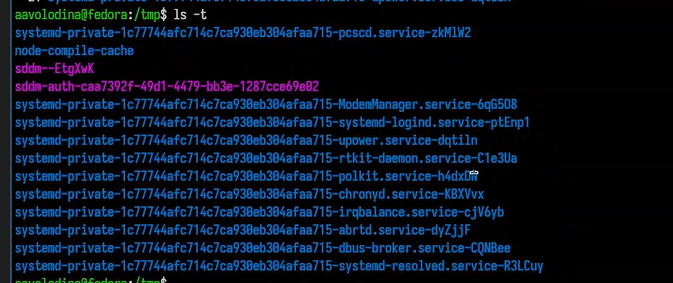{#fig-009 width=70%}

10)Определим, есть ли в каталоге /var/spool подкаталог с именем cron ([рис. @fig-010]). ([рис. @fig-011]).

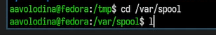{#fig-010 width=70%}

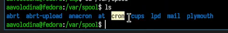{#fig-011 width=70%}

11)Перейдите в Ваш домашний каталог и выведите на экран его содержимое.([рис. @fig-012]).

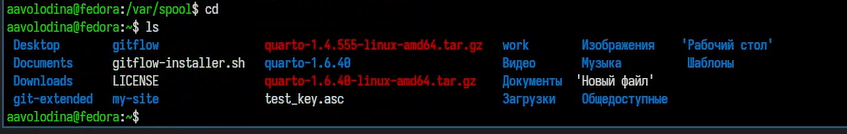{#fig-012 width=70%}

12)Определим, кто является владельцем файлов и подкаталогов. Владельцем всех каталогов, кроме gitflow являюсь я, gitflow был создан из root([рис. @fig-013]).

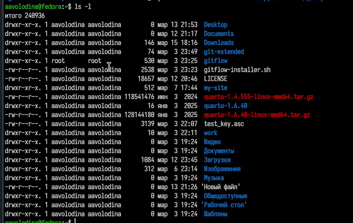{#fig-013 width=70%}

13) домашнем каталоге создайте новый каталог с именем newdir ([рис. @fig-014]).

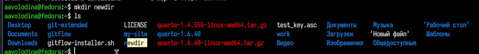{#fig-014 width=70%}

14)В каталоге ~/newdir создадим новый каталог с именем morefun ([рис. @fig-015]).

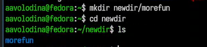{#fig-015 width=70%}

15)В домашнем каталоге создайте одной командой три новых каталога с именами letters, memos, misk([рис. @fig-016]).

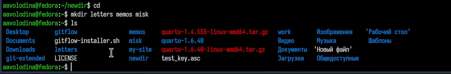{#fig-016 width=70%}

16)Затем удалим эти каталоги одной командой ([рис. @fig-017]).

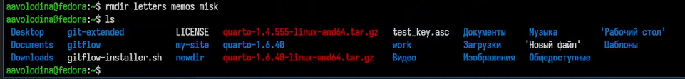{#fig-017 width=70%}

17)Попробуем удалить ранее созданный каталог ~/newdir командой rm. Поскольку каталог не пуст, он не удалился ([рис. @fig-018]).

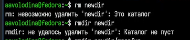{#fig-018 width=70%}

15)Удалим каталог ~/newdir/morefun из домашнего каталога. Проверим, был ли
каталог удалён.([рис. @fig-019]).

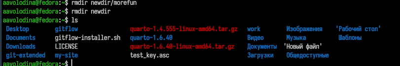{#fig-019 width=70%}

16)С помощью команды man определим, какую опцию команды ls нужно использовать для просмотра содержимого не только указанного каталога, но и подкаталогов, входящих в него ([рис. @fig-020]).

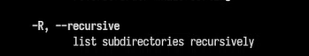{#fig-020 width=70%}

17)С помощью команды man определим набор опций команды ls, позволяющую отсортировать по времени последнего изменения выводимый список содержимого каталога с развёрнутым описанием файлов ([рис. @fig-021]). ([рис. @fig-022]).

{#fig-021 width=70%}

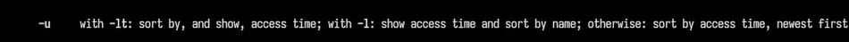{#fig-022 width=70%}

18)Используйте команду man для просмотра описания следующих команд: cd, pwd, mkdir,
rmdir, rm. Поясните основные опции этих команд: cd /-перейти в указаный каталог, cd..-перейти на уровень выше, cd ~- в домашний каталог, cd- - в предыдущий каталог. pwd -L- текущий каталог с учетом символических ссылок, -P- выводит реальный руть без символических ссылок. mkdir -p - создает недостающие на пути каталоги, mkdir -m-задает права доступа для нового каталога, mkdir -v- выводит сообщение о каждом созданом каталоге. rmdir -p -удаляет также родительские каталоги, если они становятся пустыми, mkdir -v- показывает, что удаляется. rm -r- рекурсивно удаляет каталоги и их содержимое, rm -f- игнорирует несуществующие файлы, не запрашива подтверждение, rm -i- запрашивает подтверждение перед удалением, rm -v-выводит информацию об удаленных объектах, rm -d- удаляет пустые каталоги ([рис. @fig-023]).

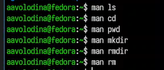{#fig-023 width=70%}

19)Используя информацию, полученную при помощи команды history, выполним модификацию и исполнение нескольких команд из буфера команд([рис. @fig-024]). ([рис. @fig-025]). ([рис. @fig-026]).

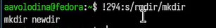{#fig-024 width=70%}

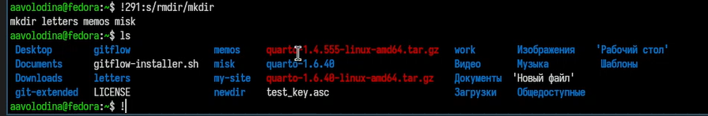{#fig-025 width=70%}

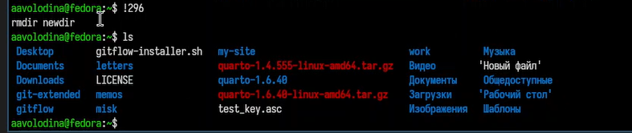{#fig-026 width=70%}

# Выводы

Я приобрела практические навыки взаимодействия пользователя с системой посредством командной строки.

# Список литературы
