---
## Title
title: "Лабораторная работа №7"
subtitle: "Архитектура компьютера"
license: "Володина Алиса Алексеевна"
---

## Докладчик

  * Володина Алиса Алексеевна
  * НКАбд-01-25 
  * Российский университет дружбы народов им. П. Лумумбы
  * 1032253521

# Цель работы

Ознакомление с файловой системой Linux, её структурой, именами и содержанием каталогов. Приобретение практических навыков по применению команд для работы с файлами и каталогами, по управлению процессами (и работами), по проверке использования диска и обслуживанию файловой системы.

# Задания

1. Выполните все примеры, приведённые в первой части описания лабораторной работы.
2. Выполните следующие действия, зафиксировав в отчёте по лабораторной работе
используемые при этом команды и результаты их выполнения:
3. Определите опции команды chmod, необходимые для того, чтобы присвоить перечис-
ленным ниже файлам выделенные права доступа, считая, что в начале таких прав
нет:
4. Проделайте приведённые ниже упражнения, записывая в отчёт по лабораторной
работе используемые при этом команды:
5. Прочитайте man по командам mount, fsck, mkfs, kill и кратко их охарактеризуйте,
приведя примеры.

# Теоретическое введение

Файловая система в Linux состоит из фалов и каталогов. Каждому физическому носителю соответствует своя файловая система. Существует несколько типов файловых систем. Перечислим наиболее часто встречающиеся типы: – ext2fs (second extended filesystem); – ext2fs (third extended file system); – ext4 (fourth extended file system); – ReiserFS; – xfs; – fat (file allocation table); – ntfs (new technology file system). Для просмотра используемых в операционной системе файловых систем можно воспользоваться командой mount без параметров.

## Выполнение лабораторной работы

## 1. Выполните все примеры, приведённые в первой части описания лабораторной работы

Копирование файла в текущем каталоге. Скопировать файл ~/abc1 в файл april
и в файл may:  

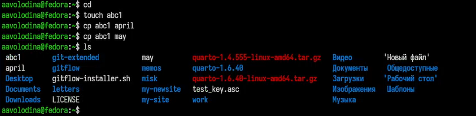{#fig-001 width=70%}

## 2. Копирование нескольких файлов в каталог. Скопировать файлы april и may в каталог
monthly

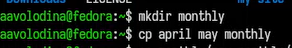{#fig-002 width=70%}

## 3. Копирование файлов в произвольном каталоге. Скопировать файл monthly/may в файл
с именем june:

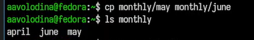{#fig-003 width=70%}

## 1. Копирование каталогов в текущем каталоге. Скопировать каталог monthly в каталог
monthly.00:

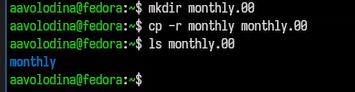{#fig-004 width=70%}

## 2. Копирование каталогов в произвольном каталоге. Скопировать каталог monthly.00
в каталог /tmp

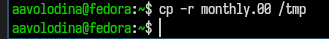{#fig-005 width=70%}

## 1. Переименование файлов в текущем каталоге. Изменить название файла april на
july в домашнем каталоге: 

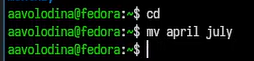{#fig-006 width=70%}

## 2. Перемещение файлов в другой каталог. Переместить файл july в каталог monthly.00: 

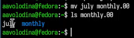{#fig-007 width=70%}

## 3. Переименование каталогов в текущем каталоге. Переименовать каталог monthly.00
в monthly.01 

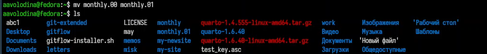{#fig-008 width=70%}

## 4. Перемещение каталога в другой каталог. Переместить каталог monthly.01 в каталог
reports: 

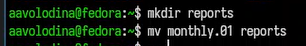{#fig-009 width=70%}

## 5. Переименование каталога, не являющегося текущим. Переименовать каталог reports/monthly.01 в reports/monthly 

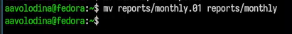{#fig-010 width=70%}

## 1. Требуется создать файл ~/may с правом выполнения для владельца, требуется лишить владельца файла ~/may права на выполнение 

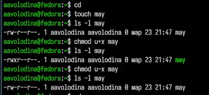{#fig-011 width=70%}

## 2. Требуется создать каталог monthly с запретом на чтение для членов группы и всех
остальных пользователей: 

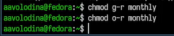{#fig-013 width=70%}

## 3. Требуется создать файл ~/abc1 с правом записи для членов группы 

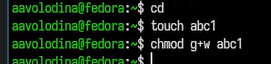{#fig-014 width=70%}

## 1. Для определения объёма свободного пространства на файловой системе можно воспользоваться командой df

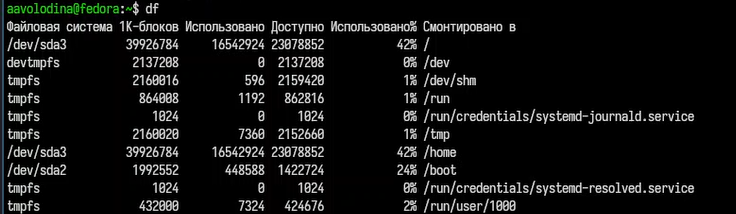{#fig-015 width=70%}

## 2. С помощью команды fsck можно проверить (а в ряде случаев восстановить) целостность файловой системы

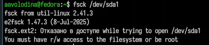{#fig-016 width=70%}

## Выполните следующие действия, зафиксировав в отчёте по лабораторной работе используемые при этом команды и результаты их выполнения:

## Скопируйте файл /usr/include/sys/io.h в домашний каталог и назовите его equipment

{#fig-017 width=70%}

## В домашнем каталоге создайте директорию ~/ski.plases 

{#fig-018 width=70%}

## Переместите файл equipment в каталог ~/ski.plases 

{#fig-019 width=70%}

## Переименуйте файл ~/ski.plases/equipment в ~/ski.plases/equiplist. 

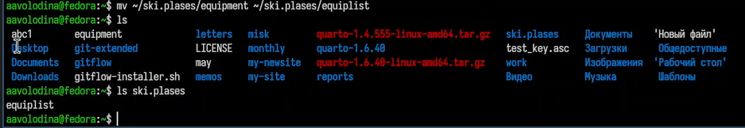{#fig-020 width=70%}

## Создайте в домашнем каталоге файл abc1 и скопируйте его в каталог ~/ski.plases, назовите его equiplist2 

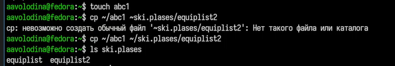{#fig-021 width=70%}

## Создайте каталог с именем equipment в каталоге ~/ski.plases.

{#fig-022 width=70%}

## Переместите файлы ~/ski.plases/equiplist и equiplist2 в каталог ~/ski.plases/equipment

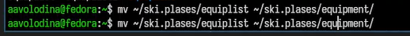{#fig-023 width=70%}

## Создайте и переместите каталог ~/newdir в каталог ~/ski.plases и назовите его plans.

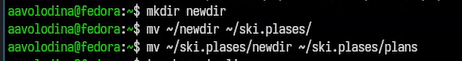{#fig-024 width=70%}

## 3. Определите опции команды chmod, необходимые для того, чтобы присвоить перечисленным ниже файлам выделенные права доступа, считая, что в начале таких прав нет:

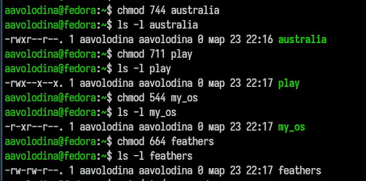{#fig-025 width=70%}

## 4. Проделайте приведённые ниже упражнения, записывая в отчёт по лабораторной
работе используемые при этом команды

## Просмотрите содержимое файла /etc/password.

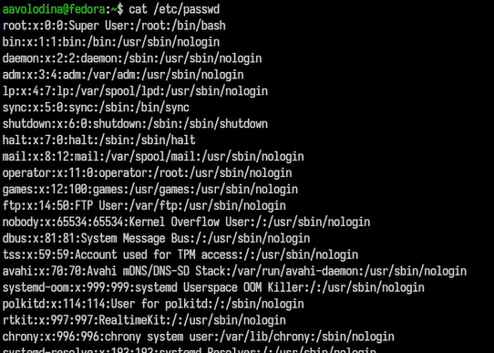{#fig-026 width=70%}

## Cкопируйте файл ~/feathers в файл ~/file.old.

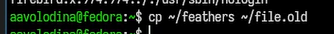{#fig-027 width=70%}

## Переместите файл ~/file.old в каталог ~/play

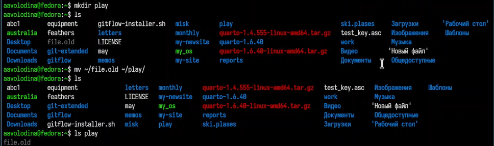{#fig-028 width=70%}

## Скопируйте каталог ~/play в каталог ~/fun 

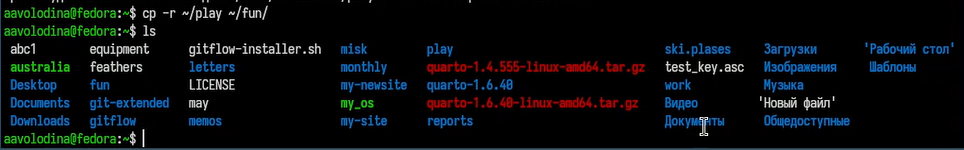{#fig-029 width=70%}

## Переместите каталог ~/fun в каталог ~/play и назовите его games. 

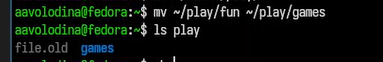{#fig-030 width=70%}

## Лишите владельца файла ~/feathers права на чтение 

{#fig-031 width=70%}

## Мы не можем использовать cat и посмотреть содержимое feathers 

{#fig-032 width=70%}

## Дайте владельцу файла ~/feathers права на чтение ([рис. @fig-033]).

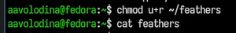{#fig-033 width=70%}

## Лишите владельца каталога ~/play права на выполнение

{#fig-034 width=70%}

## Мы не можем перейти в каталог play поскольку лишили владельца прав на выполнение

{#fig-035 width=70%}

## Дайте владельцу каталога ~/play право на выполнение.

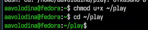{#fig-036 width=70%}

## Прочитайте man по командам mount, fsck, mkfs, kill и кратко их охарактеризуйте, приведя примеры.

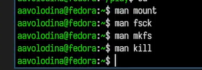{#fig-037 width=70%}

## Выводы

Мы ознакомились с файловой системой Linux, её структурой, именами и содержанием каталогов. Приобрели практические навыки по применению команд для работы с файлами и каталогами, по управлению процессами (и работами), по проверке использования диска и обслуживанию файловой системы.

