# Цель работы

Ознакомление с инструментами поиска файлов и фильтрации текстовых данных. Приобретение практических навыков: по управлению процессами (и заданиями), по проверке использования диска и обслуживанию файловых систем.

# Задания

1. Осуществите вход в систему, используя соответствующее имя пользователя.
2. Запишите в файл file.txt названия файлов, содержащихся в каталоге /etc. Допишите в этот же файл названия файлов, содержащихся в вашем домашнем каталоге.
3. Выведите имена всех файлов из file.txt, имеющих расширение .conf, после чего запишите их в новый текстовой файл conf.txt.
4. Определите, какие файлы в вашем домашнем каталоге имеют имена, начинавшиеся с символа c? Предложите несколько вариантов, как это сделать.
5. Выведите на экран (по странично) имена файлов из каталога /etc, начинающиеся с символа h.
6. Запустите в фоновом режиме процесс, который будет записывать в файл ~/logfile файлы, имена которых начинаются с log.
7. Удалите файл ~/logfile.
8. Запустите из консоли в фоновом режиме редактор gedit.
9. Определите идентификатор процесса gedit, используя команду ps, конвейер и фильтр grep. Как ещё можно определить идентификатор процесса?
10. Прочтите справку (man) команды kill, после чего используйте её для завершения процесса gedit.
11. Выполните команды df и du, предварительно получив более подробную информацию об этих командах, с помощью команды man.
12. Воспользовавшись справкой команды find, выведите имена всех директорий, имеющихся в вашем домашнем каталоге.

# Теоретическое введение

В системе по умолчанию открыто три стандартных потока:

· stdin (дескриптор 0) — ввод (обычно клавиатура);
· stdout (1) — вывод (обычно консоль);
· stderr (2) — вывод ошибок (консоль).

Команды (например, ls) выводят результат в stdout. Потоки можно перенаправлять:

· > — перенаправление с перезаписью файла;
· >> — добавление в конец файла;
· < — перенаправление ввода из файла.

Конвейер (|) передаёт вывод одной команды на ввод другой.

find — команда поиска файлов по условиям (имя, тип, размер и т.д.).

chezmoi управляет dotfiles. Исходники лежат в ~/.local/share/chezmoi (клон репозитория), локальный конфиг — в ~/.config/chezmoi/chezmoi.toml. Одинаковые на всех машинах файлы копируются без изменений; различающиеся обрабатываются как шаблоны с подстановкой данных из локального конфига.

# Выполнение лабораторной работы

1) Осуществим вход в систему, используя соответствующее имя пользователя.([рис. @fig-001]).  

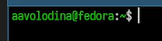{#fig-001 width=70%}

2)Запишим в файл file.txt названия файлов, содержащихся в каталоге /etc. Допишем в этот же файл названия файлов, содержащихся домашнем каталоге.([рис. @fig-002]). ([рис. @fig-003]).

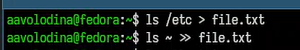{#fig-002 width=70%}

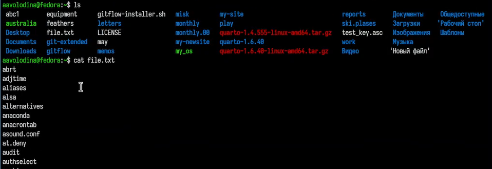{#fig-003 width=70%}

3)Выведем имена всех файлов из file.txt, имеющих расширение .conf, после чего запишем их в новый текстовой файл conf.txt.([рис. @fig-004]). ([рис. @fig-005]).

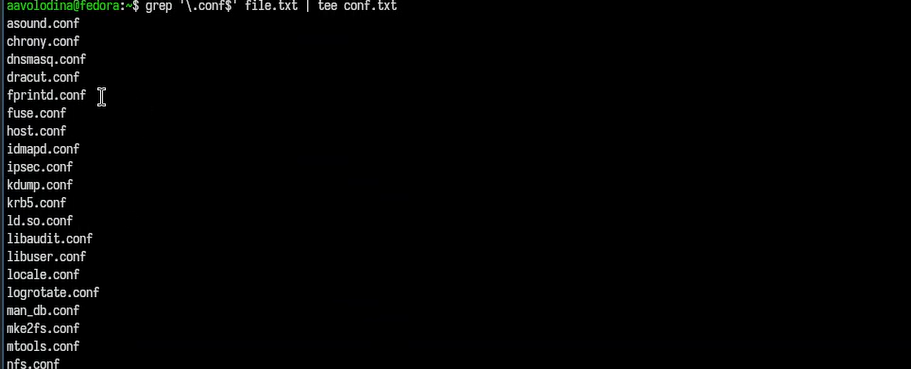{#fig-004 width=70%}

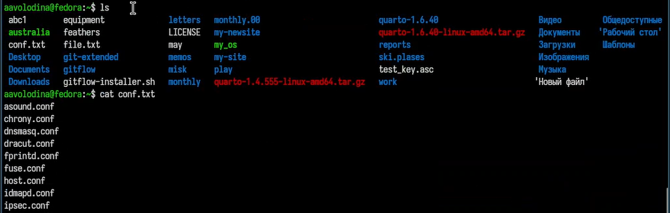{#fig-005 width=70%}

4) Определим, какие файлы в домашнем каталоге имеют имена, начинающиес с символа c? ([рис. @fig-006]).

{#fig-006 width=70%}

5) Выведем на экран (по странично) имена файлов из каталога /etc, начинающиеся с символа h.([рис. @fig-007]). ([рис. @fig-008]).

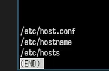{#fig-007 width=70%}

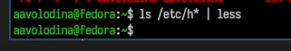{#fig-008 width=70%}

6) Запустим в фоновом режиме процесс, который будет записывать в файл ~/logfile файлы, имена которых начинаются с log.([рис. @fig-009]).

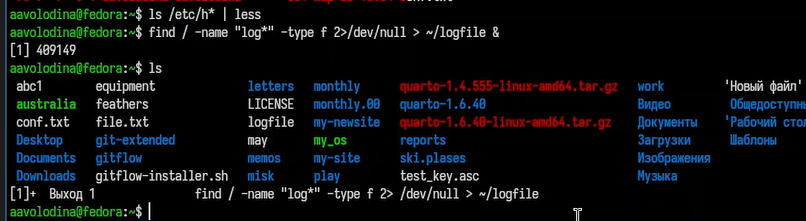{#fig-009 width=70%}

7) Удалим файл ~/logfile.([рис. @fig-010]).

{#fig-010 width=70%}

8) Запустим из консоли в фоновом режиме редактор gedit. и 9)Отобразим пароль для указанного имени файла:([рис. @fig-012]).([рис. @fig-011]).

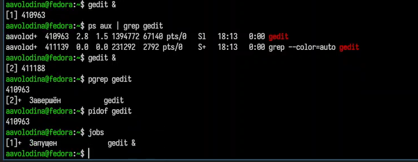{#fig-011 width=70%}

10)Прочтем справку (man) команды kill, после чего используем её для завершения процесса gedit.([рис. @fig-012]). ([рис. @fig-013]).

{#fig-012 width=70%}

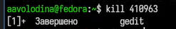{#fig-013 width=70%}

11)Выполним команды df и du, предварительно получив более подробную информацию об этих командах, с помощью команды man.([рис. @fig-014]). ([рис. @fig-015]).

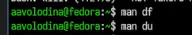{#fig-014 width=70%}

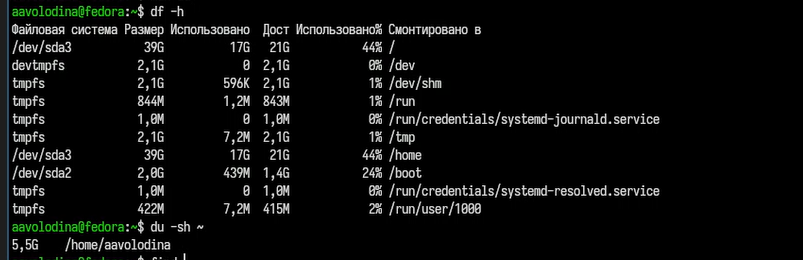{#fig-015 width=70%}

12)Воспользовавшись справкой команды find, выведите имена всех директорий, имею-
щихся в вашем домашнем каталоге.([рис. @fig-016]). 

{#fig-016 width=70%}

# Выводы

Ознакомилась с инструментами поиска файлов и фильтрации текстовых данных. Приобрела практические навыки: по управлению процессами (и заданиями), по проверке использования диска и обслуживанию файловых систем.

# Контрольные вопросы

1. Три стандартных потока:
   stdin (0) — ввод; stdout (1) — вывод; stderr (2) — вывод ошибок.
2. Разница > и >>:
   > — перезаписывает файл; >> — добавляет в конец.
3. Конвейер (|) — объединяет команды, передавая вывод последующей.
4. Программа — набор инструкций; процесс — выполняемый экземпляр программы.
5. PID — идентификатор процесса; PPID — родительского; UID/GID — реальные идентификаторы пользователя и группы, запустившего процесс.
6. Задачи (jobs) — фоновые процессы; управление: jobs для просмотра.
7. top и htop — мониторы процессов. htop удобнее в управлении и поиске; top гибче в настройке отображения.
8. find — поиск файлов по критериям. Пример:
   find /etc -name "*.conf" -print
9. Поиск по содержимому:
   find / -type f -exec grep -l "текст" {} \;
10. Свободное место на диске: df -h
11. Размер домашнего каталога: du -sh ~
12. Завершение зависшего процесса:
    kill <PID> (или kill -9), для фоновой задачи — kill %<номер>.
