---
## Title
title: "Лабораторная работа №9"
subtitle: "Архитектура компьютера"
license: "Володина Алиса Алексеевна"
---

## Докладчик

  * Володина Алиса Алексеевна
  * НКАбд-01-25 
  * Российский университет дружбы народов им. П. Лумумбы
  * 1032253521

## Цель работы

Освоение основных возможностей командной оболочки Midnight Commander. Приобретение навыков практической работы по просмотру каталогов и файлов; манипуляций с ними.

## Задание по mc

1. Изучите информацию о mc, вызвав в командной строке man mc.
2. Запустите из командной строки mc, изучите его структуру и меню
3. Выполните несколько операций в mc, используя управляющие клавиши 
4. Выполните основные команды меню левой (или правой) панели. 
5. Используя возможности подменю Файл , выполнить 4 пункта
6. С помощью соответствующих средств подменю Команда осуществить 4 пункта
7. Вызовите подменю Настройки . Освойте операции, определяющие структуру экрана mc (Full screen, Double Width, Show Hidden Files и т.д.)

## Задание по встроенному редактору mc

1. Создайте текстовой файл text.txt.
2. Откройте этот файл с помощью встроенного в mc редактора.
3. Вставьте в открытый файл небольшой фрагмент текста, скопированный из любого
другого файла или Интернета.
4. Проделайте с текстом следующие манипуляции, используя горячие клавиши:
5. Откройте файл с исходным текстом на некотором языке программирования (например C или Java)
6. Используя меню редактора, включите подсветку синтаксиса, если она не включена, или выключите, если она включена.

## Теоретическое введение

Командная оболочка — интерфейс взаимодействия пользователя с операционной систе- мой и программным обеспечением посредством команд. Midnight Commander (или mc) — псевдографическая командная оболочка для UNIX/Linux систем. Для запуска mc необходимо в командной строке набрать mc и нажать Enter . Рабочее пространство mc имеет две панели, отображающие по умолчанию списки файлов двух каталогов

## Выполнение лабораторной работы

## Изучим информацию о mc, вызвав в командной строке man mc. 

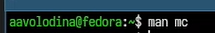{#fig-001 width=70%}

## Запустим из командной строки mc, изучим его структуру и меню ([рис. @fig-002]).

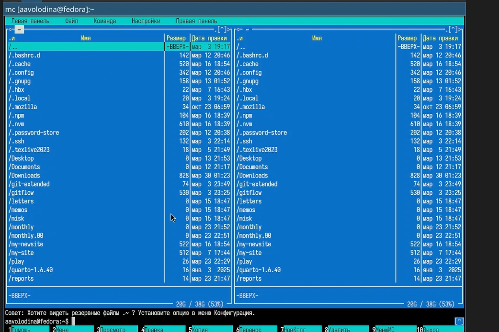{#fig-002 width=70%}

## Выполните несколько операций в mc, используя управляющие клавиши (операции
с панелями; выделение/отмена выделения файлов, копирование/перемещение фай-
лов, получение информации о размере и правах доступа на файлы и/или каталоги
и т.п.) 

## правая панель

{#fig-003 width=70%}

## левая панель

{#fig-004 width=70%}

## подсветка файла

{#fig-005 width=70%}

## копирование файла

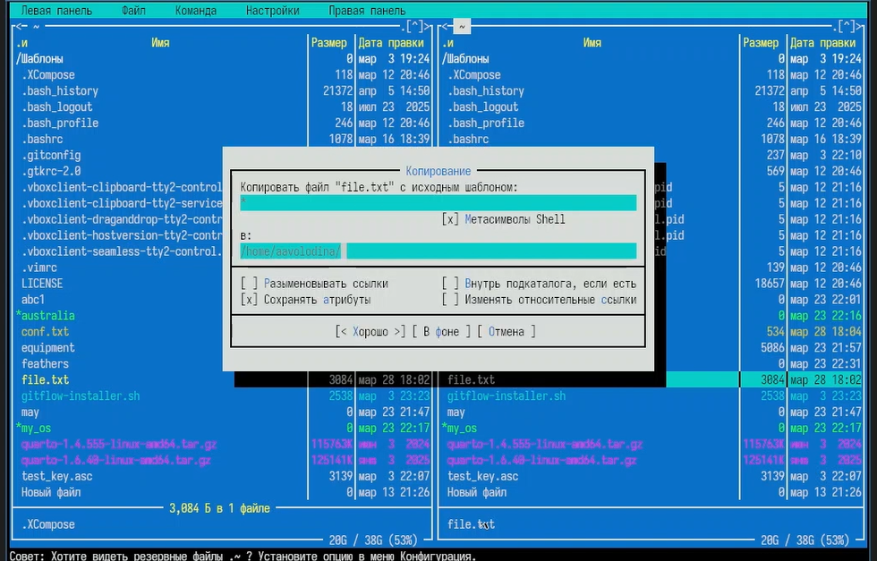{#fig-006 width=70%}

## перемещение файла

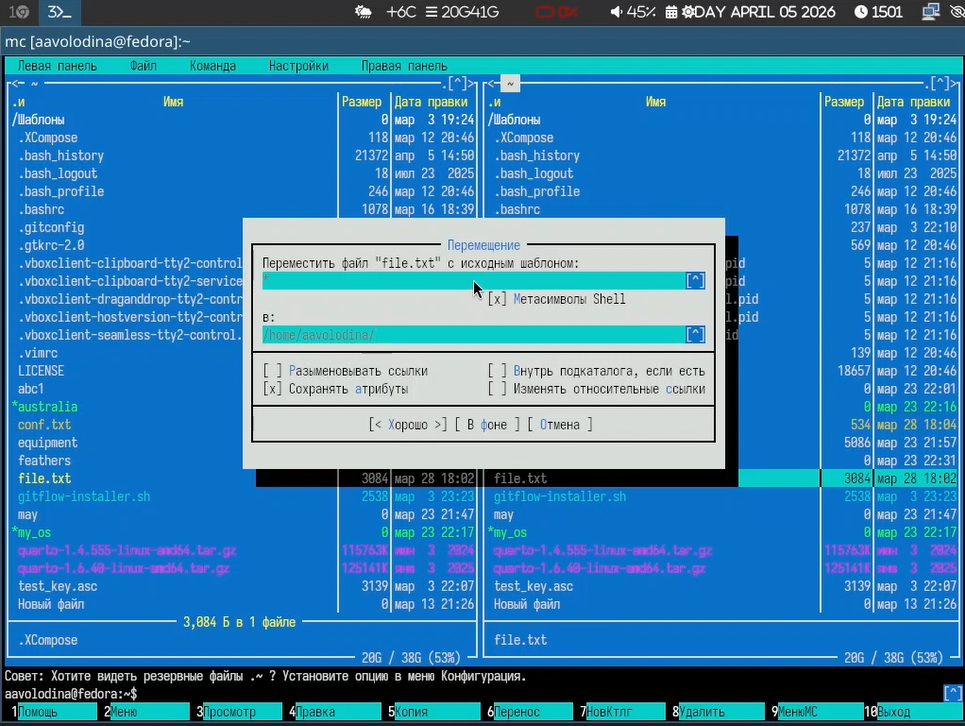{#fig-007 width=70%}

## информация о каталоге

{#fig-008 width=70%}

## Выполните основные команды меню левой (или правой) панели. Оцените степень подробности вывода информации о файлах.

## список возможных форматов

{#fig-009 width=70%}

## укороченный формат

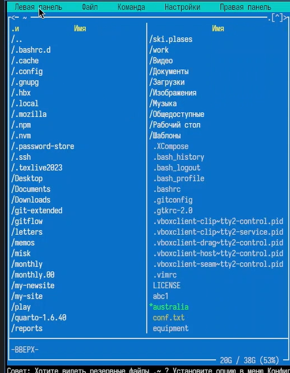{#fig-010 width=70%}

## расширенный формат

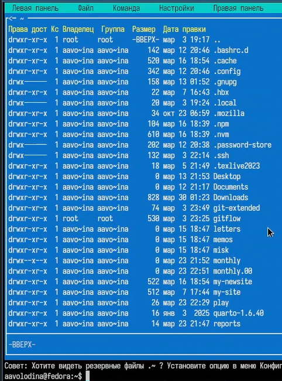{#fig-011 width=70%}

## заданный пользователем формат

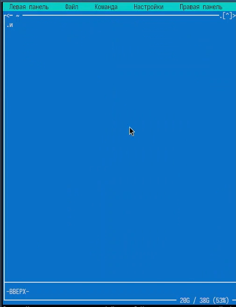{#fig-012 width=70%}

## Вывод

Расширенный формат явлется наиболее подробным 

## Используя возможности подменю Файл , выполним: – просмотр содержимого текстового файла;

{#fig-013 width=70%}

## редактирование содержимого текстового файла (без сохранения результатов редактирования);

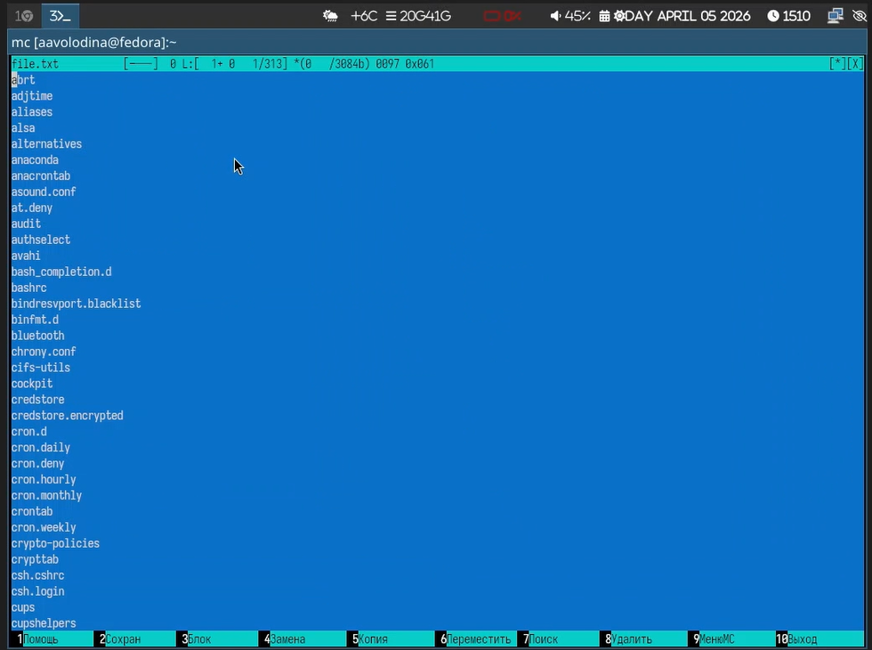{#fig-014 width=70%}

## создание каталога;

{#fig-015 width=70%}

## копирование в файлов в созданный каталог.

{#fig-016 width=70%}

## С помощью соответствующих средств подменю Команда осуществим :

– поиск в файловой системе файла с заданными условиями (например, файла с расширением .c или .cpp, содержащего строку main);

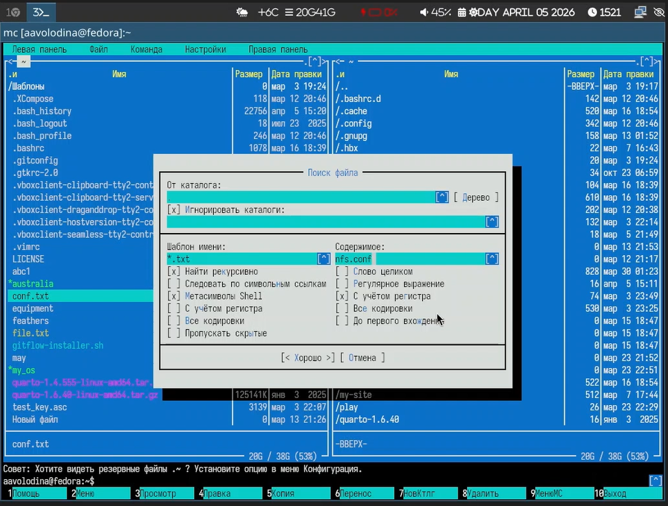{#fig-017 width=70%}

## поиск с учетом фильтра

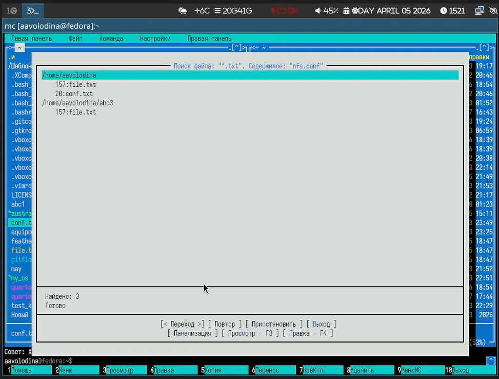{#fig-018 width=70%}

## выбор и повторение одной из предыдущих команд;

{#fig-019 width=70%}

## переход в домашний каталог;

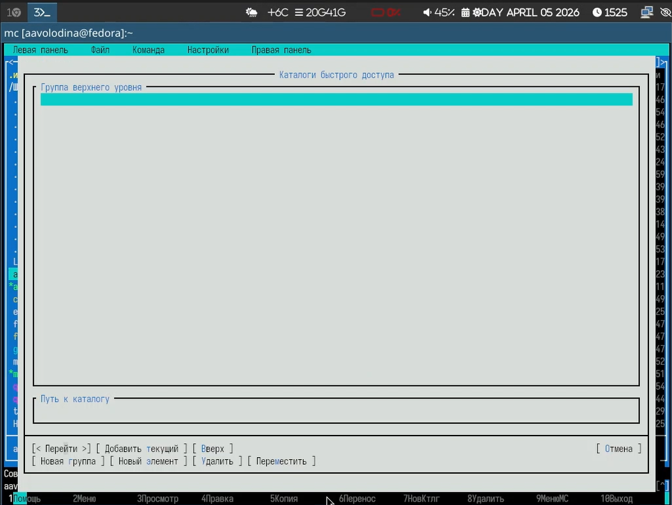{#fig-020 width=70%}

## анализ файла меню и файла расширений.

{#fig-021 width=70%}

## Вызовите подменю Настройки . Освойте операции, определяющие структуру экрана mc (Full screen, Double Width, Show Hidden Files и т.д.)

{#fig-022 width=70%}

## show hiden files

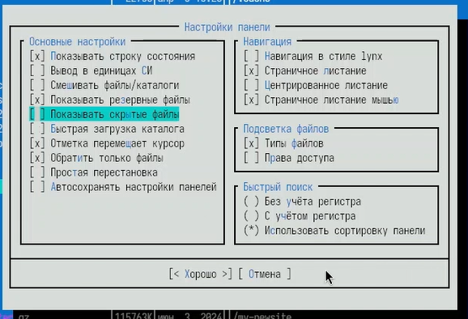{#fig-023 width=70%}

## Создадим текстовой файл text.txt. 

{#fig-024 width=70%}

## Откройтем этот файл с помощью встроенного в mc редактора.

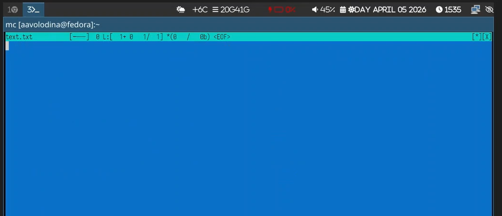{#fig-025 width=70%}

## Вставим в открытый файл небольшой фрагмент текста, скопированный из любого другого файла или Интернета.

{#fig-026 width=70%}

## Проделаем с текстом следующие манипуляции, используя горячие клавиши:

## Удалим строку текста. 

{#fig-027 width=70%}

## Выделим фрагмент текста и скопируем го на новую строку.

{#fig-028 width=70%}

## выделим строку

{#fig-029 width=70%}

 ## Выделим фрагмент текста и перенесем его на новую строку.

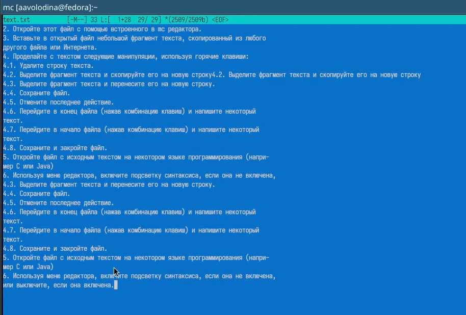{#fig-030 width=70%}

## Сохраним файл.

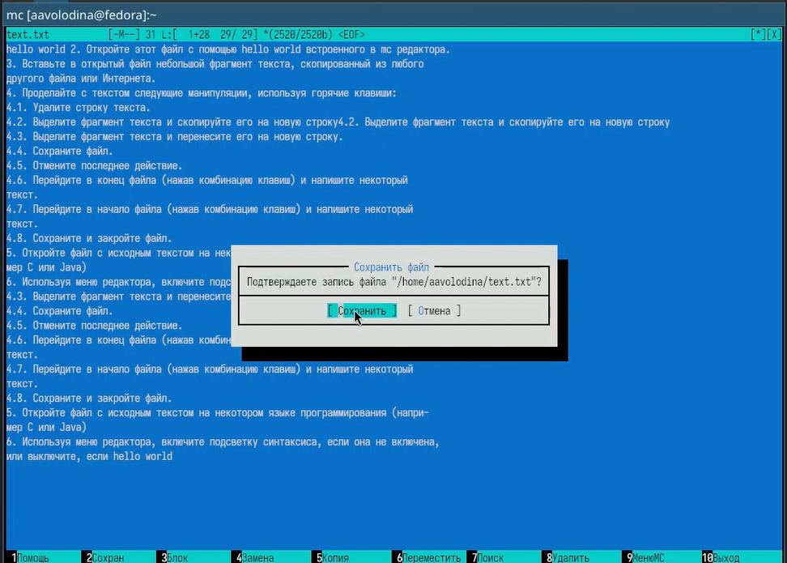{#fig-031 width=70%}

## Отменим последнее действие.

{#fig-032 width=70%}

## Перем в конец файла (нажав комбинацию клавиш) и напишим некоторый текст.

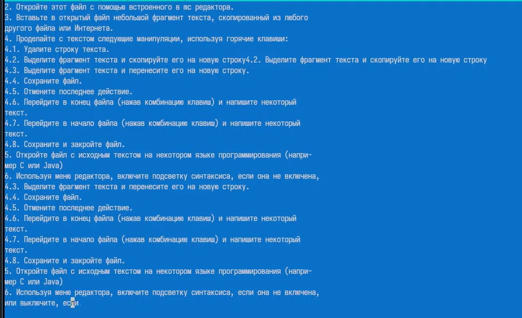{#fig-033 width=70%}

## переход в конец файла

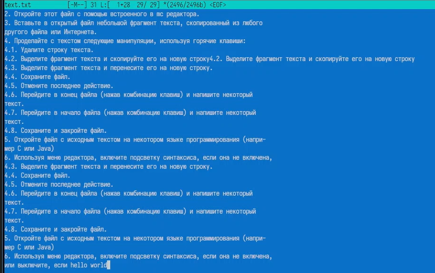{#fig-034 width=70%}

## Перем в начало файла (нажав комбинацию клавиш) и напим некоторый текст. 

{#fig-035 width=70%}

## переход в начало файла

{#fig-036 width=70%}

## Сохраним и закроем файл. 

{#fig-037 width=70%}

## Откроем файл с исходным текстом на некотором языке программирования (например C или Java) 

{#fig-037 width=70%}

## Используя меню редактора, включим подсветку синтаксиса, если она не включена, или выключим, если она включена.

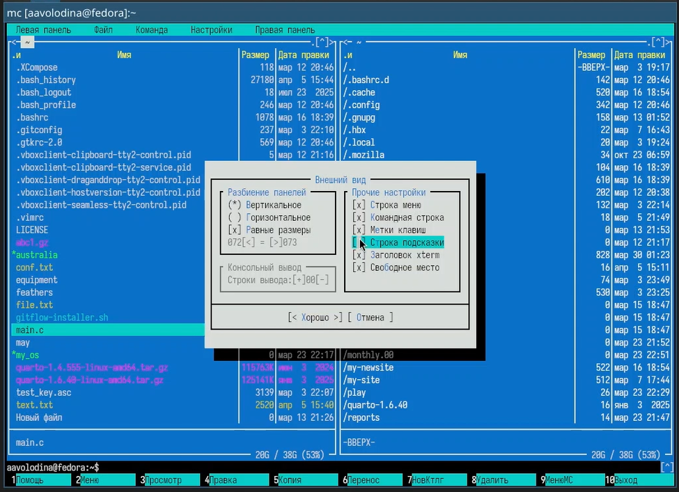{#fig-038 width=70%}

## Включение подсветки

{#fig-039 width=70%}

## Выводы

Я освоила основные возможности командной оболочки Midnight Commander. Приобрела навыки практической работы по просмотру каталогов и файлов; манипуляций с ними.

## Контрольные вопросы

## 1. Режимы панелей

Информация: данные о файле и ФС (свободное место).
Дерево: древовидная навигация по каталогам.

## 2. Операции с файлами: shell vs mc

Копирование: cp / F5
Перемещение: mv / F6
Удаление: rm / F8
Просмотр: cat, less / F3
Правка: nano, vim / F4

## 3. Меню панели → Формат списка

Стандартный, Ускоренный, Расширенный, Определённый пользователем.

## 4. Меню Файл

F3 (просмотр), F4 (правка), F5 (копия), F6 (переименование), F7 (создать каталог), F8 (удалить), F10 (выход), права доступа, ссылки (жёсткая/симв.), смена владельца.

## 5. Меню Команда

Дерево каталогов, поиск файла, сравнить каталоги, размеры папок, история команд, быстрые каталоги, восстановление файлов, редактирование меню/расширений/цветов.

## 6. Меню Настройки

Конфигурация, внешний вид, подтверждения, виртуальные ФС, распознавание клавиш.

## 7. Функциональные клавиши mc

F1 (справка), F2 (польз. меню), F3 (просмотр), F4 (правка), F5 (копия), F6 (перенос), F7 (создать папку), F8 (удалить), F9 (верхнее меню), F10 (выход).

## 8. Команды встроенного редактора mc

Ctrl+Y (удалить строку), Ctrl+U (отмена), Ins (вставка/замена), F7 (поиск), F4 (замена), F5 (копировать), F6 (вырезать), F8 (удалить фрагмент), F2 (сохранить), F10 (выход).

## 9. Пользовательское меню (~/.mc/menu)

[global] (всегда), [extension.xxx] (для типа файлов). Пункт: описание → команда. Переменные: %f (файл), %d (каталог).

## 10. Действия над текущим файлом (панели)

Активная панель → текущий каталог. Навигация (стрелки, Enter, Tab). Операции над выделенным файлом (F3, F4, F5→вторая панель, F6, F8). Выделение групп (Insert / Ctrl+T).
