# Цель работы

Освоение основных возможностей командной оболочки Midnight Commander. Приобретение навыков практической работы по просмотру каталогов и файлов; манипуляций с ними.

# Задание по mc

1. Изучите информацию о mc, вызвав в командной строке man mc.
2. Запустите из командной строки mc, изучите его структуру и меню
3. Выполните несколько операций в mc, используя управляющие клавиши (операции
с панелями; выделение/отмена выделения файлов, копирование/перемещение фай-
лов, получение информации о размере и правах доступа на файлы и/или каталоги
и т.п.)
4. Выполните основные команды меню левой (или правой) панели. Оцените степень
подробности вывода информации о файлах.
5. Используя возможности подменю Файл , выполните:
– просмотр содержимого текстового файла;
– редактирование содержимого текстового файла (без сохранения результатов
редактирования);
– создание каталога;
– копирование в файлов в созданный каталог.
6. С помощью соответствующих средств подменю Команда осуществите:
– поиск в файловой системе файла с заданными условиями (например, файла
с расширением .c или .cpp, содержащего строку main);
– выбор и повторение одной из предыдущих команд;
– переход в домашний каталог;
– анализ файла меню и файла расширений.
7. Вызовите подменю Настройки . Освойте операции, определяющие структуру экрана mc
(Full screen, Double Width, Show Hidden Files и т.д.)

# Задание по встроенному редактору mc

1. Создайте текстовой файл text.txt.
2. Откройте этот файл с помощью встроенного в mc редактора.
3. Вставьте в открытый файл небольшой фрагмент текста, скопированный из любого
другого файла или Интернета.
4. Проделайте с текстом следующие манипуляции, используя горячие клавиши:
4.1. Удалите строку текста.
4.2. Выделите фрагмент текста и скопируйте его на новую строку.
4.3. Выделите фрагмент текста и перенесите его на новую строку.
4.4. Сохраните файл.
4.5. Отмените последнее действие.
4.6. Перейдите в конец файла (нажав комбинацию клавиш) и напишите некоторый
текст.
4.7. Перейдите в начало файла (нажав комбинацию клавиш) и напишите некоторый
текст.
4.8. Сохраните и закройте файл.
5. Откройте файл с исходным текстом на некотором языке программирования (напри-
мер C или Java)
6. Используя меню редактора, включите подсветку синтаксиса, если она не включена,
или выключите, если она включена.

# Теоретическое введение

Командная оболочка — интерфейс взаимодействия пользователя с операционной систе- мой и программным обеспечением посредством команд. Midnight Commander (или mc) — псевдографическая командная оболочка для UNIX/Linux систем. Для запуска mc необходимо в командной строке набрать mc и нажать Enter . Рабочее пространство mc имеет две панели, отображающие по умолчанию списки файлов двух каталогов

# Выполнение лабораторной работы

1. Изучим информацию о mc, вызвав в командной строке man mc. ([рис. @fig-001]).

{#fig-001 width=70%}

2. Запустим из командной строки mc, изучим его структуру и меню ([рис. @fig-002]).

{#fig-002 width=70%}

3. Выполните несколько операций в mc, используя управляющие клавиши (операции
с панелями; выделение/отмена выделения файлов, копирование/перемещение фай-
лов, получение информации о размере и правах доступа на файлы и/или каталоги
и т.п.) ([рис. @fig-003]). ([рис. @fig-004]). ([рис. @fig-005]). ([рис. @fig-006]).([рис. @fig-007]). ([рис. @fig-008]).

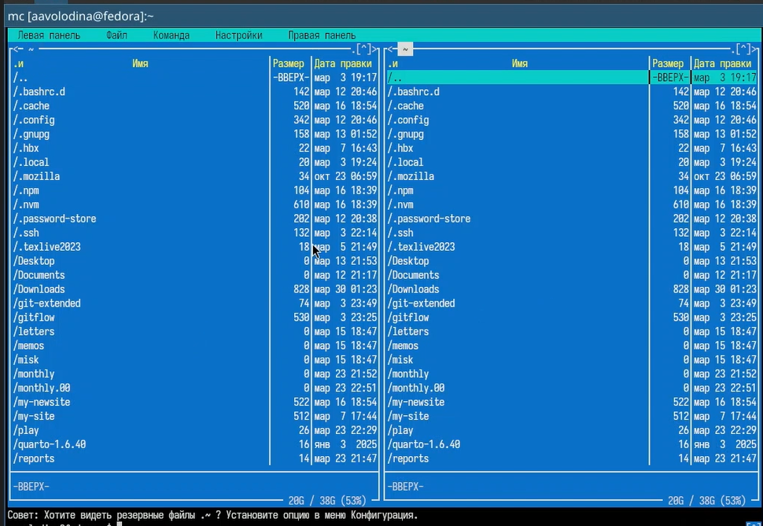{#fig-003 width=70%}

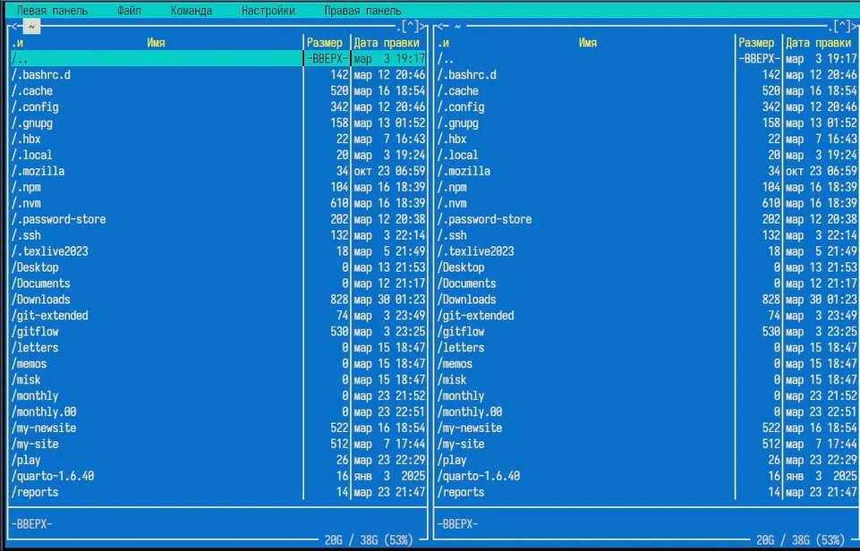{#fig-004 width=70%}

{#fig-005 width=70%}

{#fig-006 width=70%}

{#fig-007 width=70%}

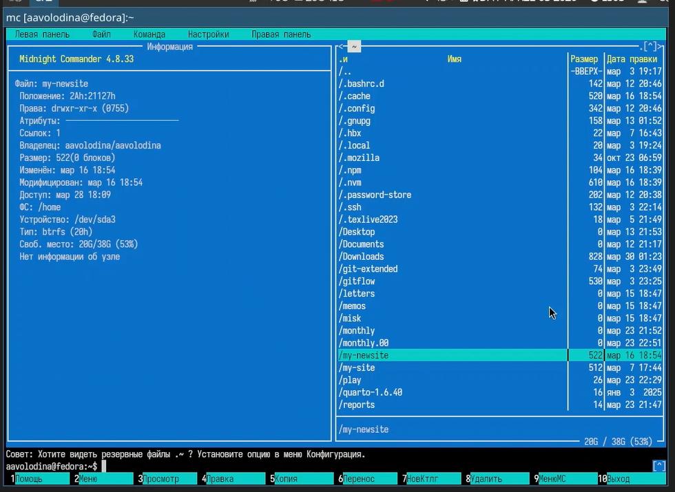{#fig-008 width=70%}

4. Выполните основные команды меню левой (или правой) панели. Оцените степень подробности вывода информации о файлах. ([рис. @fig-009]). ([рис. @fig-010]). ([рис. @fig-011]). ([рис. @fig-012]).

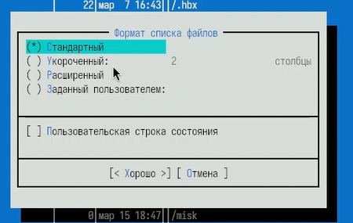{#fig-009 width=70%}

{#fig-010 width=70%}

{#fig-011 width=70%}

{#fig-012 width=70%}

Расширенный формат явлется наиболее подробным 

5. Используя возможности подменю Файл , выполним:

– просмотр содержимого текстового файла; ([рис. @fig-013]).

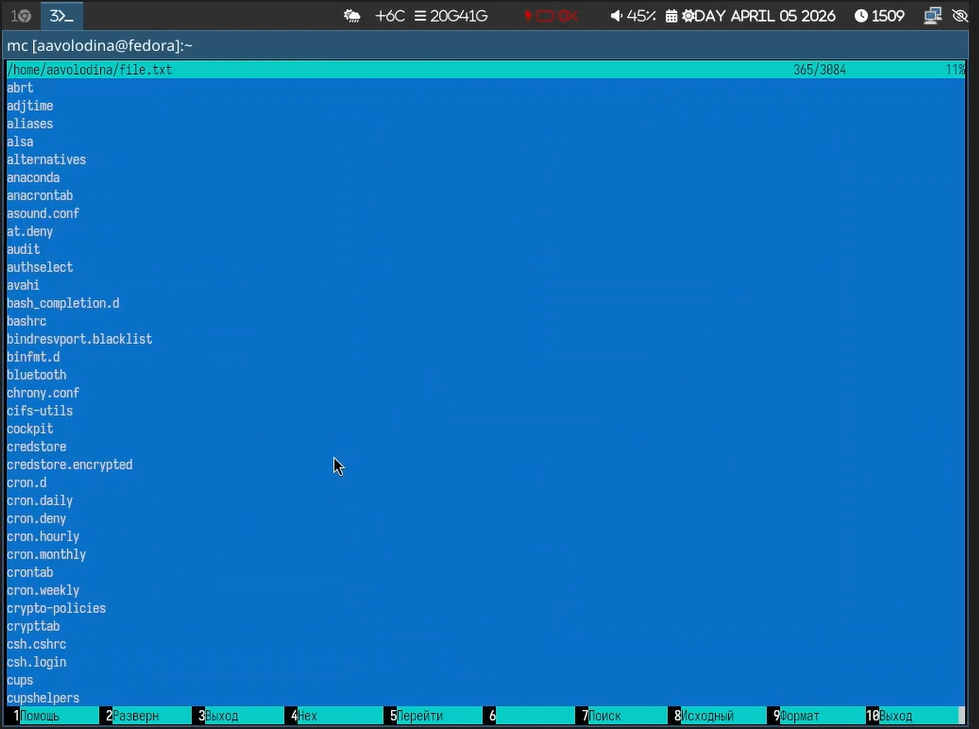{#fig-013 width=70%}

– редактирование содержимого текстового файла (без сохранения результатов редактирования);([рис. @fig-014]).

{#fig-014 width=70%}

– создание каталога;([рис. @fig-015]).

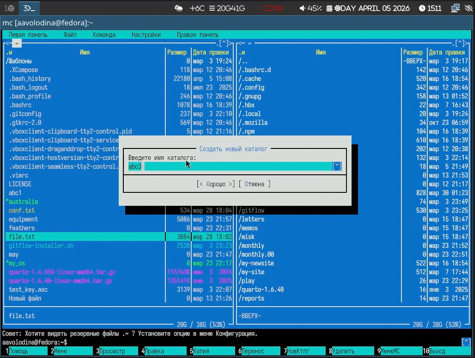{#fig-015 width=70%}

– копирование в файлов в созданный каталог.([рис. @fig-016]).

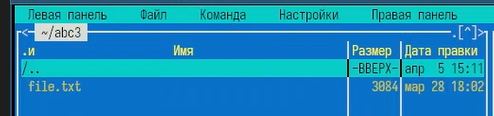{#fig-016 width=70%}

6. С помощью соответствующих средств подменю Команда осуществим :

– поиск в файловой системе файла с заданными условиями (например, файла с расширением .c или .cpp, содержащего строку main); ([рис. @fig-017]). ([рис. @fig-018]).

{#fig-017 width=70%}

{#fig-018 width=70%}

– выбор и повторение одной из предыдущих команд;([рис. @fig-019]).

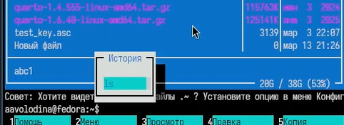{#fig-019 width=70%}

– переход в домашний каталог;([рис. @fig-020]).

{#fig-020 width=70%}

– анализ файла меню и файла расширений.([рис. @fig-021]).

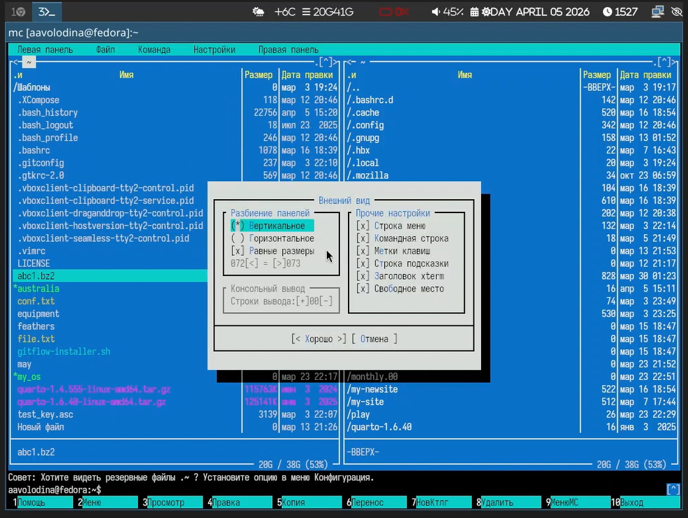{#fig-021 width=70%}

7. Вызовите подменю Настройки . Освойте операции, определяющие структуру экрана mc (Full screen, Double Width, Show Hidden Files и т.д.)([рис. @fig-022]). ([рис. @fig-023]).

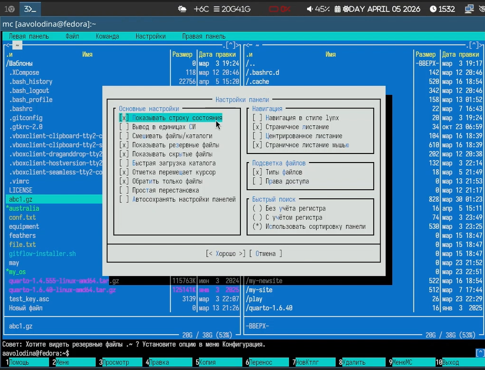{#fig-022 width=70%}

{#fig-023 width=70%}

1. Создадим текстовой файл text.txt. ([рис. @fig-024]).

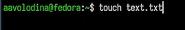{#fig-024 width=70%}

2. Откройтем этот файл с помощью встроенного в mc редактора.([рис. @fig-025]).

{#fig-025 width=70%}

3. Вставим в открытый файл небольшой фрагмент текста, скопированный из любого другого файла или Интернета.([рис. @fig-026]).

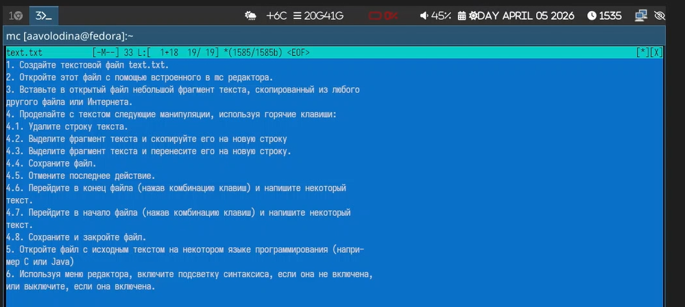{#fig-026 width=70%}

4. Проделаем с текстом следующие манипуляции, используя горячие клавиши:

4.1. Удалим строку текста. ([рис. @fig-027]).

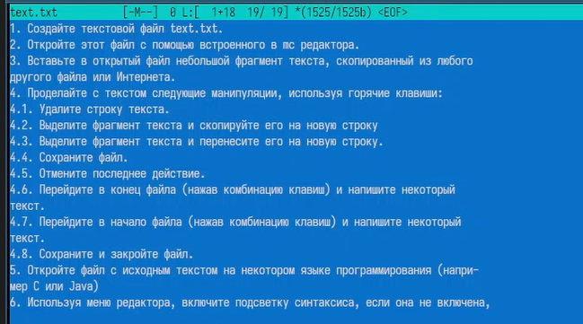{#fig-027 width=70%}

4.2. Выделим фрагмент текста и скопируем го на новую строку.([рис. @fig-028]). ([рис. @fig-029]).

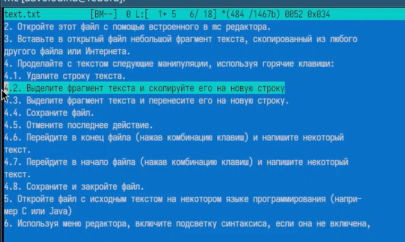{#fig-028 width=70%}

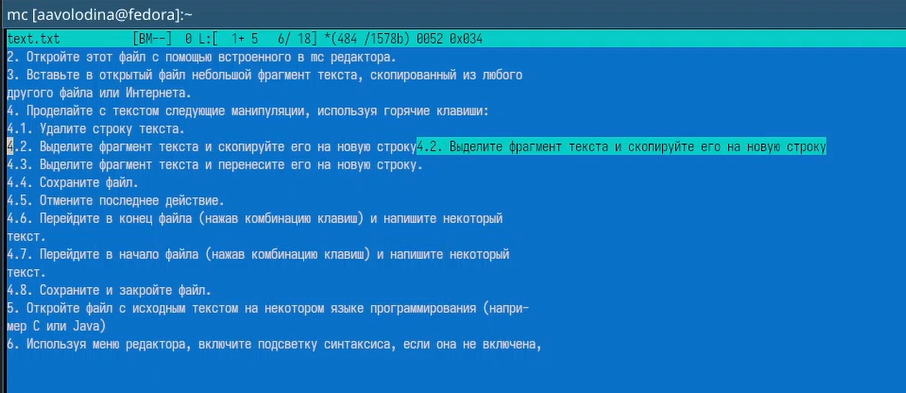{#fig-029 width=70%}

4.3. Выделим фрагмент текста и перенесем его на новую строку.([рис. @fig-030]).

{#fig-030 width=70%}

4.4. Сохраним файл.([рис. @fig-031]).

{#fig-031 width=70%}

4.5. Отменим последнее действие.([рис. @fig-032]).

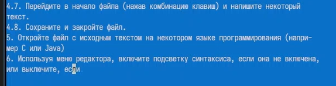{#fig-032 width=70%}

4.6. Перем в конец файла (нажав комбинацию клавиш) и напишим некоторый текст.([рис. @fig-033]). ([рис. @fig-034]).

{#fig-033 width=70%}

{#fig-034 width=70%}

4.7. Перем в начало файла (нажав комбинацию клавиш) и напим некоторый текст. ([рис. @fig-035]). ([рис. @fig-036]).

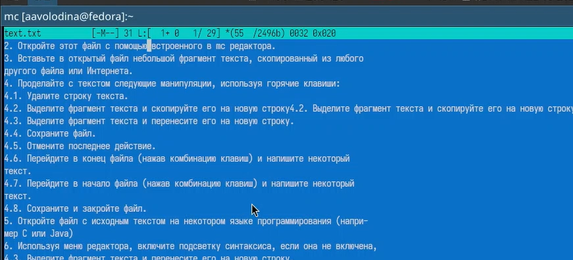{#fig-035 width=70%}

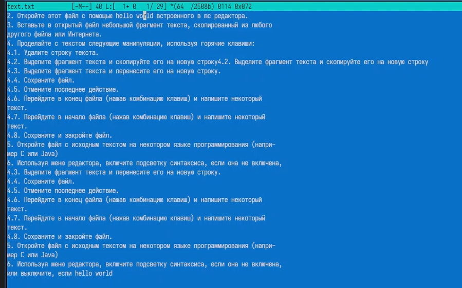{#fig-036 width=70%}

4.8. Сохраним и закроем файл. ([рис. @fig-037]).

{#fig-037 width=70%}

5. Откроем файл с исходным текстом на некотором языке программирования (например C или Java) ([рис. @fig-037]).

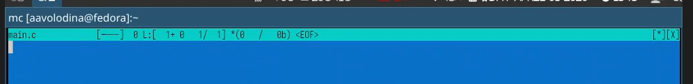{#fig-037 width=70%}

6. Используя меню редактора, включим подсветку синтаксиса, если она не включена, или выключим, если она включена.([рис. @fig-038]). ([рис. @fig-039]).

{#fig-038 width=70%}

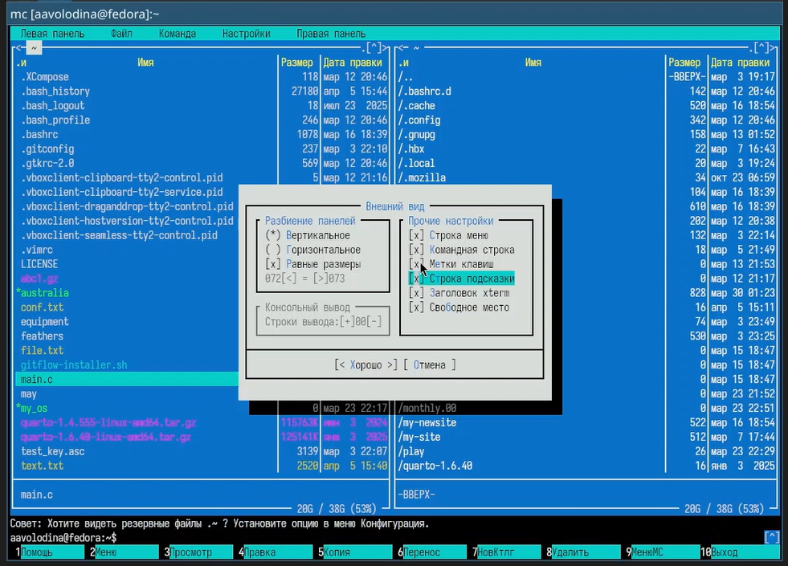{#fig-039 width=70%}

# Выводы

Я освоила основные возможности командной оболочки Midnight Commander. Приобрела навыки практической работы по просмотру каталогов и файлов; манипуляций с ними.

# Контрольные вопросы

1. Режимы работы панелей в mc

В Midnight Commander панели могут работать в двух дополнительных режимах:

Информация — на панель выводятся сведения о текущем выделенном файле и о файловой системе (свободное место, тип).

Дерево — на панели отображается древовидная структура каталогов для быстрой навигации.

2. Операции с файлами: shell и меню mc

Большинство операций можно выполнить как командами оболочки (shell), так и через меню/клавиши mc.
Примеры:

Копирование (cp в shell / F5 в mc)

Перемещение/Переименование (mv / F6)

Удаление (rm / F8)

Просмотр файла (cat, less / F3)

Правка файла (nano, vim / F4)

3. Структура меню левой/правой панели (Формат списка)

Позволяет выбрать вид отображения файлов:

Стандартный — имя, размер, время правки.

Ускоренный — только имена в несколько столбцов.

Расширенный — права доступа, владелец, группа, размер, время.

Определённый пользователем — вывод заданных пользователем полей.

4. Структура меню Файл

Содержит команды для работы с файлами и каталогами:

Просмотр (F3) — просмотр файла без правки.

Правка (F4) — редактирование файла.

Копирование (F5) — копирование файлов/каталогов.

Права доступа (Ctrl+x c) — изменение прав.

Жёсткая ссылка (Ctrl+x l) — создание жёсткой ссылки.

Символическая ссылка (Ctrl+x s) — создание символической ссылки.

Владелец/группа (Ctrl+x o) — смена владельца.

Переименование (F6) — перемещение/переименование.

Создание каталога (F7) — создание папки.

Удалить (F8) — удаление файлов/папок.

Выход (F10) — завершение работы mc.

5. Структура меню Команда

Общие команды для управления mc и системой:

Дерево каталогов — отображение структуры папок.

Поиск файла — поиск по параметрам.

Переставить панели — смена панелей местами.

Сравнить каталоги (Ctrl+x d) — сравнение содержимого двух папок.

Размеры каталогов — отображение реального размера папок.

История командной строки — список ранее введённых команд.

Каталоги быстрого доступа (Ctrl+) — быстрая смена каталога.

Восстановление файлов — для ext2/ext3.

Редактировать файл расширений — настройка ассоциаций файлов.

Редактировать файл меню (F2) — редактирование пользовательского меню.

Редактировать файл расцветки имён — настройка цвета для типов файлов.

6. Структура меню Настройки

Настройки внешнего вида и поведения mc:

Конфигурация — основные настройки панелей.

Внешний вид — отображение строки меню, подсказок, цветов.

Биты символов — настройка обработки символов терминалом.

Подтверждение — запрос подтверждения при удалении/выходе.

Распознание клавиш — тестирование клавиш.

Виртуальные ФС — настройки VFS (тайм-аут, пароль).

7. Встроенные команды mc (функциональные клавиши)

F1 — контекстная подсказка

F2 — пользовательское меню

F3 — просмотр файла

F4 — редактирование файла

F5 — копирование

F6 — перемещение/переименование

F7 — создание каталога

F8 — удаление

F9 — активация верхнего меню

F10 — выход из mc

8. Команды встроенного редактора mc

Ctrl+y — удалить строку

Ctrl+u — отмена последнего действия

Ins — режим вставки/замены

F7 — поиск (с регулярными выражениями)

Ctrl+F7 — повтор поиска

F4 — замена

F3 — начало/конец выделения

F5 — копировать выделенный фрагмент

F6 — переместить выделенный фрагмент

F8 — удалить выделенный фрагмент

F2 — сохранить файл

F10 — выход из редактора

9. Средства mc для создания пользовательского меню (файл ~/.mc/menu)

Файл ~/.mc/menu позволяет создавать собственные меню:

Секция [global] — пункты, доступные всегда.

Секции с расширениями (например, [extension.sh]) — пункты только для файлов с определённым расширением.

Формат пункта: строка с описанием, следующая строка (с пробелом) — команда.

Переменные: %f (текущий файл), %d (текущий каталог) и другие.

Пример: text

Открыть в редакторе edit %f

10. Средства mc для действий над текущим файлом (Панели)

Активная панель показывает содержимое текущего каталога (путь отображается в заголовке).
Управление панелями позволяет выполнять действия над текущим (выделенным) файлом:

Навигация по каталогам (стрелки, Enter, Tab для смены панели).

Команды над файлом (F3 — просмотр, F4 — правка, F5 — копирование на вторую панель, F6 — перемещение, F8 — удаление).

Выделение файлов (Insert или Ctrl+t) для групповых операций.
