# Цель работы

Познакомиться с операционной системой Linux. Получить практические навыки работы с редактором vi, установленным по умолчанию практически во всех дистрибутивах.

# Задание 1. Создание нового файла с использованием vi

1. Создайте каталог с именем ~/work/os/lab06.
2. Перейдите во вновь созданный каталог.
3. Вызовите vi и создайте файл hello.sh
4. Нажмите клавишу i и вводите следующий текст.
5. Нажмите клавишу Esc для перехода в командный режим после завершения ввода текста.
6. Нажмите : для перехода в режим последней строки и внизу вашего экрана появится приглашение в виде двоеточия.
7. Нажмите w (записать) и q (выйти), а затем нажмите клавишу Enter для сохранения вашего текста и завершения работы.
8. Сделайте файл исполняемым

# Задание 2. Редактирование существующего файла

1. Вызовите vi на редактирование файла
2. Установите курсор в конец слова HELL второй строки.
3. Перейдите в режим вставки и замените на HELLO. Нажмите Esc для возврата в командный режим.
4. Установите курсор на четвертую строку и сотрите слово LOCAL.
5. Перейдите в режим вставки и наберите следующий текст: local, нажмите Esc для возврата в командный режим.
6. Установите курсор на последней строке файла. Вставьте после неё строку, содержащую следующий текст: echo $HELLO.
7. Нажмите Esc для перехода в командный режим.
8. Удалите последнюю строку.
9. Введите команду отмены изменений u для отмены последней команды.
10. Введите символ : для перехода в режим последней строки. Запишите произведённые
изменения и выйдите из vi.

# Теоретическое введение

В большинстве дистрибутивов Linux в качестве текстового редактора по умолчанию устанавливается интерактивный экранный редактор vi (Visual display editor). Редактор vi имеет три режимаработы:
–командныйрежим—предназначен для ввода команд редактирования и навигации по редактируемому файлу; режим вставки—предназначен для ввода содержания редактируемого файла; 
режим последней(или командной) строки—используется для записи изменений в файловых редактора. Для вызова редактора vi необходимо указать команду vi и имя редактируемого файла: vi При этом в случае отсутствия файла с указанным именем будет создан такой файл.Переход в командный режим осуществляется нажатием клавиши Esc. Для выхода из редактора vi необходимо перейти в режим последней строки: находясь в командном режиме, нажать Shift-; (по сути символ:—двоеточие),затем:–набрать символы wq, если перед выходом из редактора требуется записать изменения в файл;–набрать символ q(или q!), если требуется выйти из редактора без сохранения

# Выполнение лабораторной работы

1. Создадим каталог с именем ~/work/os/lab06. ([рис. @fig-001]).

{#fig-001 width=70%}

2. Перейдем во вновь созданный каталог. ([рис. @fig-002]).

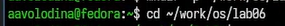{#fig-002 width=70%}

3. Вызовем vi и создадим файл hello.sh ([рис. @fig-003]). ([рис. @fig-004]).

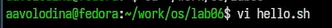{#fig-003 width=70%}

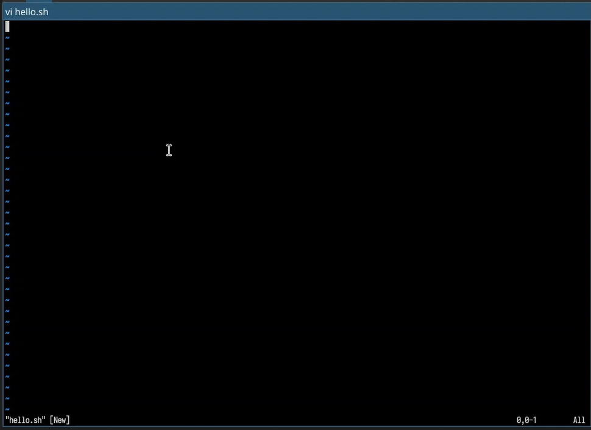{#fig-004 width=70%}

4. Нажмем клавишу i и введем следующий текст ([рис. @fig-005]).

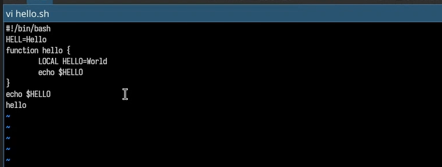{#fig-005 width=70%}

5. Нажмем клавишу Esc для перехода в командный режим после завершения ввода текста

6. Нажмем : для перехода в режим последней строки и внизу экрана появится приглашение в виде двоеточия.

7. Нажмем w (записать) и q (выйти), а затем нажмем клавишу Enter для сохранения текста и завершения работы.([рис. @fig-006]).

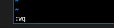{#fig-006 width=70%}

8. Сделаем файл исполняемым ([рис. @fig-007]).

{#fig-007 width=70%}

1. Вызовем vi на редактирование файла ([рис. @fig-008]).

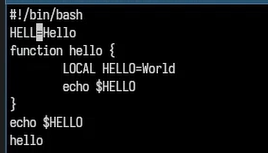{#fig-008 width=70%}

2. Установим курсор в конец слова HELL второй строки.([рис. @fig-009]).

{#fig-009 width=70%}

3. Перейдем в режим вставки и заменим на HELLO. Нажмем Esc для возврата в командный режим.([рис. @fig-010]).

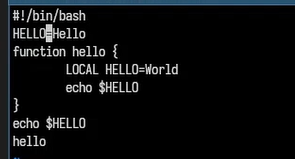{#fig-010 width=70%}

4. Установим курсор на четвертую строку и сотрем слово LOCAL ([рис. @fig-011]).

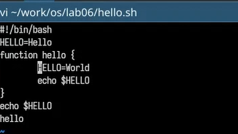{#fig-011 width=70%}

5. Перейдем в режим вставки и наберем следующий текст: local, нажмем Esc для возврата в командный режим.([рис. @fig-012]).

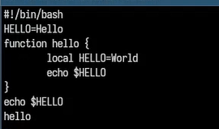{#fig-012 width=70%}

6. Установим курсор на последней строке файла. Вставим после неё строку, содержащую следующий текст: echo $HELLO.([рис. @fig-013]).

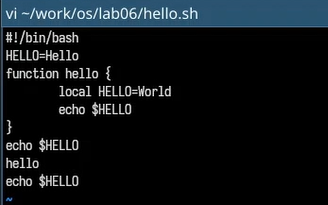{#fig-013 width=70%}

7. Нажмем Esc для перехода в командный режим.

8. Удалим последнюю строку ([рис. @fig-014]).

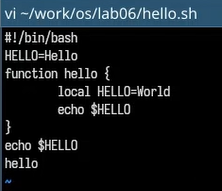{#fig-014 width=70%}

9. Введем команду отмены изменений u для отмены последней команды ([рис. @fig-015]).

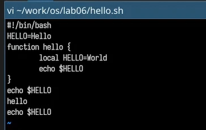{#fig-015 width=70%}

10. Введем символ : для перехода в режим последней строки. Запишим произведённые изменения и выйдем из vi. ([рис. @fig-016]).

{#fig-016 width=70%}

# Выводы

Я познакомилась с операционной системой Linux. Получила практические навыки работы с редактором vi, установленным по умолчанию практически во всех дистрибутивах.

# Контрольные вопросы

1.Режимы работы vi:
командный (ввод команд перемещения, удаления и др.), режим ввода (вставка/замена текста), режим последней строки (команды с двоеточием, поиск, замена, сохранение).

2.Выйти без сохранения:
в командном режиме набрать `:q!` и нажать Enter.

3.Команды позиционирования:
`h` (влево), `j` (вниз), `k` (вверх), `l` (вправо); `w` (к началу следующего слова), `b` (к началу предыдущего слова), `0` (в начало строки), `$` (в конец строки), `G` (в конец файла), `gg` (в начало файла).

4.Слово в vi:
последовательность букв, цифр и знаков подчеркивания, ограниченная пробелами, знаками табуляции, знаками препинания или концами строк.

5.Переход в начало/конец файла:
в командном режиме `gg` — в начало, `G` — в конец.

6.Основные группы команд редактирования:
удаление (`dd`, `dw`, `x`), вставка (`i` — перед курсором, `a` — после), замена (`r` — один символ, `R` — режим замены), копирование (`yy`), вставка из буфера (`p`, `P`), отмена (`u`).

7.Заполнить строку символами $
в командном режиме перейти в начало строки (`0`), нажать `r` и ввести `$`, затем повторять `r$` или использовать `R` и удерживать `$` либо применить `:s/.*/\$\\$\\$.../` — проще: `0R` и нажать `$` нужное количество раз.

8.Отмена некорректного действия:
в командном режиме нажать `u` (отмена последнего изменения); повторное `u` отменяет отмену. `U` отменяет все изменения в текущей строке.

9.Основные группы команд режима последней строки:
работа с файлами (`:w` — сохранить, `:q` — выйти, `:wq` — сохранить и выйти), поиск и замена (`:/pattern`, `:s/old/new/g`), установка параметров (`:set nu`, `:set ic`), выполнение внешних команд (`:!команда`).

10.Определить позицию конца строки без перемещения курсора:
в командном режиме нажать `$` — курсор перейдет в конец строки; также можно включить нумерацию строк (`:set nu`) или посмотреть на статусную строку (в некоторых версиях vi).

11.Анализ опций vi:
опций около 100–200 (зависит от реализации). Узнать их назначение можно командами `:set all` (показать все опции и их значения), `:set option?` (значение конкретной опции), `:help option-list`. Основные опции: `autoindent`, `ignorecase`, `number`, `tabstop`.

12.Определить режим работы:
по реакции клавиш: в командном режиме буквы перемещают курсор, в режиме ввода — печатают текст. Индикатор режима отображается в строке состояния (например, `-- INSERT --`). Если не уверен — нажать `Esc` (гарантированно переключит в командный режим).

13.Граф взаимосвязи режимов vi (схема): 
   Командный режим (исходный) → (i, a, o, и др.) → Режим ввода → (Esc) → Командный режим.  
   Командный режим → (:) → Режим последней строки → (Enter или Esc) → Командный режим.  
   Режим ввода и режим последней строки напрямую не переключаются, только через командный.
