# Цель работы

Познакомиться с операционной системой Linux. Получить практические навыки работы с редактором Emacs.

# Задание 

1. Открыть emacs.
2. Создать файл lab07.sh с помощью комбинации Ctrl-x Ctrl-f (C-x C-f).
3. Наберите текст
4. Сохранить файл с помощью комбинации Ctrl-x Ctrl-s (C-x C-s).
5. Проделать с текстом стандартные процедуры редактирования, каждое действие должно осуществляться комбинацией клавиш.
5.1. Вырезать одной командой целую строку (С-k).
5.2. Вставить эту строку в конец файла (C-y).
5.3. Выделить область текста (C-space).
5.4. Скопировать область в буфер обмена (M-w).
5.5. Вставить область в конец файла.
5.6. Вновь выделить эту область и на этот раз вырезать её (C-w).
5.7. Отмените последнее действие (C-/).
6. Научитесь использовать команды по перемещению курсора.
6.1. Переместите курсор в начало строки (C-a).
6.2. Переместите курсор в конец строки (C-e).
6.3. Переместите курсор в начало буфера (M-<).
6.4. Переместите курсор в конец буфера (M->).
7. Управление буферами.
7.1. Вывести список активных буферов на экран (C-x C-b)
7.2. Переместитесь во вновь открытое окно (C-x) o со списком открытых буферов и переключитесь на другой буфер.
7.3. Закройте это окно (C-x 0).
7.4. Теперь вновь переключайтесь между буферами, но уже без вывода их списка на экран (C-x b).
8. Управление окнами.
8.1. Поделите фрейм на 4 части: разделите фрейм на два окна по вертикали (C-x 3), а затем каждое из этих окон на две части по горизонтали (C-x 2) 
8.2. В каждом из четырёх созданных окон откройте новый буфер (файл) и введите несколько строк текста.
9. Режим поиска
9.1. Переключитесь в режим поиска (C-s) и найдите несколько слов, присутствующих
в тексте.
9.2. Переключайтесь между результатами поиска, нажимая C-s.
9.3. Выйдите из режима поиска, нажав C-g.
9.4. Перейдите в режим поиска и замены (M-%), введите текст, который следует найти
и заменить, нажмите Enter , затем введите текст для замены. После того как будут подсвечены результаты поиска, нажмите ! для подтверждения замены.
9.5. Испробуйте другой режим поиска, нажав M-s o. Объясните, чем он отличается от обычного режима?

# Теоретическое введение

Emacs — мощный экранный текстовый редактор, написанный на языке Elisp (диалект Lisp). Он работает в операционной системе Linux и предоставляет практически неограниченные возможности для редактирования текста, программирования, работы с файлами и буферами.

Ключевые особенности Emacs:
Буфер — объект, содержащий текст (файл, результаты компиляции, справку и т.д.).
Фрейм — графическое окно ОС, содержащее область вывода и одно или несколько окон Emacs.
Окно Emacs — область внутри фрейма, отображающая определённый буфер.
Минибуфер — используется для ввода команд и дополнительной информации.

Управление осуществляется через меню или комбинации клавиш с префиксами C- (Ctrl), M- (Meta / Alt / Esc).

Основные комбинации включают:
C-x C-f — открыть файл
C-x C-s — сохранить файл
C-x C-c — выйти из Emacs
C-g — прервать текущую операцию

# Выполнение лабораторной работы

1. Откроем emacs. ([рис. @fig-001]). ([рис. @fig-002]).

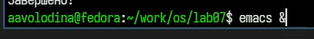{#fig-001 width=70%}

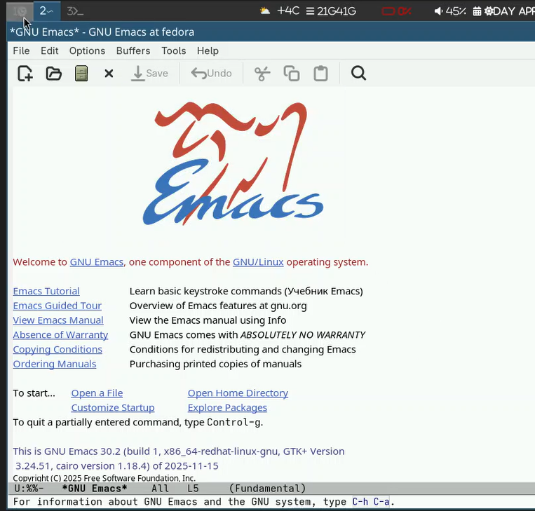{#fig-002 width=70%}

2. Создадим файл lab07.sh с помощью комбинации Ctrl-x Ctrl-f (C-x C-f). ([рис. @fig-003]). ([рис. @fig-004]).

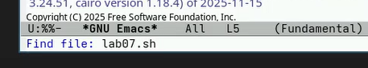{#fig-003 width=70%}

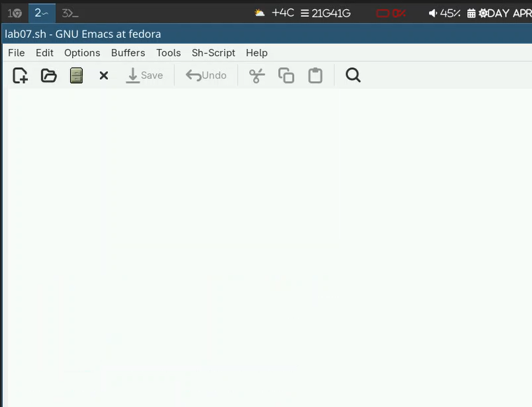{#fig-004 width=70%}

3. Наберем текст ([рис. @fig-005]).

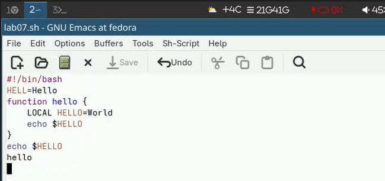{#fig-005 width=70%}

4. Сохраним файл с помощью комбинации Ctrl-x Ctrl-s (C-x C-s).

5. Проделаем с текстом стандартные процедуры редактирования, каждое действие должно осуществляться комбинацией клавиш.

5.1. Вырежем одной командой целую строку (С-k). ([рис. @fig-006]).

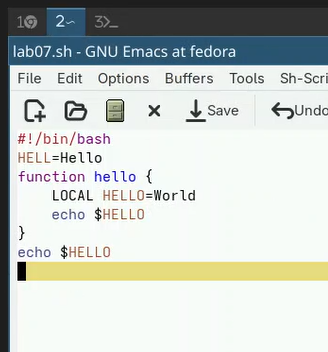{#fig-006 width=70%}

5.2. Вставим эту строку в конец файла (C-y). ([рис. @fig-007]).

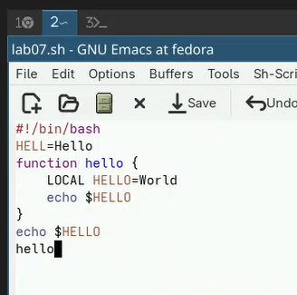{#fig-007 width=70%}

5.3. Выделим область текста (C-space). ([рис. @fig-008]).

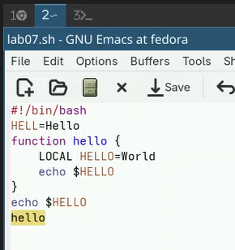{#fig-008 width=70%}

5.4. Скопируем область в буфер обмена (M-w). ([рис. @fig-009]).

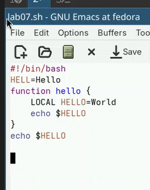{#fig-009 width=70%}

5.5. Вставим область в конец файла. ([рис. @fig-009]). ([рис. @fig-010]).

{#fig-009 width=70%}

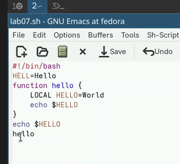{#fig-010 width=70%}

5.6. Вновь выделим эту область и на этот раз вырежем её (C-w). ([рис. @fig-011]).

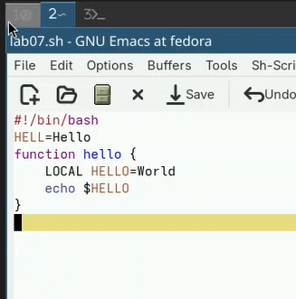{#fig-011 width=70%}

5.7. Отменим последнее действие (C-/). ([рис. @fig-012]).

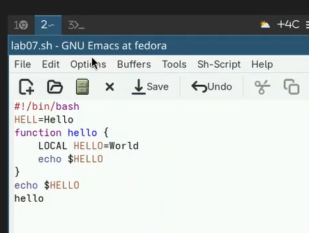{#fig-012 width=70%}

6. Научимся использовать команды по перемещению курсора.

6.1. Переместим курсор в начало строки (C-a). ([рис. @fig-013]).

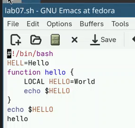{#fig-013 width=70%}

6.2. Переместим курсор в конец строки (C-e). ([рис. @fig-014]).

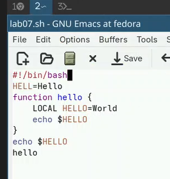{#fig-014 width=70%}

6.3. Переместим курсор в начало буфера (M-<), а затем 6.4. Переместим курсор в конец буфера (M->). ([рис. @fig-015]).

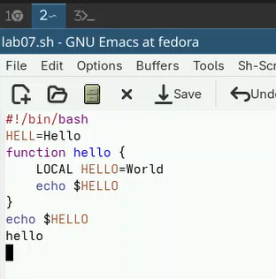{#fig-015 width=70%}

7. Управление буферами.

7.1. Выведем список активных буферов на экран (C-x C-b) ([рис. @fig-016]).

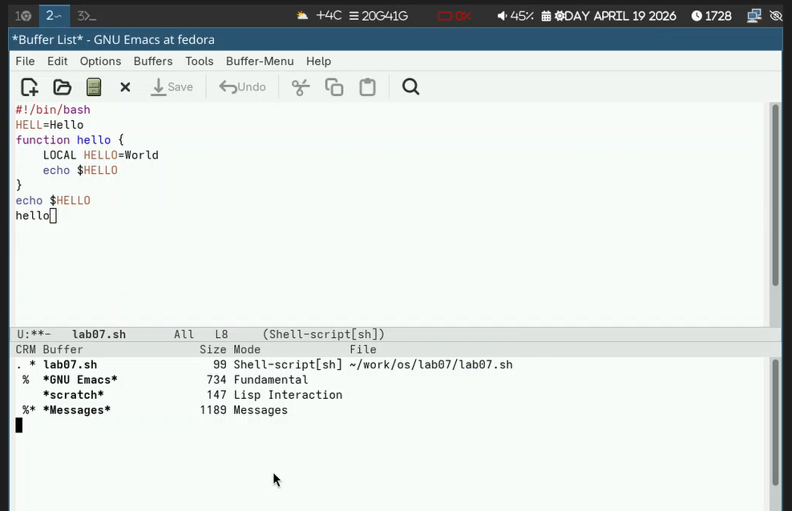{#fig-016 width=70%}

7.2. Переместимся во вновь открытое окно (C-x) o со списком открытых буферов и переключимся на другой буфер. ([рис. @fig-017]).

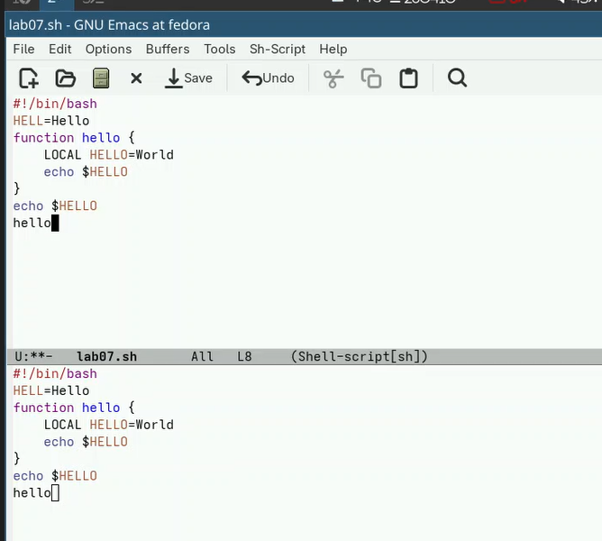{#fig-017 width=70%}

7.3. Закроем это окно (C-x 0). ([рис. @fig-018]).

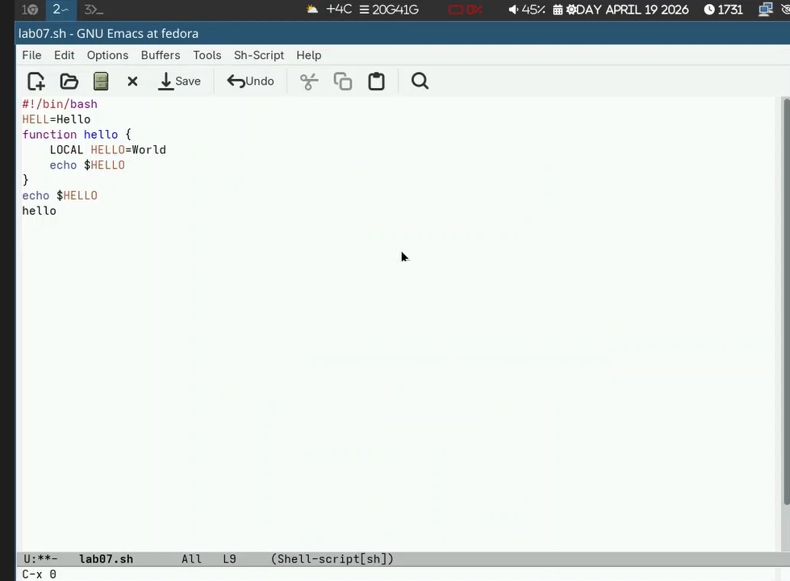{#fig-018 width=70%}

7.4. Теперь вновь переключимся между буферами, но уже без вывода их списка на экран (C-x b). ([рис. @fig-019]).

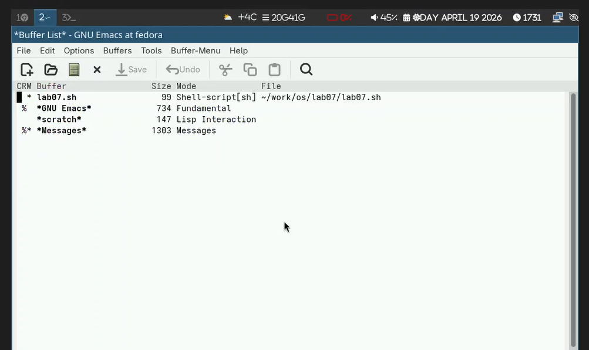{#fig-019 width=70%}

8. Управление окнами.

8.1. Поделите фрейм на 4 части: разделим фрейм на два окна по вертикали (C-x 3), а затем каждое из этих окон на две части по горизонтали (C-x 2) ([рис. @fig-020]).

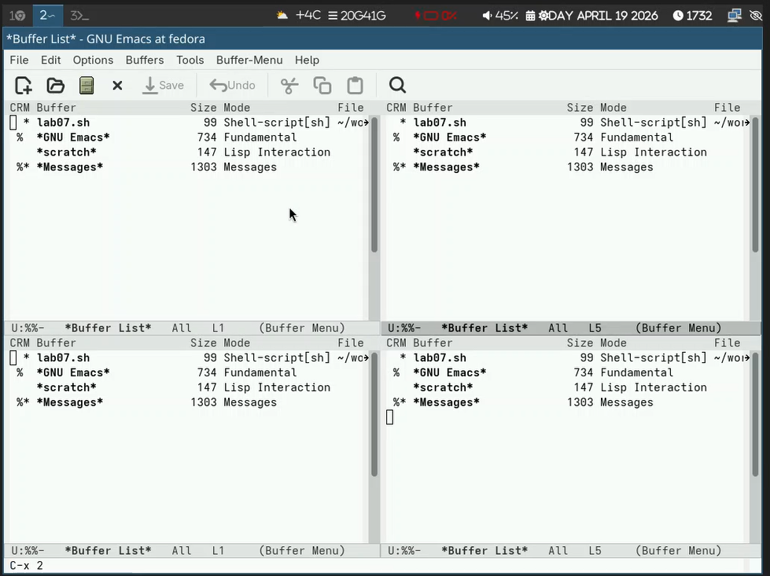{#fig-020 width=70%}

8.2. В каждом из четырёх созданных окон откроем новый буфер (файл) и введем несколько строк текста. ([рис. @fig-021]).

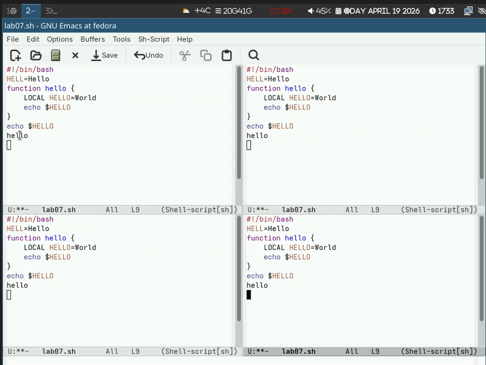{#fig-021 width=70%}

9. Режим поиска

9.1. Переключимся в режим поиска (C-s) и найдем несколько слов, присутствующих в тексте. ([рис. @fig-022]).

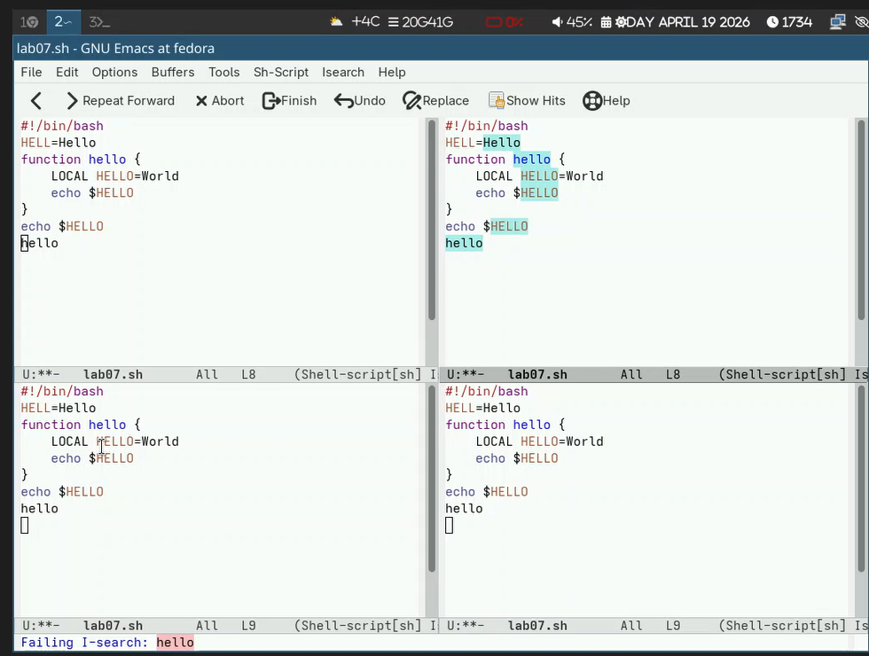{#fig-022 width=70%}

9.2. Переключимся между результатами поиска, нажимая C-s. ([рис. @fig-023]).

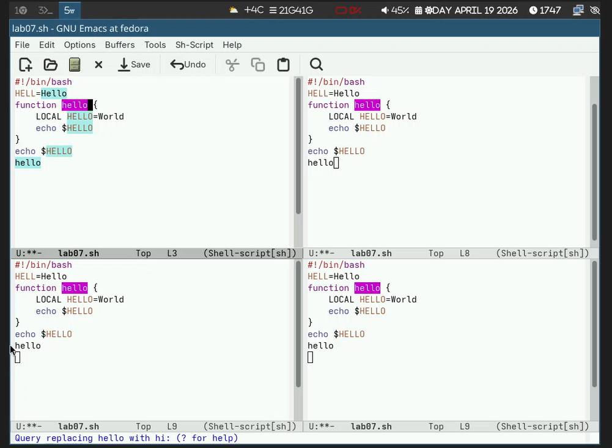{#fig-023 width=70%}

9.3. Выйдем из режима поиска, нажав C-g.

9.4. Перейдем в режим поиска и замены (M-%), введем текст, который следует найти
и заменить, нажмем Enter , затем введем текст для замены. После того как будут подсвечены результаты поиска, нажмем ! для подтверждения замены. ([рис. @fig-024]).

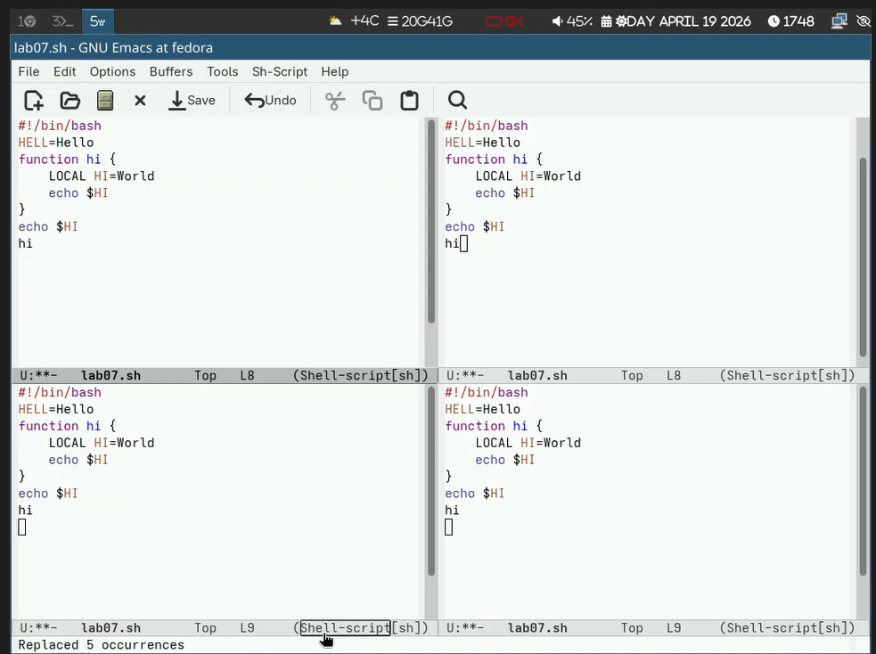{#fig-024 width=70%}

9.5. Испробуем другой режим поиска, нажав M-s o ([рис. @fig-025]).

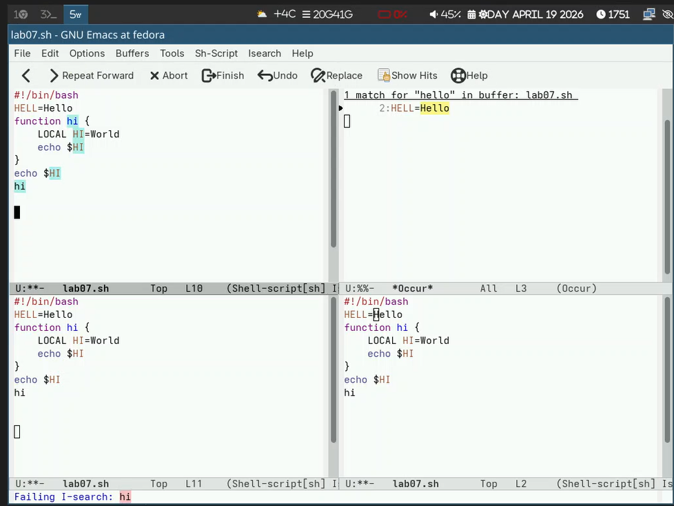{#fig-025 width=70%}

# Выводы

Я познакомиться с операционной системой Linux. Получила практические навыки работы с редактором Emacs.

# Контрольные вопросы

1. Кратко охарактеризуйте редактор emacs.

Emacs — это мощный расширяемый текстовый редактор с графическим и консольным интерфейсом, написанный на языке Elisp. Он поддерживает множество режимов редактирования, работу с буферами и окнами, встроенную справку, поиск и замену с регулярными выражениями, а также может использоваться как среда разработки.

2. Какие особенности данного редактора могут сделать его сложным для освоения новичком?

Обилие комбинаций клавиш с Ctrl и Meta (Alt/Esc), которые нужно запоминать.
Отсутствие привычной клавиши Meta на PC-клавиатуре (используется Alt или Esc).
Специфическая терминология (буфер, фрейм, минибуфер, точка вставки).
Множество режимов (Fundamental, Text, C, Lisp и др.), поведение редактора зависит от текущего режима.
Необходимость использовать командную строку (M-x command) для некоторых операций.

3. Своими словами опишите, что такое буфер и окно в терминологии emacs’а.

Буфер — это «контейнер» с текстом, который может быть файлом, результатом работы программы, справкой и т.д. Буфер не привязан жёстко к окну.

Окно — это область на экране (внутри фрейма), в которой отображается содержимое какого-либо буфера. В одном фрейме может быть несколько окон, показывающих разные буферы или разные части одного буфера.

4. Можно ли открыть больше 10 буферов в одном окне?

Да, можно. Количество буферов в Emacs практически не ограничено, но в одном окне одновременно отображается только один буфер. Однако можно переключаться между буферами в этом окне (например, C-x b). Ограничение связано только с доступной памятью.

5. Какие буферы создаются по умолчанию при запуске emacs?

При запуске Emacs обычно создаёт:

буфер с приветствием (например, *GNU Emacs* или *scratch* — для временных заметок на Elisp)
буфер *Messages* (системные сообщения)
буфер *Minibuffer-0* (для минибуфера)
возможно, *Help* (если открыта справка)

6. Какие клавиши вы нажмёте, чтобы ввести следующую комбинацию C-c | и C-c C-|?

C-c | — удерживая Ctrl, нажать c, отпустить, затем нажать | (вертикальная черта).
C-c C-| — удерживая Ctrl, нажать c, затем, не отпуская Ctrl, нажать | (однако C-| нестандартна; обычно | вводится без Ctrl, так что, вероятно, имеется в виду последовательное нажатие: Ctrl+c, затем Ctrl+Shift+\ или Ctrl+<...>). В реальности в Emacs такая комбинация встречается редко. Если строго следовать логике: C-c C-| = Ctrl+c, затем Ctrl+Shift+\ (так как | на многих раскладках вводится с Shift).

7. Как поделить текущее окно на две части?

По горизонтали (верх/низ): C-x 2
По вертикали (лево/право): C-x 3

8. В каком файле хранятся настройки редактора emacs?

Настройки пользователя хранятся в файле .emacs или init.el (обычно в домашней директории ~/.emacs.d/init.el). Также может использоваться ~/.emacs.
9. Какую функцию выполняет клавиша C-g и можно ли её переназначить?

C-g выполняет функцию прерывания текущей операции (отмена поиска, выход из минибуфера, остановка выполняющейся команды).
Да, её можно переназначить, переопределив в конфигурационном файле, например:
elisp

(global-set-key (kbd "C-g") 'my-new-function)

Но это не рекомендуется, так как C-g — стандартный способ аварийного выхода.

10. Какой редактор вам показался удобнее в работе vi или emacs? Поясните почему.

Мне удобнее Emacs, потому что:
В нём интуитивно понятнее работа с буферами и окнами (можно разделять экран и видеть несколько файлов сразу).
Комбинации клавиш легче запоминаются (например, C-f — forward, C-b — backward), тогда как в vi нужно переключаться между режимами.
Emacs имеет встроенную справку и интерактивный учебник.
Для программирования удобны подсветка синтаксиса, интеграция с компилятором и отладчиком.
Однако vi быстрее для простых правок в консоли, и он есть на каждом Unix-подобном сервере.
