# Цель работы

Изучить основы программирования в оболочке ОС UNIX. Научиться писать более сложные командные файлы с использованием логических управляющих конструкций и циклов

# Задание 

1. Написать командный файл, реализующий упрощённый механизм семафоров. Командный файл должен в течение некоторого времени t1 дожидаться освобождения ресурса, выдавая об этом сообщение, а дождавшись его освобождения, использовать его в течение некоторого времени t2<>t1, также выдавая информацию о том, что ресурс используется соответствующим командным файлом (процессом). Запустить командный файл в одном виртуальном терминале в фоновом режиме, перенаправив его вывод в другой (> /dev/tty#, где # — номер терминала куда перенаправляется вывод), в котором также запущен этот файл, но не фоновом, а в привилегированном режиме. Доработать программу так, чтобы имелась возможность взаимодействия трёх и более процессов.

2. Реализовать команду man с помощью командного файла. Изучите содержимое ката- лога /usr/share/man/man1. В нем находятся архивы текстовых файлов, содержащих справку по большинству установленных в системе программ и команд. Каждый архив можно открыть командой less сразу же просмотрев содержимое справки. Командный файл должен получать в виде аргумента командной строки название команды и в виде результата выдавать справку об этой команде или сообщение об отсутствии справки, если соответствующего файла нет в каталоге man1.

3. Используя встроенную переменную $RANDOM, напишите командный файл, генерирующий случайную последовательность букв латинского алфавита. Учтите, что $RANDOM выдаёт псевдослучайные числа в диапазоне от 0 до 32767

# Теоретическое введение

Bash (Bourne Again Shell) — это мощная командная оболочка Unix, которая используется для выполнения различных задач в терминале. Bash предоставляет интерактивный интерфейс, в котором пользователи могут вводить команды, а затем получать результаты. Она также поддерживает скрипты оболочки, которые представляют собой текстовые файлы, содержащие последовательность команд Bash для автоматизации задач. Bash широко используется в средах Unix и Linux, а также поддерживается Windows с помощью подсистемы Windows для Linux (WSL). Перечислим основные возможности этой оболочки. Обработка команд. Bash может обрабатывать как простые, так и сложные команды. Простые состоят из одного действия и, возможно, некоторых аргументов. Сложные команды могут содержать несколько простых, объединенных с помощью операторов конвейера (|), перенаправления ввода и вывода (<, >, >>), условных операторов (if/else, case/esac, while/do). О них мы расскажем позже. Расширенный ввод, редактирование строк. Оболочка предоставляет функции расширенного ввода, такие как автодополнение, которое предлагает возможные варианты завершения команд и имен файлов по мере их ввода. Она также поддерживает историю, позволяя пользователям просматривать ранее введенные команды, а затем повторно их использовать. Возможность создания и запуска скриптов. Скрипты оболочки — это текстовые файлы, содержащие последовательность команд. Их можно создавать с помощью текстового редактора, а затем запускать в терминале, что дает возможность пользователям автоматизировать задачи и управлять системой. Скрипты могут содержать условные операторы, циклы, функции для обеспечения дополнительной гибкости и контроля.

# Выполнение лабораторной работы

создадим файл для первого командного файла и перейдем к редактированию([рис. @fig-001]).

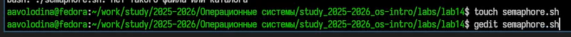{#fig-001 width=70%}

1. Напишем командный файл, реализующий упрощённый механизм семафоров. Командный файл должен в течение некоторого времени t1 дожидаться освобождения ресурса, выдавая об этом сообщение, а дождавшись его освобождения, использовать его в течение некоторого времени t2<>t1, также выдавая информацию о том, что ресурс используется соответствующим командным файлом (процессом). Запустить командный файл в одном виртуальном терминале в фоновом режиме, перенаправив его вывод в другой (> /dev/tty#, где # — номер терминала куда перенаправляется вывод), в котором также запущен этот файл, но не фоновом, а в привилегированном режиме. Доработать программу так, чтобы имелась возможность взаимодействия трёх
и более процессов. ([рис. @fig-002]).

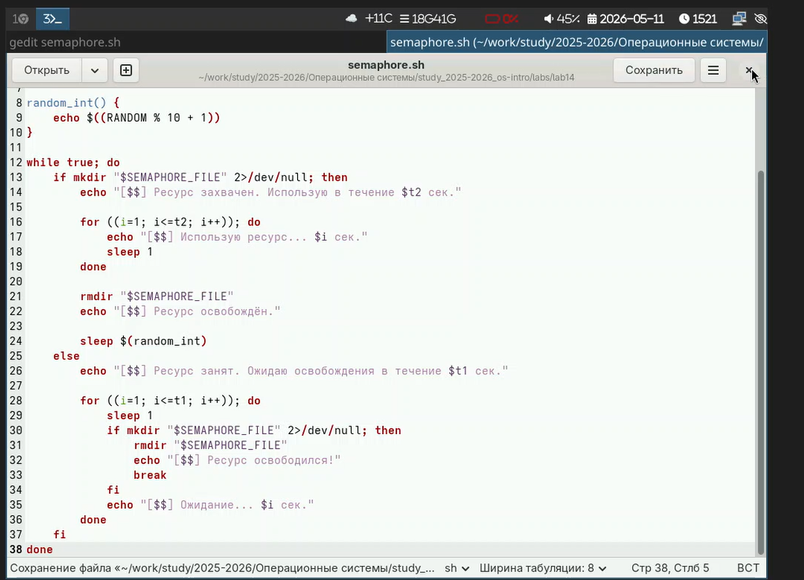{#fig-002 width=70%}

Сделаем файл исплняемым и проверим его работу в фоновом режиме ([рис. @fig-003]).

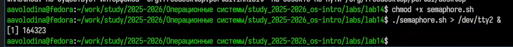{#fig-003 width=70%}

Проверим работу файла в  привилегированном режиме ([рис. @fig-004]).

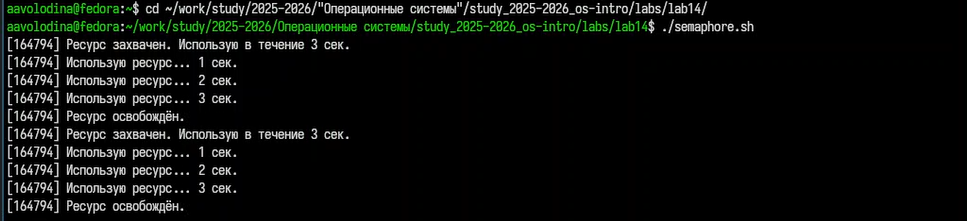{#fig-004 width=70%}

2. Реализуем команду man с помощью командного файла. Изучим содержимое каталога /usr/share/man/man1. В нем находятся архивы текстовых файлов, содержащих справку по большинству установленных в системе программ и команд. Каждый архив можно открыть командой less сразу же просмотрев содержимое справки. Командный файл должен получать в виде аргумента командной строки название команды и в виде результата выдавать справку об этой команде или сообщение об отсутствии справки, если соответствующего файла нет в каталоге man1.([рис. @fig-005]). ([рис. @fig-006]). ([рис. @fig-007]). ([рис. @fig-008]). ([рис. @fig-009]). ([рис. @fig-010]). ([рис. @fig-011]).

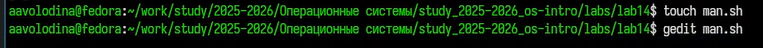{#fig-005 width=70%}

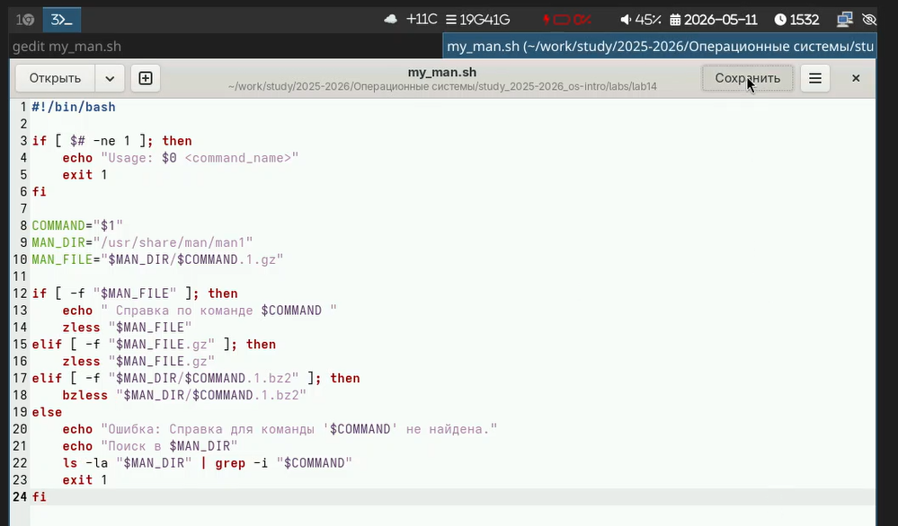{#fig-006 width=70%}

{#fig-007 width=70%}

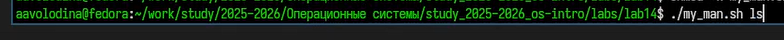{#fig-008 width=70%}

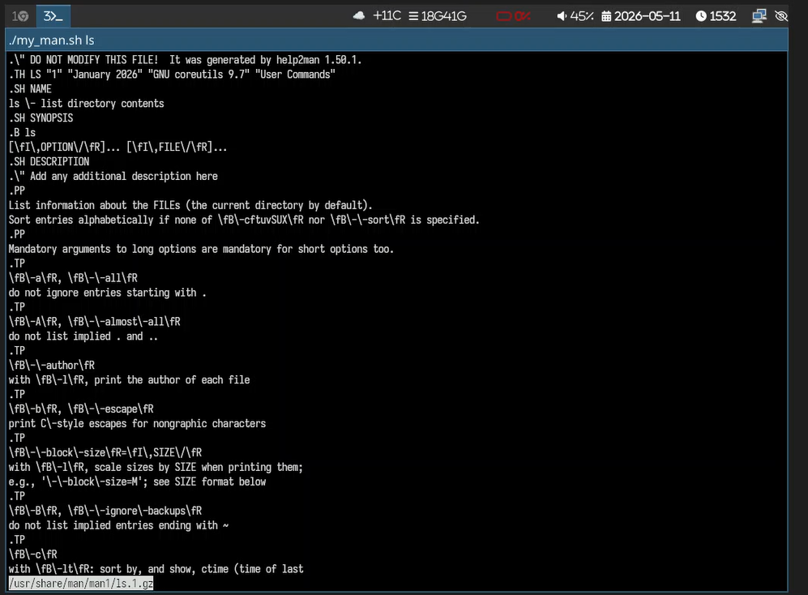{#fig-009 width=70%}

{#fig-010 width=70%}

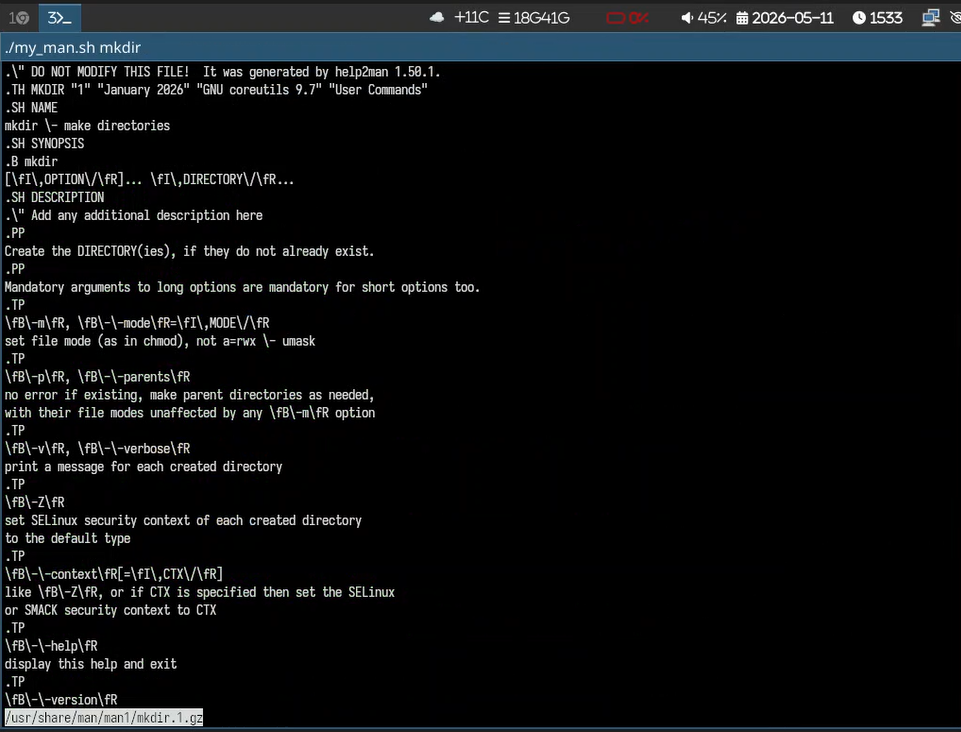{#fig-011 width=70%}

3. Используя встроенную переменную $RANDOM, напишите командный файл, генерирующий случайную последовательность букв латинского алфавита. Учтите, что $RANDOM выдаёт псевдослучайные числа в диапазоне от 0 до 32767. ([рис. @fig-012]). ([рис. @fig-013]). ([рис. @fig-014]).

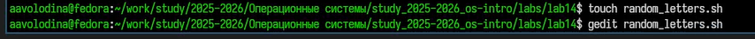{#fig-012 width=70%}

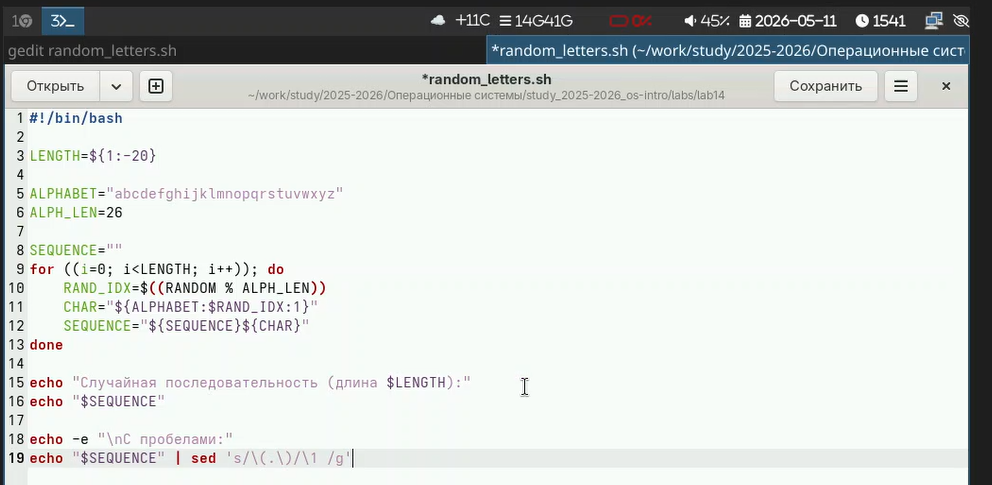{#fig-013 width=70%}

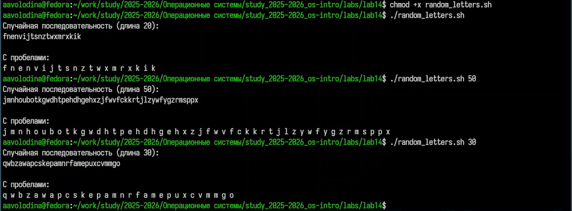{#fig-014 width=70%}

# Выводы

Я изучила основы программирования в оболочке ОС UNIX. Научилась писать более сложные командные файлы с использованием логических управляющих конструкций и циклов.

# Контрольные вопросы

1. Синтаксическая ошибка в строке while [$1 != "exit"] — отсутствуют пробелы между скобками и условием. Правильно: while [ "$1" != "exit" ]

2. Объединить строки в bash можно несколькими способами:

    str="$str1$str2"
    str="${str1}${str2}"
    использовать подстановку: str="$str1$str2"

3. seq — генерирует последовательности чисел. Альтернативы в bash:

    Цикл for ((i=1; i<=N; i++))
    echo {1..N} (для целых)
    eval echo {1..N}

4. $((10/3)) даст 3 (целочисленное деление, остаток отбрасывается).

5. Основные отличия zsh от bash:

    Лучшая автодополнение и настройка промпта
    Встроенная поддержка ассоциативных массивов без declare -A
    Отсутствие необходимости экранирования [ в условиях
    Индексы массивов начинаются с 1 (а не с 0)
    Глобальные суффиксы и более мощные globs (**/*.txt)

6. Синтаксис for ((a=1; a <= LIMIT; a++)) — верен (это C-стиль цикла в bash).

7. Сравнение bash с другими языками (например, Python, C):
   Преимущества: удобство работы с файлами/процессами, запуск внешних команд, простой конвейер, переносимость скриптов администрирования.

    Недостатки: медленная работа со сложными структурами данных, неудобная арифметика (только целые), сложный синтаксис для условий, слабая поддержка ООП, отсутствие нормальных отладчиков.
