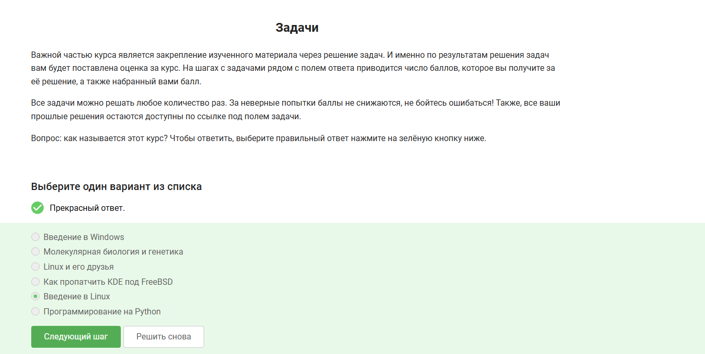
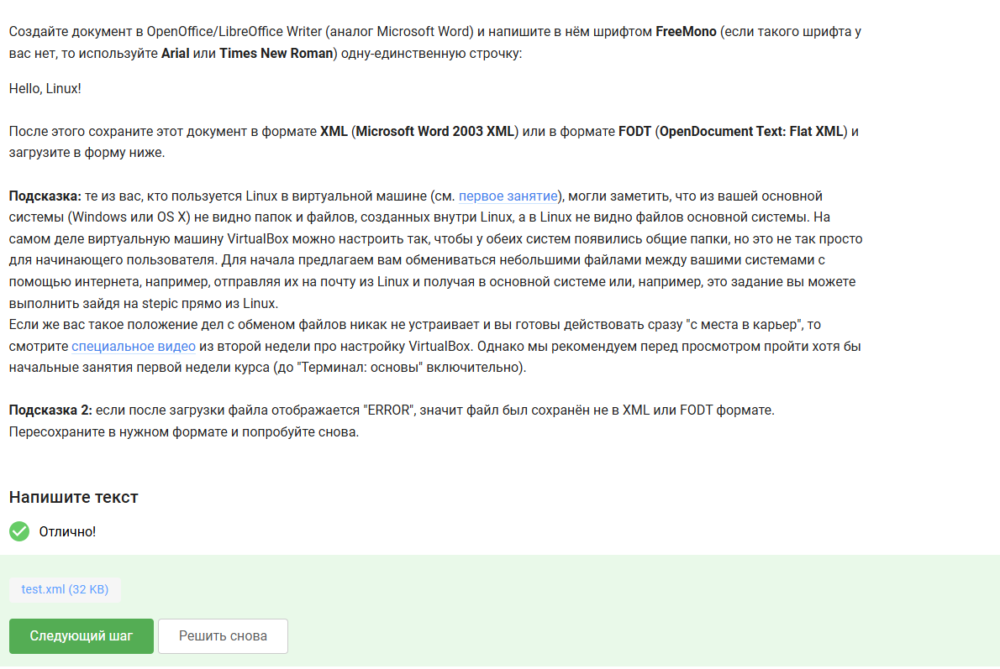
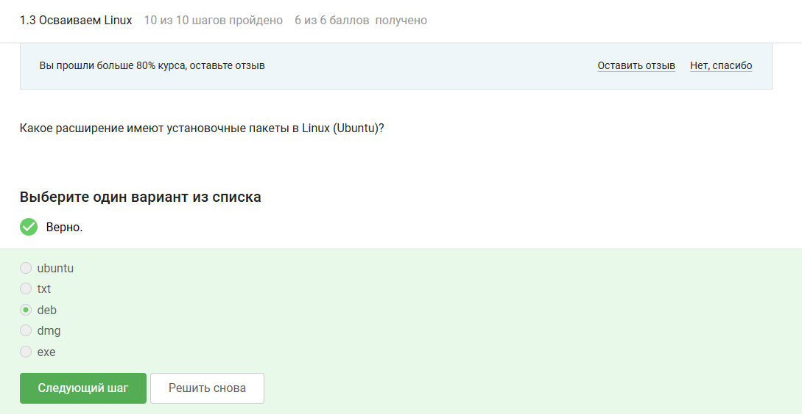
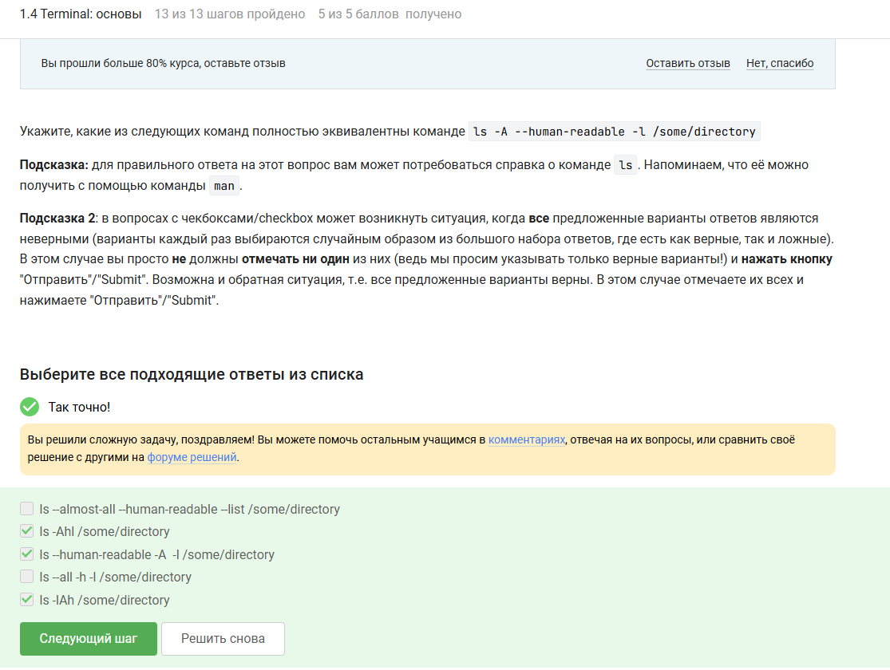
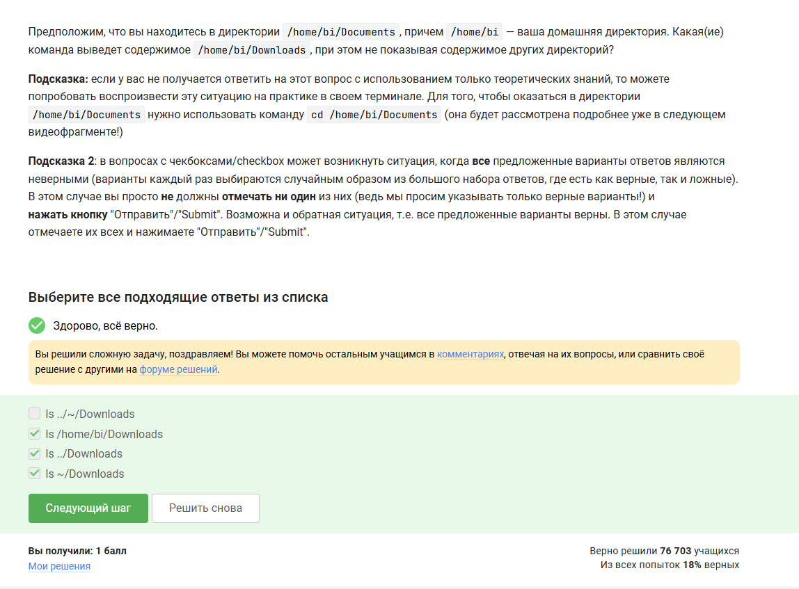
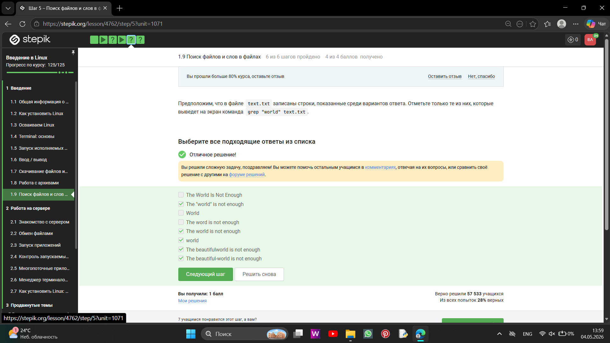
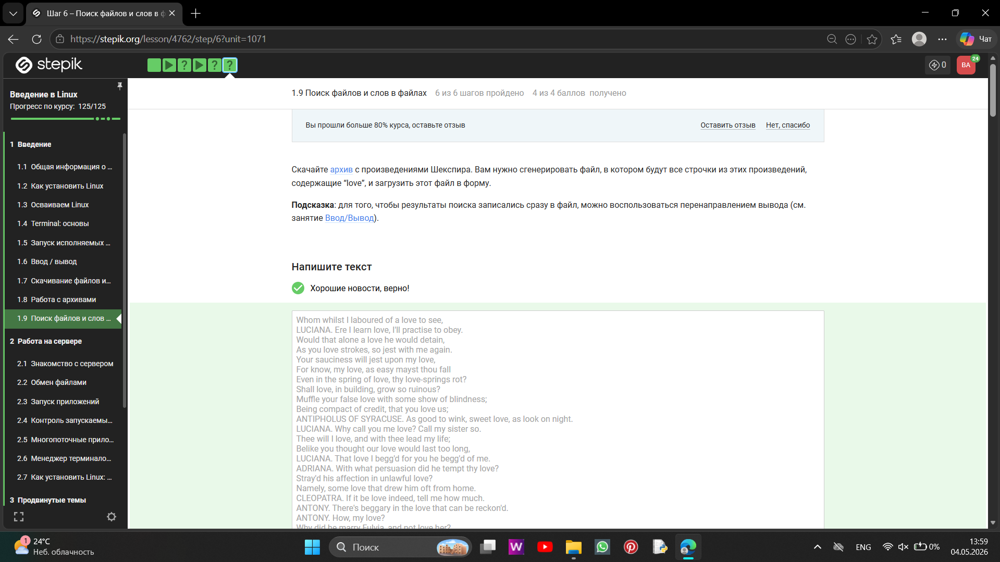

# Цель работы

Выполнить 1 этап внешнего курса, ознакомиться с видеороликами, прикрепленными на сайте, и выполнить задания по ним.

# Задание

Выполнить 1 этап внешнего курса в stepic.

# Выполнение лабораторной работы

1) Вопрос: как называется этот курс? Чтобы ответить, выберите правильный ответ нажмите на зелёную кнопку ниже ([рис. @fig-001]).

{#fig-001 width=70%}

Внешний курс называется Введение в Linux

2) Ответить на вопросы про то, как строится курс ([рис. @fig-002]).

{#fig-002 width=70%}

Основами курса являются такие критерии: Дедлайнов по курсу нет, но я постараюсь проходить уроки регулярно, чтобы изучить Linux, Я не буду распространять и выкладывать в открытом доступе свои решения задач курса, чтобы другим оставалось интересно их решать самостоятельно, Я буду работать над задачами курса самостоятельно, чтобы извлечь для себя максимальную пользу от курса.

3) Какую операционную систему вы обычно используете? В таких типах задания (с галочками/чекбоксами/checkbox) вы можете выбирать несколько вариантов ответа (от 0 до всех)! ([рис. @fig-003]).

{#fig-003 width=70%}

Я чаще всего использую Windows, поскольку эта операционная система установленна как основная на моем пк.

4) Что такое виртуальная машина? Выберите наиболее подходящий ответ! В таком типе заданий (с радиокнопками/radio button) ответ всегда ровно один! ([рис. @fig-004]).

{#fig-004 width=70%}

Виртуальна машина - специальная программа для запуска одной ОС на другой ОС. На виртальную машину можно ставить разнообразные операционные системы.

5) Смогли ли вы запустить на своем компьютере Linux? ([рис. @fig-005]).

{#fig-005 width=70%}

Да, на это была направлена 1 лабораторна работа предмета "архитектура компьютера"

6) Создайте документ в OpenOffice/LibreOffice Writer (аналог Microsoft Word) и напишите в нём шрифтом FreeMono (если такого шрифта у вас нет, то используйте Arial или Times New Roman) одну-единственную строчку:
Hello, Linux! ([рис. @fig-006]).

{#fig-006 width=70%}

Я создала документ, вписала туда "Hello, Linux!", сохранила в нужном формате и прикрепила в окошко дл крипления файлов

7) Какое расширение имеют установочные пакеты в Linux (Ubuntu)? ([рис. @fig-007]).

{#fig-007 width=70%}

В дистрибутивах Linux, основанных на Debian, установочные пакеты имеют расширение deb. Эти файлы содержат скомпелированные программы, библиотеки и инструкции для менеджера пакетов

8)Запустите, откройте Help → About (или Shift+F1) и напишите ниже первую фамилию (без имени!) из вкладки Authors. Обратите внимание, что в англоязычных текстах обычно имя стоит на первом месте (first name), а фамилия на втором (last name). ([рис. @fig-008]).

{#fig-008 width=70%}

Я запустила, открыла Help → About и посмотрела, какая первая фамилия находитс в вкладке Authors. Ответ: Denis-Courmont

9) Для чего можно использовать приложение Update Manager? ([рис. @fig-009]).

{#fig-009 width=70%}

Правильными ответами являются:  Для обновления всей системы до новой версии, Для обновления установленных программ, Для обновления ссылок в Software Center. Эти функции выполняет приложение Update Manager. Остальные варианты не подходят, потому что: Для установки новых программ- задача Software Center, apt install или Snap Store, Для удаления установленных программ - задача Software Center или apt remove 

10) Выберите все синонимы для “командной строки”. ([рис. @fig-010]).

{#fig-010 width=70%}

Синонимами для “командной строки” являются Консоль и Терминал, остальные варианты (Ассоль, Термин) не имеют отношения к слову "командная строка" 

11) Какая команда напечатает в какой директории мы сейчас находимся? ([рис. @fig-011]).

{#fig-011 width=70%}

Ответ: Только pwd. Команда чувствительна к регистру: PWD — переменная, а Pwd — несуществующая команда.

12) Укажите, какие из следующих команд полностью эквивалентны команде ls -A --human-readable -l /some/directory ([рис. @fig-012]).

{#fig-012 width=70%}

Ответ: ls -Ahl /some/directory, ls --human-readable -A  -l /some/directory, ls -lAh /some/directory. Остальные варианты не подходят, потому что ls --all -h -l /some/directory — --all = -a (включает . и ..), а нужно -A (--almost-all). Не эквивалентно

13) Предположим, что вы находитесь в директории /home/bi/Documents, причем /home/bi — ваша домашняя директория. Какая(ие) команда выведет содержимое /home/bi/Downloads, при этом не показывая содержимое других директорий? ([рис. @fig-013]).

{#fig-013 width=70%}

/home/bi/Downloads это абсолютный путь., ../Downloads это относительный: из /home/bi/Documents подняться на уровень выше (/home/bi/) в Downloads. ~/Downloads это ~ = домашняя директория (/home/bi). Не подходит: ls ../~/Downloads это синтаксически неверно (.. и ~ вместе не работают как путь).

14) Какая команда используется для удаления директорий? ([рис. @fig-014]).

{#fig-014 width=70%}

rm -r - удаляет директорию рекурсивно (вместе с содержимым), mkdir - создаёт директории, rm -f - удаляет только файлы (без рекурсии, -f — принудительно), mv - перемещает/переименовывает.

15) Что произойдет, если ввести в терминал команду firefox (для запуска одноименного браузера), а затем ввести туда же команду exit? ([рис. @fig-015]).

{#fig-015 width=70%}

Оба процесса (Firefox и терминал) продолжают существовать, если терминал - это окно, которое не закрывается автоматически после exit

16) Чему эквивалентен запуск программы с &? ([рис. @fig-016]).

{#fig-016 width=70%}

& запускает программу в фоне сразу. Вручную это делается так: Запуск программы (нажимаем Enter), останавливаем её через Ctrl+Z (приостановка), переводим в фон командой bg.

17) Скачайте файл с программой, сделайте его исполняемым, запустите и скопируйте то, что он выведет на экран, в форму ниже. ([рис. @fig-017]).

{#fig-017 width=70%}

Я скачала файл с программой, сделала его исполняемым, запустила и получила такой результат:
2026-05-02 20:54:29
Control sum: 949

18) Куда по умолчанию выводится поток ошибок из программы, запущенной в терминале? ([рис. @fig-018]).

{#fig-018 width=70%}

Поток ошибок (stderr) по умолчанию выводится на экран (тот же терминал, что и stdout), но не перенаправляется автоматически в файл.

19) Какие (какая) из команд создадут файл file.txt и запишут в него поток ошибок программы program? Считайте, что в момент запуска программы файл file.txt не существует. ([рис. @fig-019]).

{#fig-019 width=70%}

Вернуе варианты: program 2> file.txt, program 2>> file.txt. Остальные варианты не подходят, потому что >> / < / << — работают с stdout или вводом, а не с stderr, program file.txt <2 — синтаксически неверно.

20) Куда деваются сообщения об ошибках (т.е. вывод в stderr) от тех программ, которые объединены в конвейер (pipe)? ([рис. @fig-020]).

{#fig-020 width=70%}

В конвейере (pipe) перенаправляется только stdout между командами. stderr (поток ошибок) по умолчанию остаётся на экране (терминале) и не попадает в конвейер.

21) В каком файле на диске окажется картинка, если для её скачивания были выполнены следующие команды?
cd /home/alex/
wget -P /home/alex/Pictures -O 1.jpg http://example.com/example.jpg ([рис. @fig-021]).

{#fig-021 width=70%}

Ключ -O (заглавная буква O) переопределяет выходной файл, игнорируя директорию из -P. Файл сохраняется в текущей рабочей директории (/home/alex/) с именем 1.jpg, а не в Pictures.

22) Какую опцию нужно указать команде wget, чтобы она не выводила никаких сообщений на экран (Resolving.., Connecting to.. и т.д.)? ([рис. @fig-022]).

{#fig-022 width=70%}

-q (--quiet) - подавляет все сообщения (Resolving..., Connecting... и т.д.).
-v (--verbose) - наоборот, делает вывод подробным (по умолчанию).
-nv (--no-verbose) — отключает подробный вывод, но некоторые сообщения (ошибки, прогресс) могут остаться.

23) Пусть на некоторой web-странице есть ссылки на картинки в форматах png и jpg, а также ссылки на другие страницы сайта (обычные html файлы). Какие файлы будут скачаны на компьютер, если запустить wget -r -l 1 -A jpg и передать в качестве аргумента ссылку на эту web-страницу ([рис. @fig-023]).

{#fig-023 width=70%}

-l 1 - глубина рекурсии 1 тогда wget скачивает стартовую HTML-страницу и все ссылки с неё (jpg и другие html-страницы).
-A jpg - фильтр на сохранение только jpg, но HTML-файлы всё равно сначала скачиваются, чтобы wget мог прочитать ссылки.
После завершения рекурсии wget удаляет HTML-файлы, не подходящие под -A, оставляя только jpg.
png не скачиваются, так как их нет в -A jpg

24) Чем отличаются архиваторы gzip и zip? ([рис. @fig-024]).

{#fig-024 width=70%}

gzip по умолчанию сжимает один файл в .gz, заменяя его архивом. При распаковке (gunzip) архив удаляется, восстанавливая исходный файл. zip по умолчанию создаёт отдельный архивный файл, исходные файлы не удаляет, и при распаковке сам архив остаётся на диске.

25) Какие из перечисленных программ-архиваторов могут создать архив из директории с файлами? ([рис. @fig-025]).

{#fig-025 width=70%}

tar - архивирует директории и файлы в один файл (tar-архив), не сжимая.
zip - архивирует + сжимает директории и файлы в один .zip-файл.
gzip - сжимает только один файл, не работает с директорией напрямую (нужен tar для объединения).

26) Какой набор опций нужно указать программе tar, чтобы запаковать файлы в my_archive.tar.bz2? ([рис. @fig-026]).

{#fig-026 width=70%}

c - создать архив (create).
j - использовать сжатие bzip2 (получится .tar.bz2).
f - указать имя файла архива.

27) Какая маска команды find НЕ найдет файл Alexey.jpeg? ([рис. @fig-027]).

{#fig-027 width=70%}

Файл: Alexey.jpeg (с заглавной A).
*.? - ищет расширение из одного символа (.j? нет, в .jpeg — 4 символа).
*.jpg - ищет расширение .jpg, а у нас .jpeg.
alexey.* - ищет имя с маленькой a, а у нас A заглавная.

Остальные варианты найдут:
*.* - любой файл с точкой подойдёт.
Alex* - начинается на Alex
Alexey.jpeg - полное совпадение

28) Предположим, что в файле  text.txt записаны строки, показанные среди вариантов ответа. Отметьте только те из них, которые выведет на экран команда  grep "world" text.txt. ([рис. @fig-028]).

{#fig-028 width=70%}

Не подходят 3 варианта, они не подходят потому что The World Is Not Enough - заглавная W, без -i не найдёт, World - заглавная W, The word is not enough - word, а не world.

29) Cкачайте архив с произведениями Шекспира. Вам нужно сгенерировать файл, в котором будут все строчки из этих произведений, содержащие “love”, и загрузить этот файл в форму. ([рис. @fig-029]).

{#fig-029 width=70%}

 скачала файл и сгенерироала файл, в котором получила такой список: 
 Whom whilst I laboured of a love to see,
LUCIANA. Ere I learn love, I'll practise to obey.
Would that alone a love he would detain,
As you love strokes, so jest with me again.
Your sauciness will jest upon my love,
For know, my love, as easy mayst thou fall
Even in the spring of love, thy love-springs rot?
Shall love, in building, grow so ruinous?
Muffle your false love with some show of blindness;
Being compact of credit, that you love us;
ANTIPHOLUS OF SYRACUSE. As good to wink, sweet love, as look on night.
LUCIANA. Why call you me love? Call my sister so.
Thee will I love, and with thee lead my life;
Belike you thought our love would last too long,
LUCIANA. That love I begg'd for you he begg'd of me.
ADRIANA. With what persuasion did he tempt thy love?
Stray'd his affection in unlawful love?
Namely, some love that drew him oft from home.
CLEOPATRA. If it be love indeed, tell me how much.
ANTONY. There's beggary in the love that can be reckon'd.
ANTONY. How, my love?
Why did he marry Fulvia, and not love her?
Now for the love of Love and her soft hours,
SOOTHSAYER. You shall be more beloving than beloved.
CHARMIAN. O, excellent! I love long life better than figs.
finest part of pure love. We cannot call her winds and waters
Whose love is never link'd to the deserver
CHARMIAN. Madam, methinks, if you did love him dearly,
Are newly grown to love. The condemn'd Pompey,
CLEOPATRA. O most false love!
So Antony loves.
And give true evidence to his love, which stands
And the ebb'd man, ne'er lov'd till ne'er worth love,
Ever love Caesar so?
The people love me, and the sea is mine;
Of both is flatter'd; but he neither loves,
Looking for Antony. But all the charms of love,
ENOBARBUS. Or, if you borrow one another's love for the instant,
Where now half tales be truths. Her love to both
Would each to other, and all loves to both,
The heart of brothers govern in our loves
Did ever love so dearly. Let her live
Fly off our loves again!
The winds were love-sick with them; the oars were silver,
Of us that trade in love.
than the love of the parties.
ENOBARBUS. A very fine one. O, how he loves Caesar!
ENOBARBUS. But he loves Caesar best. Yet he loves Antony.
His love to Antony. But as for Caesar,
AGRIPPA. Both he loves.
Betwixt us as the cement of our love
ANTONY. The April's in her eyes. It is love's spring,
I'll wrestle with you in my strength of love.
Let your best love draw to that point which seeks
Can never be so equal that your love
The ostentation of our love, which left unshown
Of us and those that love you. Best of comfort,
Each heart in Rome does love and pity you;
As you did love, but as you fear'd him.
I'll make death love me; for I will contend
More tight at this than thou. Dispatch. O love,
To business that we love we rise betime,
CLEOPATRA. Why is my lord enrag'd against his love?
As to a lover's bed. Come, then; and, Eros,
ANTONY. Let him that loves me, strike me dead.
Than love that's hir'd! What, goest thou back? Thou shalt
Which my love makes religion to obey,
The stroke of death is as a lover's pinch,
As needful in our loves, fitting our duty?
And with no less nobility of love
Ham. For God's love let me hear!
I will requite your loves. So, fare you well.
Ham. Your loves, as mine to you. Farewell.
Grows wide withal. Perhaps he loves you now,
Whereof he is the head. Then if he says he loves you,
Oph. My lord, he hath importun'd me with love
If thou didst ever thy dear father love-
As meditation or the thoughts of love,
From me, whose love was of that dignity
With all my love I do commend me to you;
May do t' express his love and friending to you,
Pol. Mad for thy love?
This is the very ecstasy of love,
More grief to hide than hate to utter love.
But never doubt I love.
reckon my groans; but that I love thee best, O most best, believe
Receiv'd his love?
When I had seen this hot love on the wing
Or look'd upon this love with idle sight?
Mark the encounter. If he love her not,
for love- very near this. I'll speak to him again.- What do you
obligation of our ever-preserved love, and by what more dear a
Ham. [aside] Nay then, I have an eye of you.- If you love me, hold
target; the lover shall not sigh gratis; the humorous man shall
The which he loved passing well.'
love passing well.
If't be th' affliction of his love, or no,
The pangs of despis'd love, the law's delay,
but now the time gives it proof. I did love you once.
inoculate our old stock but we shall relish of it. I loved you
Sprung from neglected love.- How now, Ophelia?
his love.
Ham. As woman's love.
Since love our hearts, and Hymen did our hands,
Make us again count o'er ere love be done!
For women's fear and love holds quantity,
Now what my love is, proof hath made you know;
And as my love is siz'd, my fear is so.
Where love is great, the littlest doubts are fear;
Where little fears grow great, great love grows there.
King. Faith, I must leave thee, love, and shortly too;
Such love must needs be treason in my breast.
Are base respects of thrift, but none of love.
That even our loves should with our fortunes change;
Whether love lead fortune, or else fortune love.
And hitherto doth love on fortune tend,
Ham. I could interpret between you and your love, if I could see
shall see anon how the murtherer gets the love of Gonzago's wife.
Ros. My lord, you once did love me.
Guil. O my lord, if my duty be too bold, my love is too unmannerly.
From the fair forehead of an innocent love,
You cannot call it love; for at your age
Stew'd in corruption, honeying and making love
Would gambol from. Mother, for love of grace,
This mad young man. But so much was our love
And, England, if my love thou hold'st at aught,-
How should I your true-love know
With true-love showers.
Nature is fine in love, and where 'tis fine,
After the thing it loves.
Oph. There's rosemary, that's for remembrance. Pray you, love,
Is the great love the general gender bear him,
I lov'd your father, and we love ourself,
King. Not that I think you did not love your father;
But that I know love is begun by time,
There lives within the very flame of love
In youth when I did love, did love,
Could not (with all their quantity of love)
Queen. For love of God, forbear him!
As love between them like the palm might flourish,
Ham. Why, man, they did make love to this employment!
I do receive your offer'd love like love,
O that you were your self, but love you are
O none but unthrifts, dear my love you know,
And all in war with Time for love of you,
Thou art more lovely and more temperate:
O carve not with thy hours my love's fair brow,
My love shall in my verse ever live young.
Mine be thy love and thy love's use their treasure.
Of his self-love to stop posterity?
Calls back the lovely April of her prime,
Unthrifty loveliness why dost thou spend,
The lovely gaze where every eye doth dwell
No love toward others in that bosom sits
For shame deny that thou bear'st love to any
Grant if thou wilt, thou art beloved of many,
Shall hate be fairer lodged than gentle love?
Make thee another self for love of me,

# Выводы

Я выполнила 1 этап внешнего курса, охнакомилась с видеороликами, представленными на сайте, и выполнила задания по ним.

