# Цель работы

Выполнить 3 этап внешнего курса, ознакомиться с видеороликами, прикрепленными на сайте, и выполнить задания по ним.

# Задание

Выполнить 3 этап внешнего курса в stepic.

# Выполнение лабораторной работы

1) Какую клавишу(и) нужно нажать на клавиатуре, чтобы выйти из редактора vim? Считайте, что вы только что открыли файл и вам сразу понадобилось выйти из редактора. ([рис. @fig-001]).

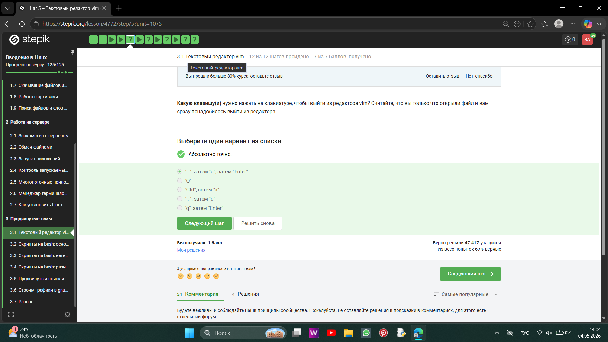{#fig-001 width=70%}

В vim нормальный режим (Normal mode) — это режим по умолчанию сразу после открытия файла. Чтобы выйти, нужно перейти в режим командной строки (Command-line mode) с помощью : (двоеточие), затем ввести команду q (quit) и подтвердить её клавишей Enter. Команда :q работает, если файл не был изменён. Если изменения были, потребуется :q!.

2) А для того, чтобы убедиться, что вы разобрались, отметьте ниже все верные утверждения про следующую строку:
Strange_TEXTis_here.2=2 YES! ([рис. @fig-002]).

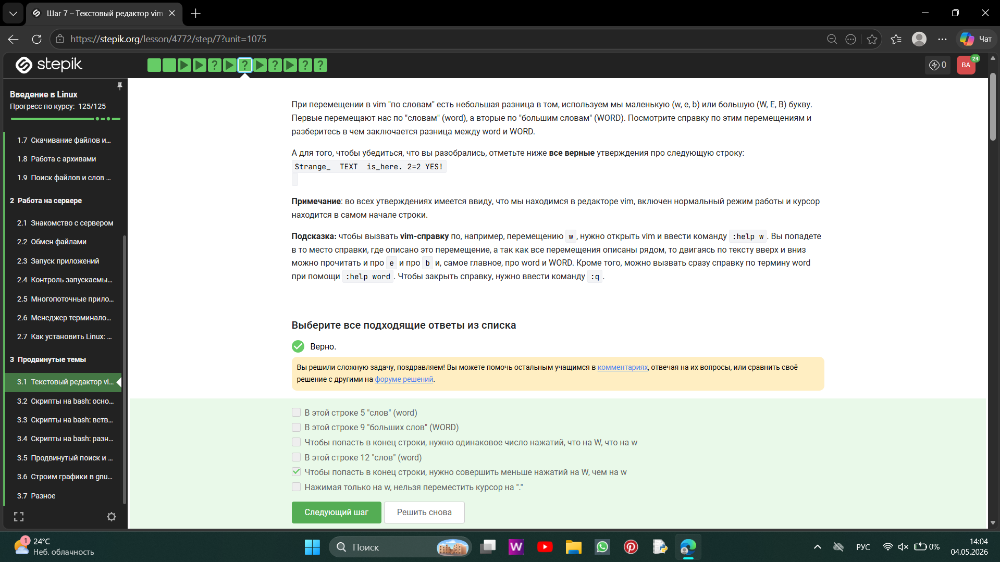{#fig-002 width=70%}

w делит строку на большее количество мелких частей (буквы, цифры, _ против пунктуации), а W — на крупные блоки, разделённые только пробелами. Поэтому для прохода всей строки клавишу W нужно нажать меньше раз, чем w

3) Предположим, что в текстовом файле записана одна единственная строка:
one two three four five
и вам нужно преобразовать её в строку
three four four four five
Какие(ой) из предложенных ниже наборов нажатий клавиш выполнят такое редактирование? В этих наборах нажатие на клавишу Esc обозначается как <Esc> (т.е. знаки "<" и ">" не несут отдельного смысла). ([рис. @fig-003]).

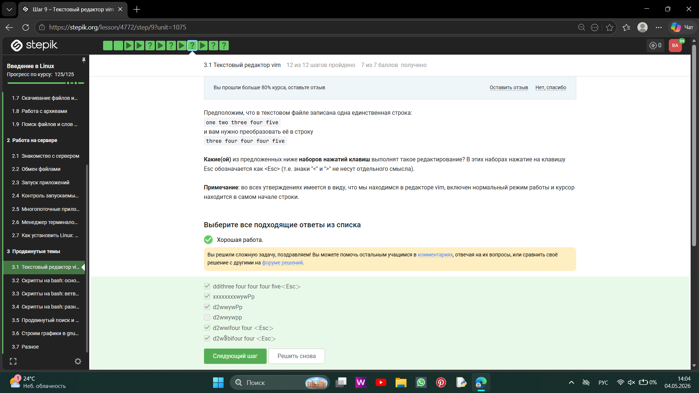{#fig-003 width=70%}

· d2wwywpp неверен, потому даёт three three three four five (три «three»).
· Все остальные варианты (включая странные типа xxxxxxxxwywPp) либо дают нужную строку three four four four five, либо содержат команды, которые ничего не ломают (например, xxxxxxxx игнорируется), а последующие движения и вставки в итоге приводят к правильному результату. Поэтому тест засчитал их как верные.

4) Какую команду нужно ввести для этого в vim? Укажите необходимую команду целиком (т.е. включая ввод ":" в самом начале), однако нажатие на Enter после ввода команды обозначать никак не нужно. ([рис. @fig-004]).

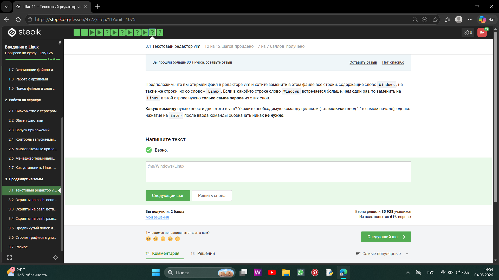{#fig-004 width=70%}

Правильная команда: :%s/Windows/Linux/
· % — применить ко всем строкам файла.
· s/Windows/Linux/ — заменить первое вхождение Windows в каждой строке на Linux.
· Отсутствие флага g означает замену только первого слова в строке, что соответствует условию.

5) Чтобы убедиться, что вы разобрались с этим режимом работы, отметьте, пожалуйста, все верные утверждения из списка ниже. ([рис. @fig-005]).

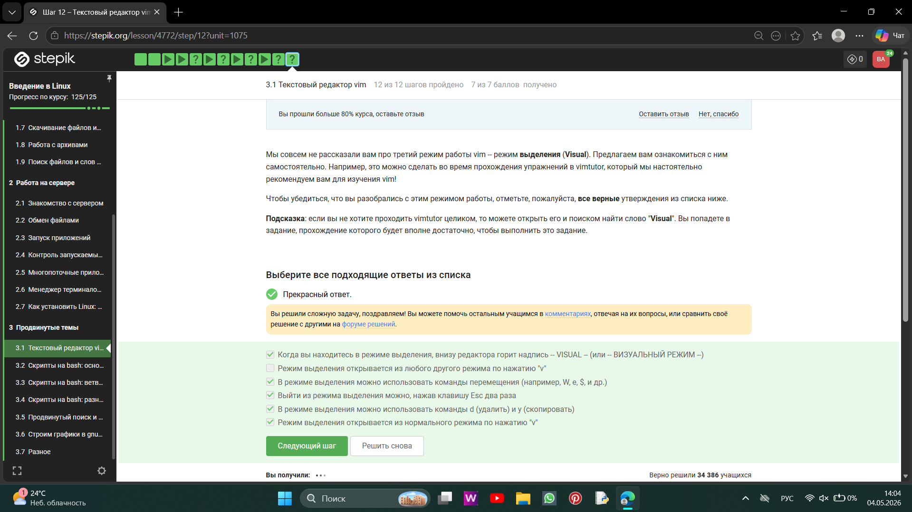{#fig-005 width=70%}

Из утверждения «Режим выделения открывается из любого другого режима по нажатию "v"» неверно, потому что v работает только из нормального режима. Из режима вставки или командной строки нужно сначала нажать Esc. Остальное всё верно

6) Предположим, что вы открыли терминал и у вас в нем запущена оболочка bash. Вы набираете в ней команды А1, А2, А3, а затем запускаете оболочку sh. В этой оболочке вы набираете команды B1, В2, В3 и запускаете оболочку bash. И, наконец, в этой последней оболочке вы набираете команды С1, С2, С3. Если теперь вы попробуете при помощи стрелочек вверх/вниз перемещаться по истории набранных команд, то команды из какого набора(ов) будут появляться? ([рис. @fig-006]).

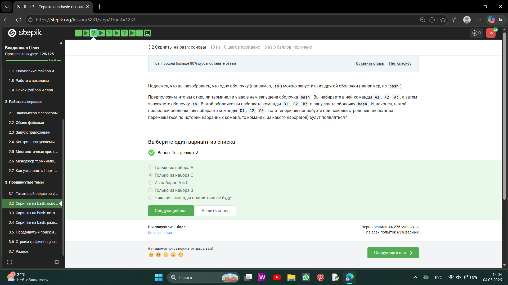{#fig-006 width=70%}

История команд (стрелочки вверх/вниз) хранится в текущей оболочке и не наследуется дочерними оболочками.
· Вы запустили bash следовательно набор А в истории этой оболочки.
· Запустили sh (дочерняя оболочка) значит у неё своя пустая история, команды В записываются в неё.
· Запустили bash (ещё одна дочерняя) значит у неё своя пустая история, команды С записываются в неё.
Когда вы нажимаете стрелочки в последнем bash, видите только С, потому что история родительских оболочек (А и В) недоступна.

7) Вы можете скачать и изучить скрипты, которые мы показали в видеофрагменте: script1.sh, script2.sh.

Предположим, что вы находитесь в директории /home/bi/Documents/ и запускаете в ней скрипт. Как будет выглядеть абсолютный путь до созданного файла file1.txt по окончанию работы скрипта? ([рис. @fig-007]).

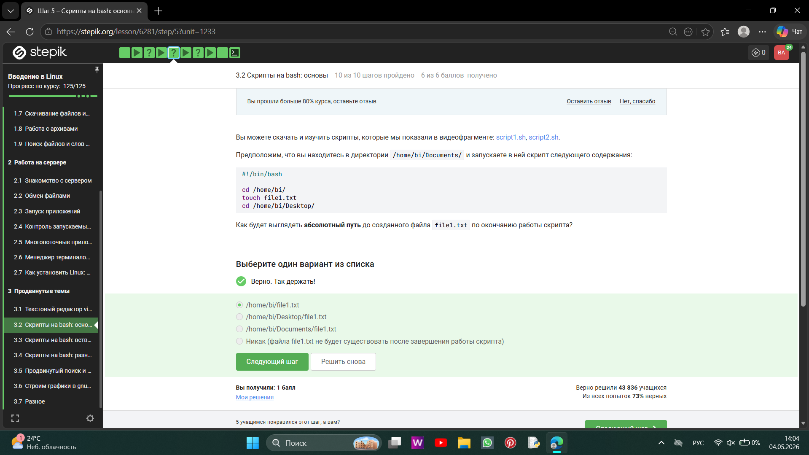{#fig-007 width=70%}

1. cd /home/bi/ — переход в директорию /home/bi/
2. touch file1.txt — создание файла file1.txt в текущей директории, которой теперь является /home/bi/
3. cd /home/bi/Desktop/ — переход в другую директорию, но файл уже создан в /home/bi/
Таким образом, абсолютный путь к созданному файлу — /home/bi/file1.txt. Последняя смена директории не перемещает уже созданный файл.

8) Какие из представленных ниже строк могут быть именами переменных в bash? Выберите все подходящие варианты! ([рис. @fig-008]).

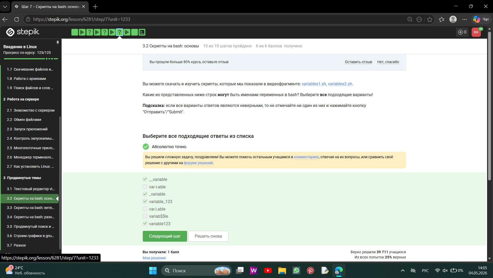{#fig-008 width=70%}

Почему подходят:
· __variable — можно (начинается с _, дальше буквы и _)
· _variable — можно (начинается с _)
· variable_123 — можно (буквы, цифры и _)
· variable123 — можно (буквы и цифры)
Почему остальные не подходят:
· var-i-able — дефис - не разрешён (воспринимается как вычитание)
· var.i.able — точка . не разрешена
· variab$$le — $ имеет специальное значение (подстановка переменной)

9) Напишите скрипт на bash, который принимает на вход два аргумента и выводит на экран строку следующего вида:Arguments are: $1=первый_аргумент $2=второй_аргумент ([рис. @fig-009]).

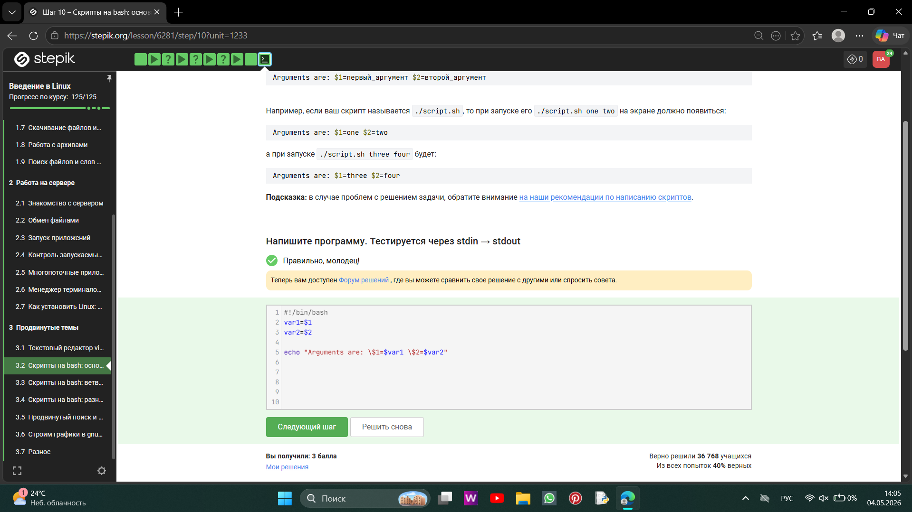{#fig-009 width=70%}

1. #!/bin/bash — шебанг (shebang), указывает, что скрипт должен выполняться в оболочке bash.
2. var1=$1 — присваивает переменной var1 значение первого аргумента, переданного скрипту ($1).
3. var2=$2 — присваивает переменной var2 значение второго аргумента ($2).
4. echo "Arguments are: \$1=$var1 \$2=$var2" — выводит строку, где:
   · \$1 — экранированный доллар, выводится как символ $1 (не подстановка)
   · $var1 — подставляется значение переменной var1
   · \$2 — выводится как символ $2
   · $var2 — подставляется значение переменной var2
   
10) Предположим, вы пишете скрипт на bash и хотите использовать в нем конструкцию if в следующем фрагменте.
Вы можете вписать вместо "..." (внутри [[ ]] и не забудьте про пробелы после [[ и перед ]]!) любое из перечисленных ниже условий. Однако мы просим вас выбрать только те из них, при которых echo напечатает на экран True вне зависимости от того, с какими параметрами был запущен ваш скрипт и какие в нем есть переменные. ([рис. @fig-010]).

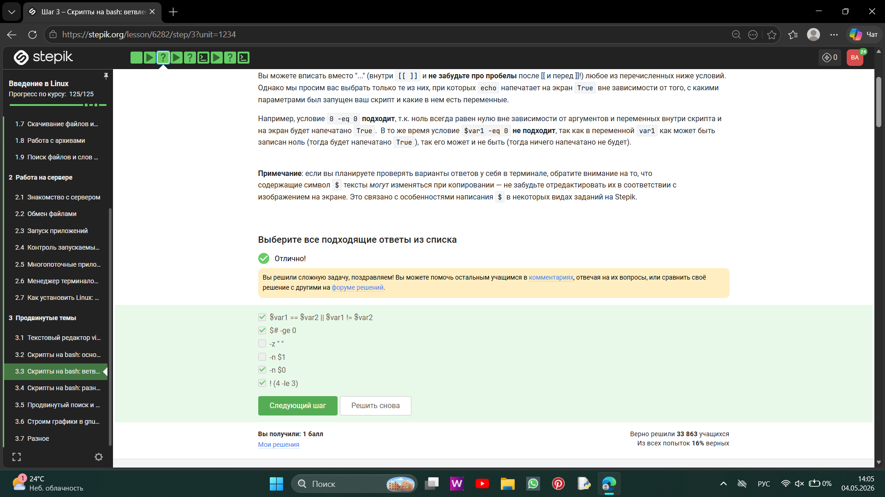{#fig-010 width=70%}

1. $var1 == $var2 || $var1 != $var2 — логическая тавтология (закон исключённого третьего), всегда истинно.
2. $# -ge 0 — количество аргументов всегда ≥ 0 (ноль или больше), всегда истинно.
3. -n $0 — $0 (имя скрипта) всегда непустая строка, поэтому -n всегда истинно.
4. ! (4 -le 3) — 4 ≤ 3 — ложь, отрицание лжи → истина.

11)Посмотрите на фрагмент bash-скрипта. Какие строки и в какой последовательности он выведет на экран, если сначала этот скрипт запустили задав переменную var=3, а затем запустили еще раз, но уже с var=5. ([рис. @fig-011]).

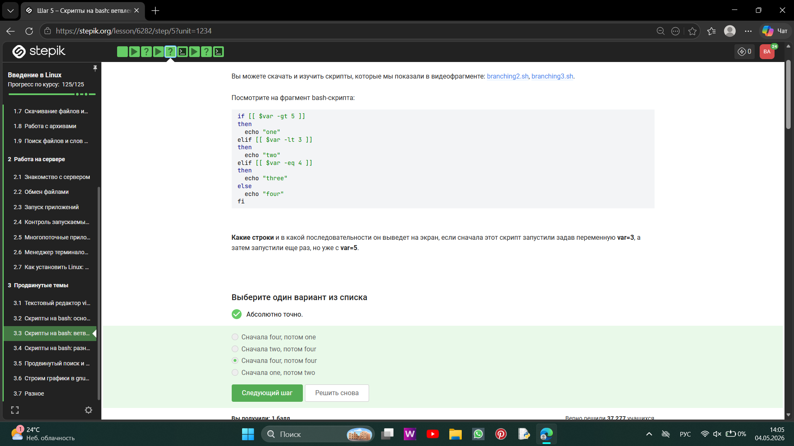{#fig-011 width=70%}

· При var=3:
  Проверяем условия по порядку:
  3 -gt 5? → нет
  3 -lt 3? → нет (равно, а не меньше)
  3 -eq 4? → нет
  Идём в else → выводим "four"
· При var=5:
  5 -gt 5? → нет (не больше, а равно)
  5 -lt 3? → нет
  5 -eq 4? → нет
  Идём в else → выводим "four"
  
12) Напишите скрипт на bash, который принимает на вход один аргумент (целое число от 0 до бесконечности), который будет обозначать число студентов в аудитории. В зависимости от значения числа нужно вывести разные сообщения. 
Соответствие входа и выхода должно быть таким:
0 -->  No students
1 -->  1 student
2 -->  2 students
3 -->  3 students
4 -->  4 students
5 и больше A lot of students
Примечание а): выводить нужно только строку справа, т.е. "-->" выводить не нужно.
Примечание б): в последней строке слово "lot" с маленькой буквы! ([рис. @fig-012]).

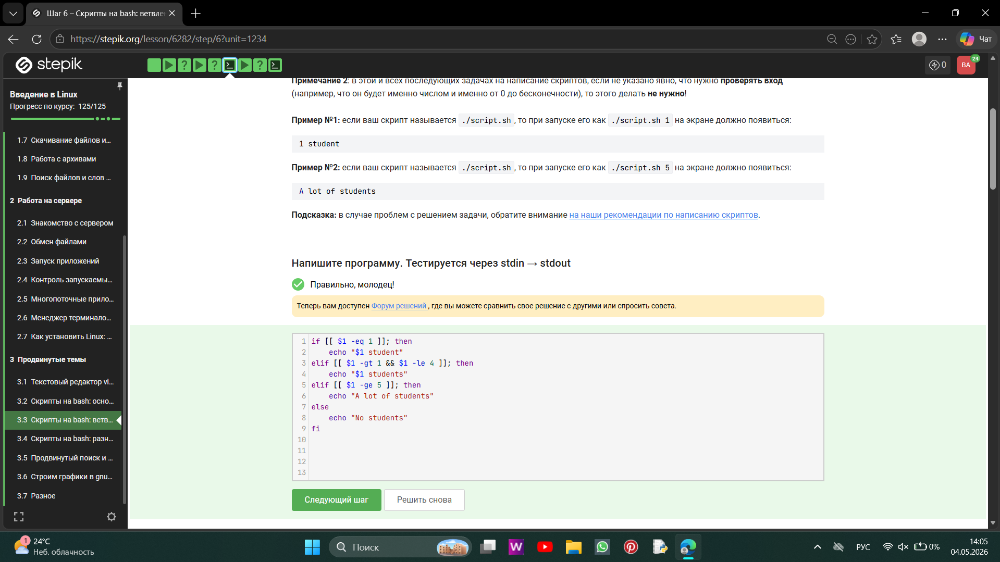{#fig-012 width=70%}

Скрипт анализирует переданный аргумент $1 (количество студентов) и выводит:
· $1 student — если $1 равно 1
· $1 students — если $1 от 2 до 4 включительно
· A lot of students — если $1 ≥ 5
· No students — если $1 отрицательное или не число (иначе)

13) Вы можете скачать и изучить скрипты, которые мы показали в видеофрагменте: loops1.sh, loops2.sh.
Посмотрите на фрагмент bash-скрипта. Если запустить этот скрипт, то сколько раз на экран будет выведено слово "start", а сколько раз слово "finish"? ([рис. @fig-013]).

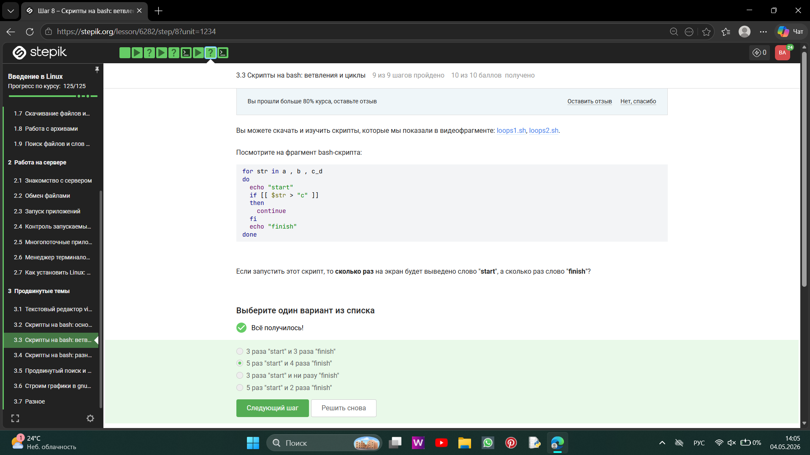{#fig-013 width=70%}

Цикл перебирает 5 элементов: a , , , b , , , c_d
· "start" печатается 5 раз (на каждый элемент)
· "finish" печатается 4 раза (только для первых четырёх, так как для c_d срабатывает continue)

14) Напишите скрипт на bash, который будет определять в какую возрастную группу попадают пользователи. При запуске скрипт должен вывести сообщение "enter your name:" и ждать от пользователя ввода имени (используйте read, чтобы прочитать его). Когда имя введено, то скрипт должен написать "enter your age:" и ждать ввода возраста (опять нужен read). Когда возраст введен, скрипт пишет на экран "<Имя>, your group is <группа>", где <группа> определяется на основе возраста по следующим правилам:
    младше либо равно 16: "child",
    от 17 до 25 (включительно): "youth",
    старше 25: "adult".
После этого скрипт опять выводит сообщение "enter your name:" и всё начинается по новой (бесконечный цикл!). Если в какой-то момент работы скрипта будет введено пустое имя или возраст 0, то скрипт должен написать на экран "bye" и закончить свою работу (выход из цикла!) ([рис. @fig-014]).

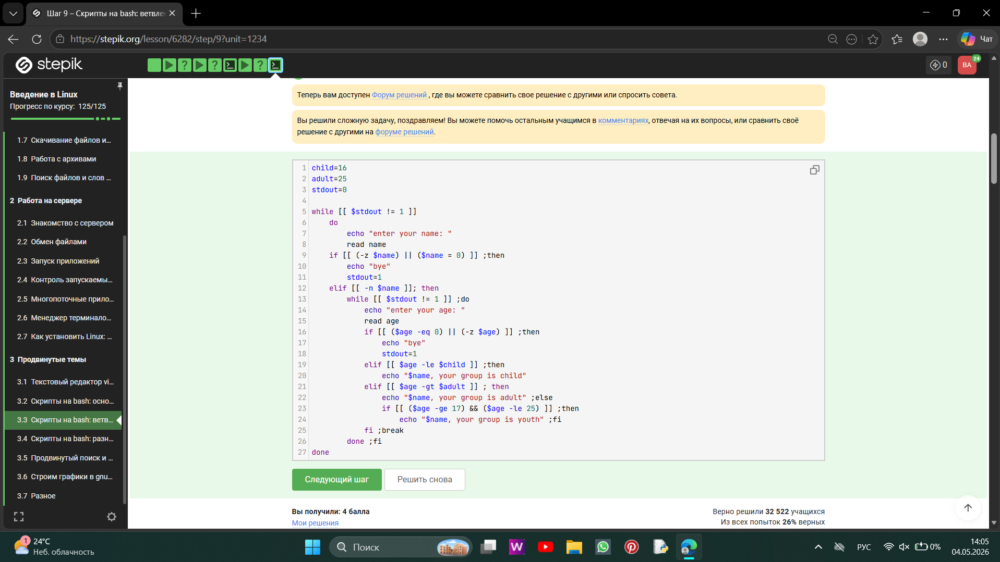{#fig-014 width=70%}

1. Запрашивает имя.
   · Если имя пустое или 0 → выводит bye и завершает работу.
2. Если имя введено → переходит к запросу возраста.
   · Возраст 0 или пустой → bye и выход.
3. В зависимости от возраста выводит группу:
   · ≤ 16 → child
   · ≥ 17 и ≤ 25 → youth (отдельная проверка внутри else)
   · > 25 → adult
   
15) Какие(ая) из предложенных ниже инструкций увеличат значение переменной а на значение переменной b? Например, если в а было записано 10, в b было 5, то в а должно записаться 15. ([рис. @fig-015]).

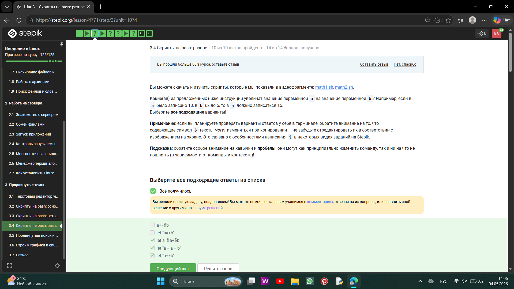{#fig-015 width=70%}

1. "let a=$a+$b" — let выполняет арифметику, подставляются значения переменных, результат присваивается a.
2. "let "a = a + b"" — кавычки позволяют использовать пробелы, let складывает значения a и b, результат в a.
3. "let "a+=b"" — сокращённая форма a = a + b, работает корректно.
Почему остальные не подходят:
· "a+=$b" — в bash это конкатенация строк (не сложение чисел), если a=10, b=5, то a станет 105.
· "let "a=+b"" — это присваивание a = b (с унарным плюсом), а не сложение.
· "let a=$a+$b" — работает (входит в верные), но в списке он написан с разрывами: "let a= $a+ $b" — из‑за пробелов после = и перед + будет синтаксическая ошибка.

16) Пусть вы находитесь в директории /home/bi/Documents/ и запускаете в ней скрипт следующего содержания.
Что в этом случае выведет команда echo на экран? ([рис. @fig-016]).

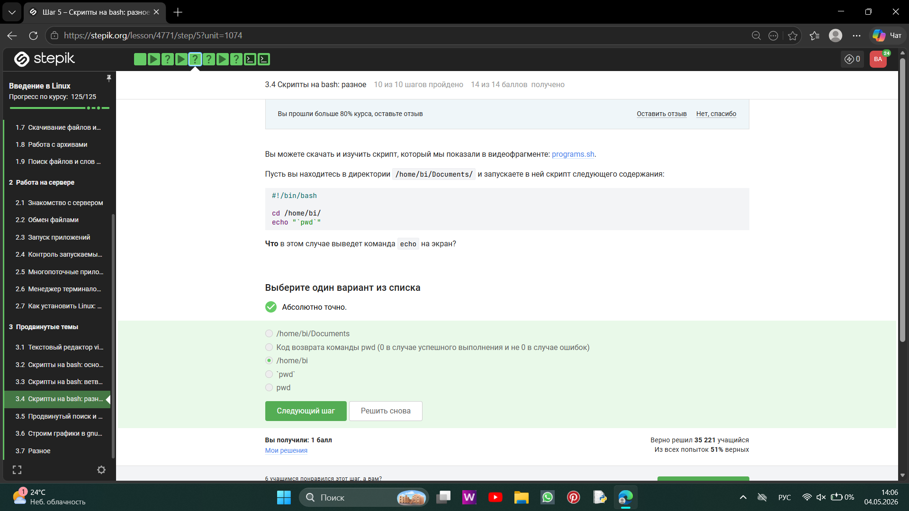{#fig-016 width=70%}

Внутри скрипта сначала выполняется cd /home/bi/ — текущая директория меняется на /home/bi/. Затем команда echo "pwd" использует обратные кавычки (или $()), которые подставляют результат выполнения команды pwd. pwd выводит путь к текущей директории, а она теперь равна /home/bi/. Поэтому echo выводит /home/bi.

17) Однако как быть, если хочется всё-таки запустить программу program, которая пишет что-то в stdout, и потом выполнить какие-то действия, если её код возврата равен 0? Выберите все верные утверждения или правильно работающие конструкции if (рис. @fig-017).

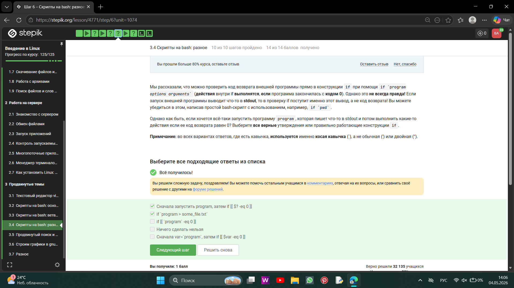{#fig-017}

- Сначала запустить program, затем if [[ $? -eq 0 ]]
  - $? хранит код возврата последней выполненной команды.
  - Вывод program в stdout при этом игнорируется (или может быть перенаправлен), а проверяется именно код возврата.
- if program > some_file.txt
  - Перенаправление stdout в файл убирает вывод из проверяемой подстановки.
  - if смотрит на код возврата program, а не на то, что попало в файл.
  - Условие сработает, если код возврата = 0.

Почему остальные не подходят:
- if [[ $(program) -eq 0 ]] — в условие подставится вывод program, а не код возврата. Если программа выводит текст, это вызовет ошибку.
- var=$(program); if [[ $var -eq 0 ]] — аналогично, var получает вывод, а не код.
- «Ничего сделать нельзя» — неверно, варианты выше работают.

18) Посмотрите на функцию из bash-скрипта.
Впишите в форму ниже строку, которую выведет на экран команда echo "counters are $c1 and $c2" если она находится в скрипте после десяти вызовов функции counter с параметрами сначала 1, затем 2, затем 3 и т.д., последний вызов с параметром 10. ([рис. @fig-018]).

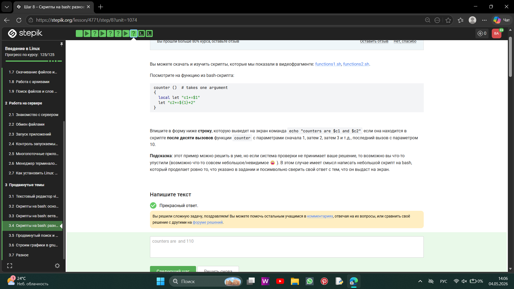{#fig-018 width=70%}

c1 объявлена как local → живёт только внутри функции, глобальное значение c1 остаётся 0.
c2 глобальная → накапливает сумму: 2*(1+2+...+10) = 110.

19) Напишите скрипт на bash, который будет искать наибольший общий делитель (НОД, greatest common divisor, GCD) двух чисел. При запуске ваш скрипт не должен ничего писать на экран, а просто ждет ввода двух натуральных чисел через пробел (для этого можно использовать read и указать ему две переменные -- см. пример в видеофрагменте). После ввода чисел скрипт считает их НОД и выводит на экран сообщение "GCD is <посчитанное значение>", например, для чисел 15 и 25 это будет "GCD is 5". После этого скрипт опять входит в режим ожидания двух натуральных чисел. Если в какой-то момент работы пользователь ввел вместо этого пустую строку, то нужно написать на экран "bye" и закончить свою работу. ([рис. @fig-019]).

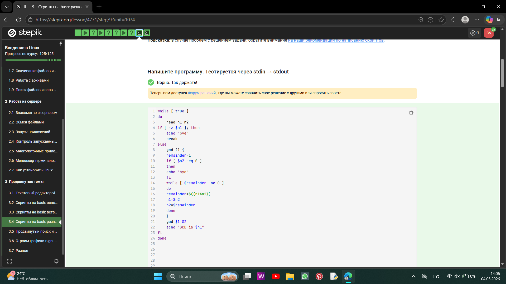{#fig-019 width=70%}

Скрипт в цикле читает два числа n1 и n2.
Если первое число пустое → bye и выход.
Функция gcd:
Проверяет n2 (внутренний, не глобальный) на ноль — если ноль, выводит bye.
Алгоритм Евклида: пока остаток не ноль — вычисляет n1 % n2, обновляет n1 и n2.
После вызова функции выводится "GCD is $n1" (глобальный n1 не менялся функцией, так как внутри функции используются свои локальные переменные из аргументов).

20) Напишите калькулятор на bash. При запуске ваш скрипт должен ожидать ввода пользователем команды (при этом на экран выводить ничего не нужно). Команды могут быть трех типов: 
    Слово "exit". В этом случае скрипт должен вывести на экран слово "bye" и завершить работу. 
    Три аргумента через пробел -- первый операнд (целое число), операция (одна из "+", "-", "*", "/", "%", "**") и второй операнд (целое число). В этом случае нужно произвести указанную операцию над заданными числами и вывести результат на экран. После этого переходим в режим ожидания новой команды.
    Любая другая команда из одного аргумента или из трех аргументов, но с операцией не из списка. В этом случае нужно вывести на экран слово "error" и завершить работу.
Чтобы проверить работу скрипта, вы можете записать сразу несколько команд в файл и передать его скрипту на stdin (т.е. выполнить ./script.sh < input.txt). В этом случае он должен вывести сразу все ответы на экран ([рис. @fig-020]).

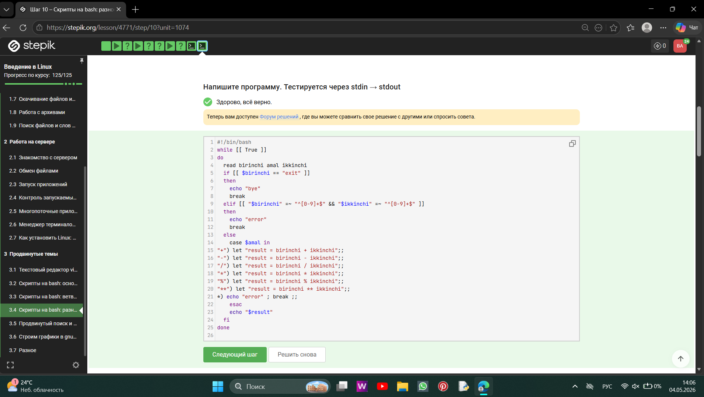{#fig-020 width=70%}

1. Читает три слова: birinchi, amal, ikkinchi
2. Если birinchi == "exit" → выводит "bye" и выходит
3. Если birinchi и ikkinchi оба являются числами (по регулярному выражению) → выводит "error" и выходит (логика странная)
4. Иначе выполняет операцию (amal) между числами (birinchi и ikkinchi) через case:
   · +, -, /, *, %, ** — арифметические действия
   · * и ** нужно экранировать при вводе
5. Выводит результат и повторяет цикл

21)Пусть в директории /home/bi лежат файлы Star_Wars.avi, star_trek_OST.mp3, STARS.txt, stardust.mpeg, Eddard_Stark_biography.txt. Отметьте все файлы, которые найдет команда find /home/bi -iname "star*", но НЕ найдет команда find /home/bi -name "star*"? ([рис. @fig-021]).

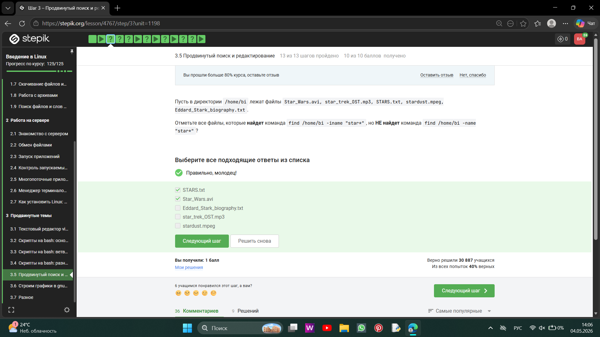{#fig-021 width=70%}

-name "star*" — ищет файлы, начинающиеся ровно с star (регистр важен) → найдёт только stardust.mpeg и star_trek_OST.mp3 (если они начинаются с star в нижнем регистре).
· -iname "star*" — ищет без учёта регистра → найдёт также STARS.txt (начинается с STARS) и Star_Wars.avi (начинается с Star).
· Eddard_Stark_biography.txt не начинается с star/Star/STAR в любом регистре → не подходит.

22) Задание на понимание работы опций -path и -name команды find. Отметьте все верные утверждения из перечисленных ниже. ([рис. @fig-022]).

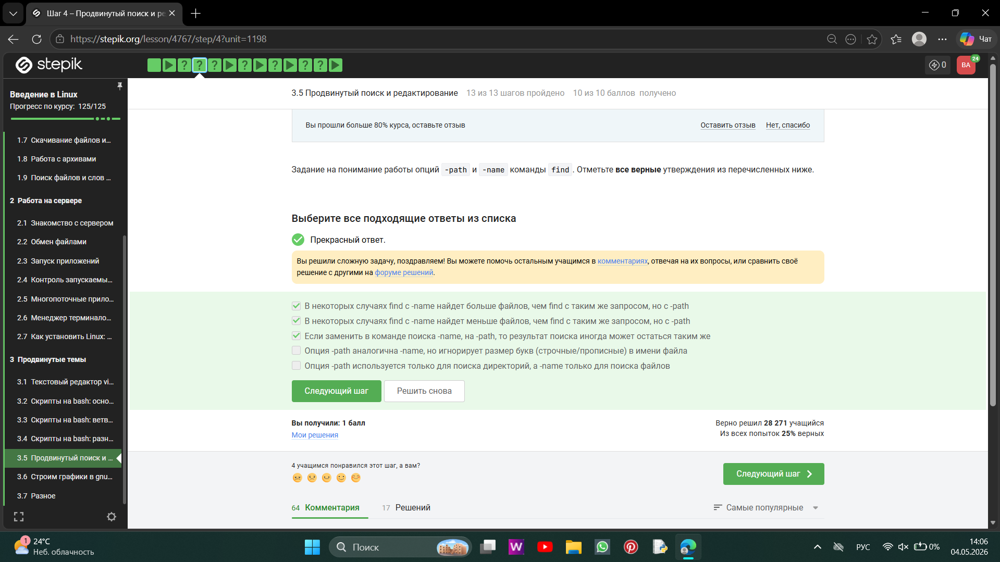{#fig-022 width=70%}

1. -name найдёт больше — если шаблон (например "f*") есть в имени файла, но не в полном пути, а -path его не найдёт, потому что путь не соответствует.
2. -name найдёт меньше — если шаблон соответствует части пути, но не совпадает с именем файла. Пример: ищем "dir" — файл с именем dir.txt не подойдёт, а путь ./my_dir/file подойдёт для -path.
3. Результат может быть одинаковым — если файлы лежат прямо в искомой директории, и шаблон совпадает и с именем, и с путём (например, "file.txt"). Тогда замена -name на -path ничего не меняет.
Остальные неверны:
· -path не игнорирует регистр (для этого есть -ipath).
· -path ищет по полному пути, а -name — только по имени файла, оба могут искать и файлы, и директории.

23) Предположим, что в директории /home/bi/ есть следующая структура файлов и поддиректорий. Какие(ой) из трех файлов (file1, file2, file3) будут найдены по команде find /home/bi -mindepth 2 -maxdepth 3 -name "file*"? ([рис. @fig-023]).

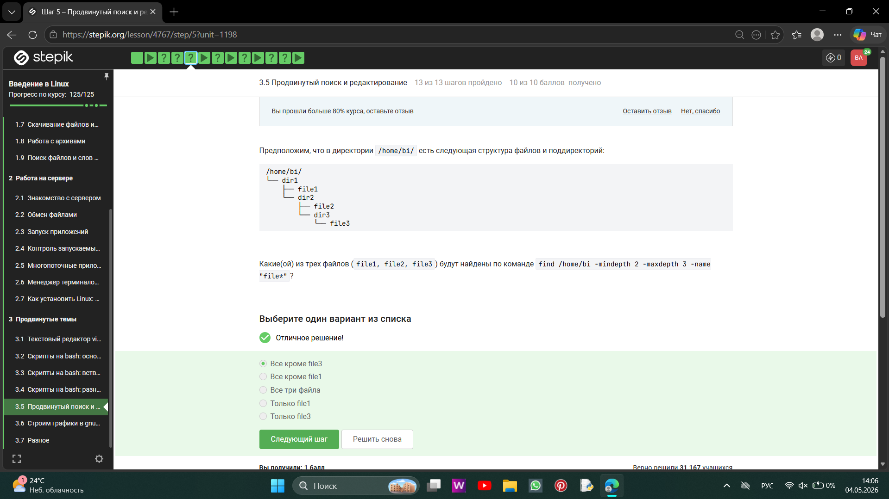{#fig-023 width=70%}

Команда: find /home/bi -mindepth 2 -maxdepth 3 -name "file*"
· -mindepth 2 — начинаем поиск с уровня глубины 2 (относительно /home/bi).
· -maxdepth 3 — не глубже уровня 3.
Определим глубину каждого файла:
· /home/bi/dir1/file1 — глубина 2
· /home/bi/dir1/dir2/file2 — глубина 3
· /home/bi/dir1/dir2/dir3/file3 — глубина 4
file3 имеет глубину 4, что превышает -maxdepth 3, поэтому он не будет найден. Остальные два — попадают в диапазон.

24) Задание на понимание работы опций -A, -B и -C команды grep. Пусть у вас есть файл file.txt из 10 строк, причем в каждой строке есть слово "word". Если вы выполните на этом файле команды:
grep "word" file.txt > results.txt
grep -A 1 "word" file.txt > results.txt
grep -B 1 "word" file.txt > results.txt
grep -C 1 "word" file.txt > results.txt
то какая(ие) из них создаст файл
results.txt наибольшего размера? ([рис. @fig-024]).

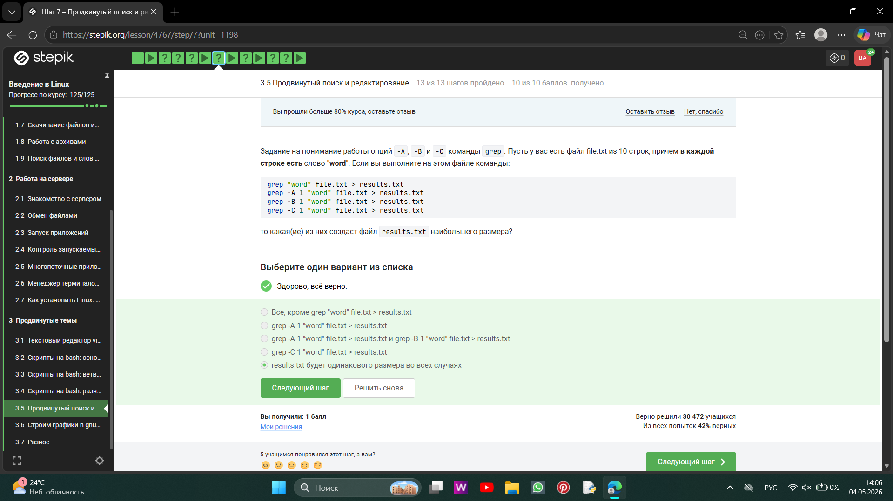{#fig-024 width=70%}

Файл состоит из 10 строк, и каждая строка содержит слово "word".
· grep "word" — найдет все 10 строк.
· grep -A 1 — найдет каждую строку + 1 строку после. Но так как "word" есть в каждой строке, а следующая строка тоже содержит "word" (и тоже будет выведена как часть совпадения), суммарно всё равно будут выведены все 10 строк (без дублирования).
· grep -B 1 — аналогично, каждая строка + 1 строка до → опять все 10 строк.
· grep -C 1 — каждая строка + 1 до + 1 после → всё те же 10 строк.
Во всех случаях выводится один и тот же набор строк (весь файл), поэтому размер results.txt одинаков.

25) Предположим, что в файле  text.txt записаны строки, показанные среди вариантов ответа. Отметьте только те из них, которые выведет на экран команда  grep -E "[xklXKL]?[uU]buntu$" text.txt. ([рис. @fig-025]).

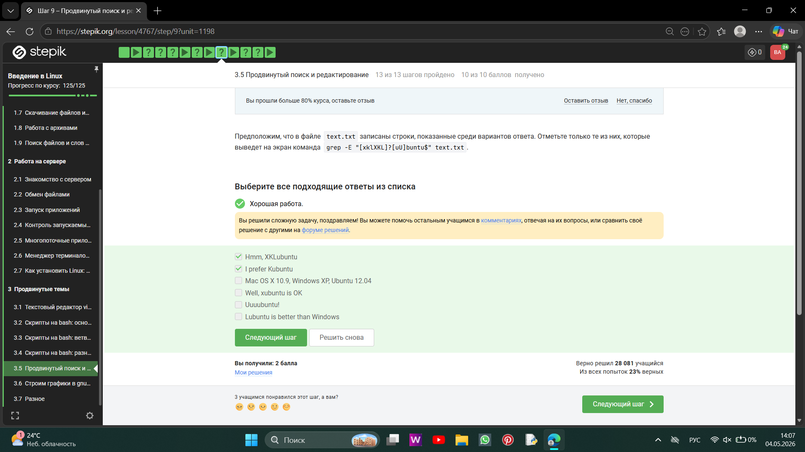{#fig-025 width=70%}

Регулярна [xklXKL]?[uU]buntu$ ищет в конце строки:
· ubuntu или Ubuntu
· с возможным одним символом перед ними из набора x,k,l,X,K,L.
Подходят:
· Hmm, XKLubuntu (в конце XKLubuntu, L из набора перед ubuntu)
· I prefer Kubuntu (в конце Kubuntu, K из набора перед ubuntu)
Остальные либо не заканчиваются на buntu, либо неправильный символ перед ним (Uuuubuntu! — U не входит в набор).

26) Что произойдет, если в команде sed -n "/[a-z]*/p" text.txt не указывать опцию -n? ([рис. @fig-026]).

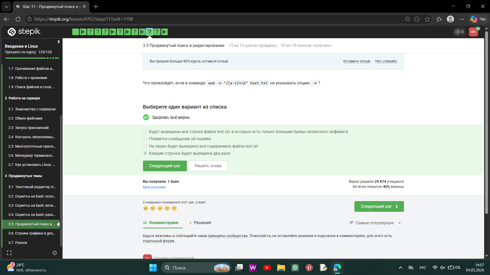{#fig-026 width=70%}

 Без -n sed по умолчанию печатает каждую строку (как p в конце каждого цикла).
· Команда "/[a-z]*/p" говорит: дополнительно напечатать каждую строку, которая соответствует шаблону [a-z]* (а это любая строка, так как * означает "ноль или более" строчных букв).
· Итог: каждая строка печатается один раз автоматически + второй раз по команде p следовательно два раза.

27) Запишите в форму ниже инструкцию sed, которая заменит все "аббревиатуры" в файле input.txt на слово "abbreviation" и запишет результат в файл edited.txt (на экран при этом ничего выводить не нужно). Обратите внимание, что в инструкции должны быть указаны и сам sed, и оба файла! ([рис. @fig-027]).

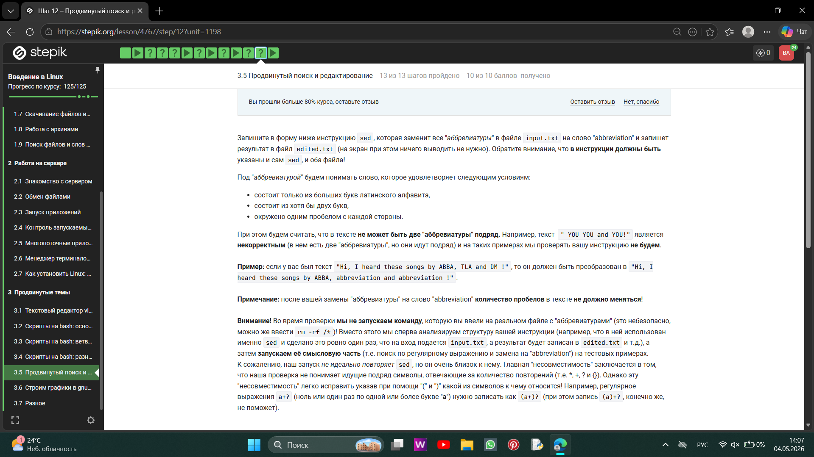{#fig-027 width=70%}

Команда sed -r 's/ [A-Z][A-Z]+ / abbreviation /g' input.txt > edited.txt
· Ищет пробел → две и более заглавные буквы → пробел
· Заменяет найденное на " abbreviation " (пробелы сохраняются)
· -r включает расширенные regex (чтобы + работал)
· > edited.txt сохраняет результат в файл, на экран ничего не выводит

28) Какую опцию нужно указать при запуске gnuplot, чтобы при его закрытии не были автоматически закрыты и все нарисованные в нём графики? ([рис. @fig-028]).

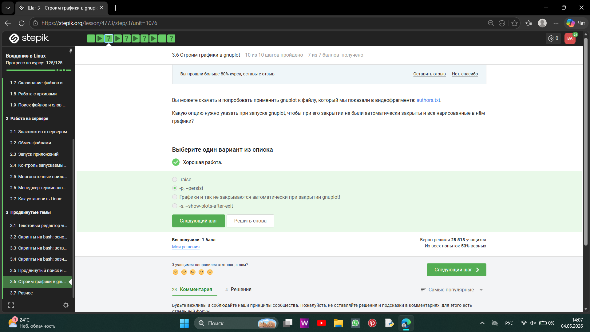{#fig-028 width=70%}

Опция --persist (или -p) заставляет gnuplot не закрывать окна с графиками после выхода из программы. Без этой опции графики закрываются вместе с gnuplot.

29) Предположим у вас есть файл data.csv с двумя столбцами по 10 чисел в каждом. В первой строке не записаны названия столбцов, т.е. ряды данных начинаются прямо с первой строки. Вы запускаете gnuplot и вводите в него две команды:
set key autotitle columnhead
plot 'data.csv' using 1:2
Какое в этом случае будет название у построенного ряда данных и сколько будет нарисовано точек на графике? ([рис. @fig-029]).

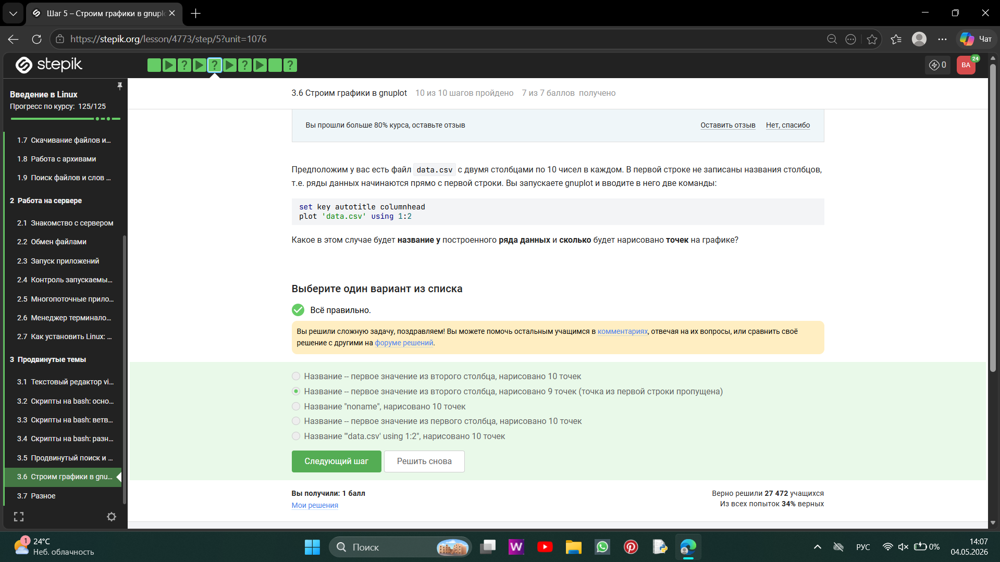{#fig-029 width=70%}

1. set key autotitle columnhead — gnuplot берёт название ряда из первой строки указанного столбца. В данном случае из второго столбца (using 1:2).
2. Первая строка используется как заголовок → она не рисуется как точка.
3. Всего строк 10. Одна уходит на заголовок → остаётся 9 точек для построения графика.

30) Предположим, что вы пишите gnuplot-скрипт и у вас в нем есть три переменные x1, x2, x3, в которых записаны координаты важных точек по оси ОХ (по возрастанию). Вы хотите, чтобы на этой оси было только три деления (т.е. три черточки) в этих самых координатах, а подписи этих делений были оформлены в виде "point <номер точки>, value <значение соответствующей переменной>". ([рис. @fig-030]).

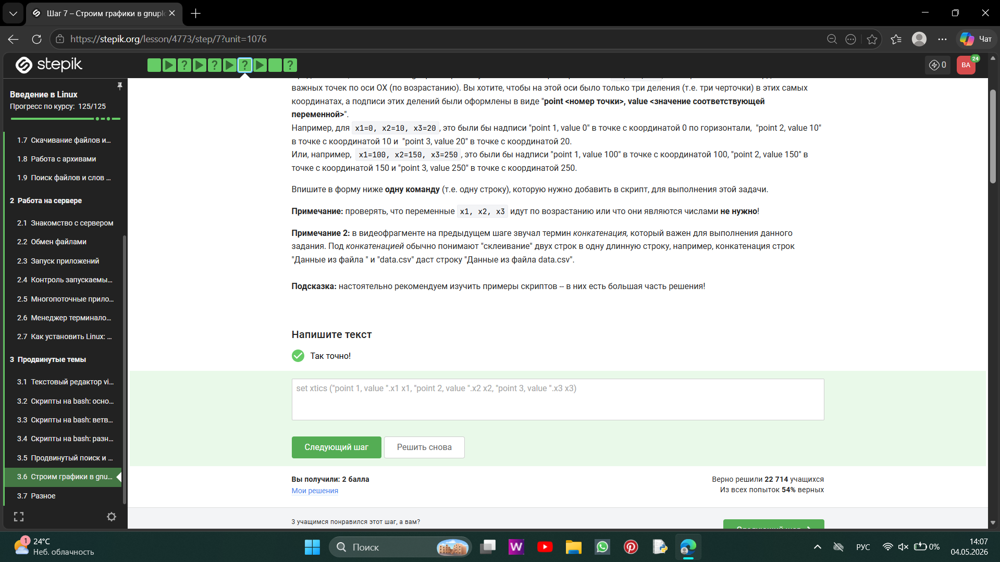{#fig-030 width=70%}

· set xtics — задаёт положение и подписи делений на оси X.
· В скобках перечисляются пары "подпись" положение.
· С помощью конкатенации (через точку .) склеиваем текст "point 1, value " со значением переменной x1.
· После запятой указываем координату x1 — где поставить деление.
· Аналогично для x2, x3.

31) Указанные файлы использовались в последнем видеофрагменте для создания вращающегося графика. Измените инструкции в файле move.rot (т.е. добавлять и удалять инструкции нельзя!) таким образом, чтобы:
    График отразился зеркально относительно горизонтальной поверхности. То есть там, где была точка (10, 10, 200), станет точка (10, 10, -200), где была точка  (-10, -10, 200) станет (-10, -10, -200) и т.д. При этом точка (0, 0, 0) останется на месте.
    Изображение стало вращаться в обратную сторону. То есть если раньше вращалось "влево", то теперь станет "вправо".
    Вращение стало в два раза быстрее. То есть станет в два раза больше перерисовок графика на каждую секунду вращения. Измененный файл загрузите в форму ниже. ([рис. @fig-031]).

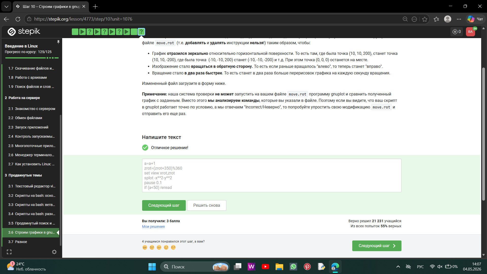{#fig-031 width=70%}

· zrot=(zrot+20)%360 — скорость выше в 2 раза (20° вместо 10°), направление обратное
· splot x* *2+y* *2 — зеркальное отражение (смена знака Z)

32) Какая команда(ы) установят файлу file.txt права доступа rwxrw-r--, если изначально у него были права r--r--r--. Укажите все верные варианты ответа! ([рис. @fig-032]).

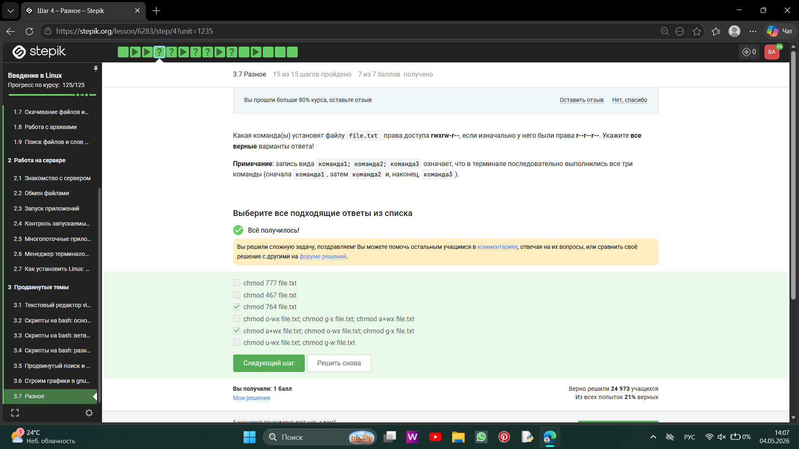{#fig-032 width=70%}

Нужные права: rwx rw- r--
· Восьмерично: 764 (rwx=7, rw-=6, r--=4)
1. chmod 764 file.txt — напрямую задаёт нужные права.
2. chmod a+wx file.txt; chmod o-wx file.txt; chmod g-x file.txt
   · a+wx → добавляет w и x всем (rwxrwxrwx из r--r--r--)
   · o-wx → убирает w и x у остальных (rwxrwxr--)
   · g-x → убирает x у группы (rwxrw-r--) → готово.
Почему остальные неверны:
· chmod 777 → rwxrwxrwx (много лишнего)
· chmod 467 → r--rw-rwx (не те права)
· chmod o-wx; chmod g-x; chmod a+wx — порядок другой, итог может отличаться.

33) Предположим вы использовали команду sudo для создания директории dir. По умолчанию для dir были выставлены права доступа rwxr-xr-x (владелец root, группа root). Таким образом никто кроме пользователя root не может ничего записывать в эту директорию, например, не может создавать файлы в ней. 
После выполнения какой команды user из группы group всё-таки сможет создать файл внутри dir? Укажите все верные варианты ответов! ([рис. @fig-033]).

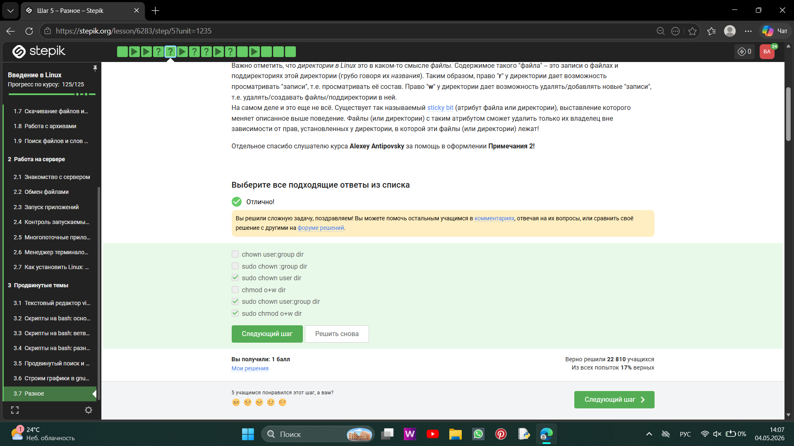{#fig-033 width=70%}

Верные варианты:
· sudo chown user dir — user становится владельцем → получает право на запись.
· sudo chown user:group dir — user владелец → может писать.
· sudo chmod o+w dir — добавляет запись для остальных, включая user.
Не подходит sudo chown :group dir — user не владелец и не в группе group, права на запись не появляются

34) Отметьте какие характеристики файла можно посчитать с использованием команды wc ([рис. @fig-034]).

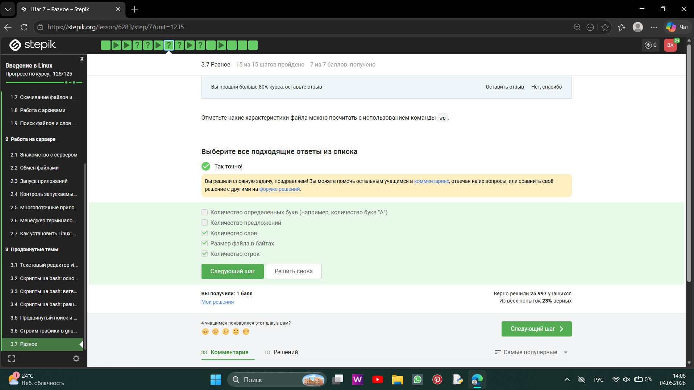{#fig-034 width=70%}

wc (word count) по умолчанию выводит три числа:
· Количество строк (-l)
· Количество слов (-w)
· Размер файла в байтах (-c)
Остальные варианты не подходят:
· Количество определённых букв — wc не умеет считать символы по шаблону (для этого grep -o)
· Количество предложений — wc не анализирует пунктуацию

35) Впишите в форму ниже команду, которая выведет сколько места на диске занимает текущая директория (при этом размер нужно вывести в удобном для чтения формате (например, вместо 2048 байт надо выводить 2.0К) и больше на экран выводить ничего не нужно). В команде указывайте только необходимые для выполнения задания опции и аргументы, лишних опций указывать не нужно! ([рис. @fig-035]).

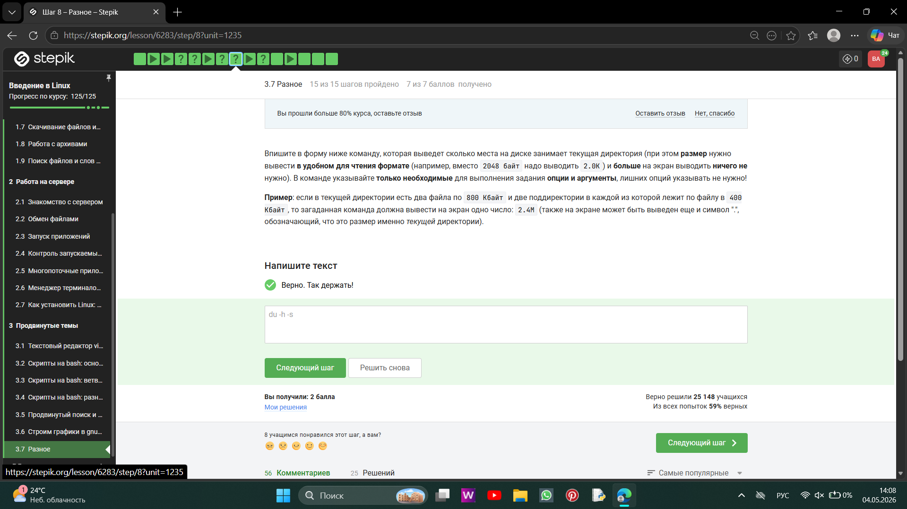{#fig-035 width=70%}

· du (disk usage) — оценивает использование дискового пространства
· -h (human-readable) — выводит размер в удобном формате (K, M, G)
· -s (summary) — показывает суммарный размер только текущей директории, без подробного перебора вложенных файлов и поддиректорий
Точка в выводе означает, что размер указан именно для текущей директории (.).

36) Впишите в форму ниже максимально короткую команду (т.е. в которой минимально возможное число символов), которая позволит создать в текущей директории 3 поддиректории с именами dir1, dir2, dir3. ([рис. @fig-036]).

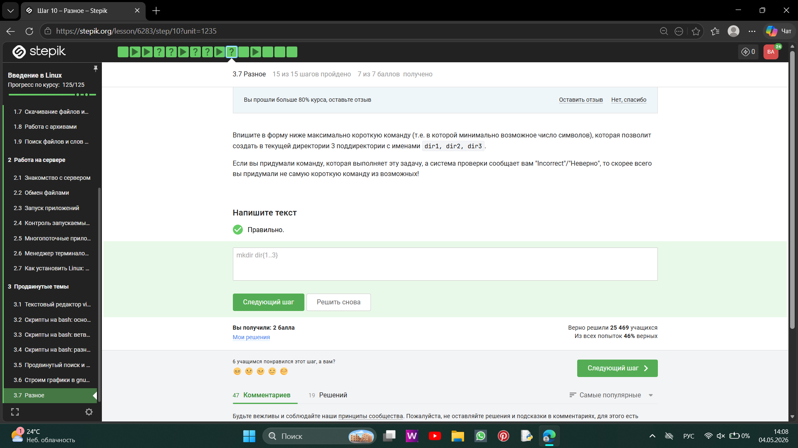{#fig-036 width=70%}

· Фигурные скобки {1..3} раскрываются в dir1 dir2 dir3
· mkdir создаёт все три директории одним вызовом
·Альтернатива (mkdir dir1 dir2 dir3) длиннее на 2 символа (пробелы)

37) Полученный по окончанию курса сертификат([рис. @fig-037]).

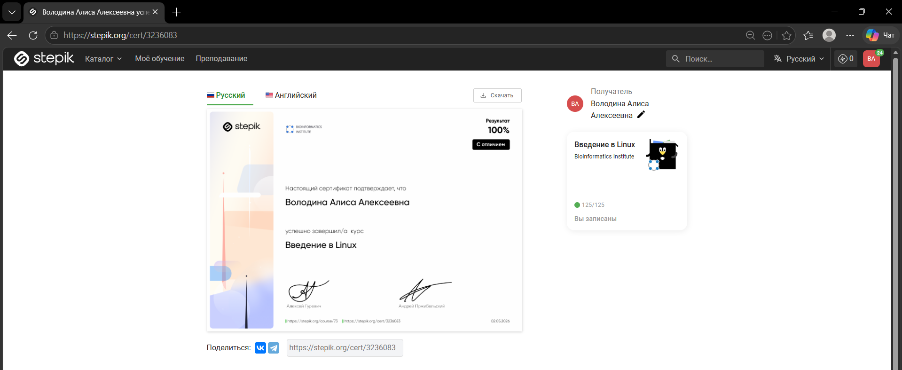{#fig-037 width=70%}

# Выводы

Я выполнила 3 этап внешнего курса, ознакомилась с видеороликами на сайте, и выполнила задания по ним

