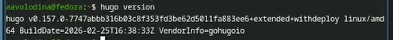
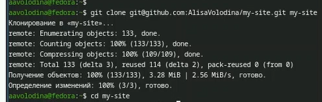
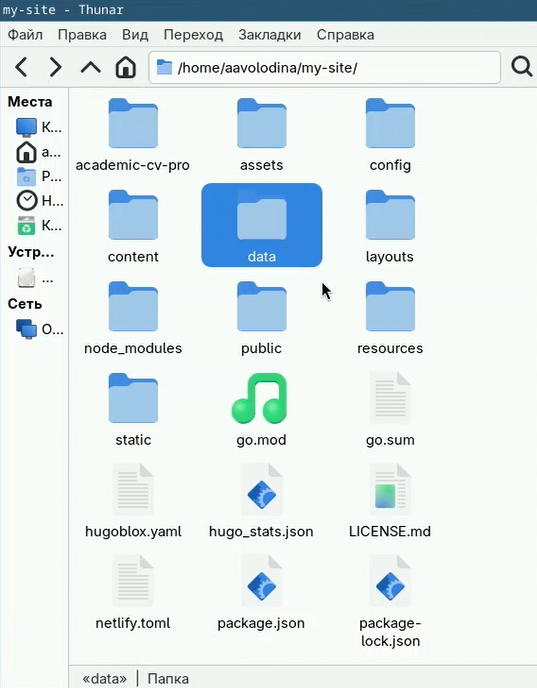

# Цель работы

Целью данной работы является создание шаблона сайта

# Задание

Установка hugo, клонирование репозитория, первоначальная настройка сайта

# Выполнение индивидуального проекта

1)скачиваю hugo([рис. @fig-001]).

{#fig-001 width=70%}

2)создаю новый репозиторий ([рис. @fig-002]).

{#fig-002 width=70%}

3)клонирую репозиторий ([рис. @fig-003]).

{#fig-003 width=70%}

4)Настраиваю в файлах информацию о себе ([рис. @fig-004]).

{#fig-004 width=70%}

5)отправляю файлы в репозиторий([рис. @fig-005]).

{#fig-005 width=70%}

6)Создаю сайт([рис. @fig-006]).

{#fig-006 width=70%}

7)Откроем сайт ([рис. @fig-007]).

{#fig-007 width=70%}

# Выводы

В ходе выполнения этого этапа работы я сделала первоначальную настройку сайта

# Список литературы

