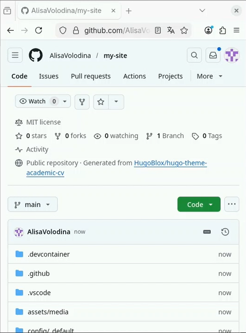
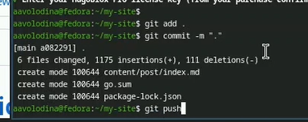
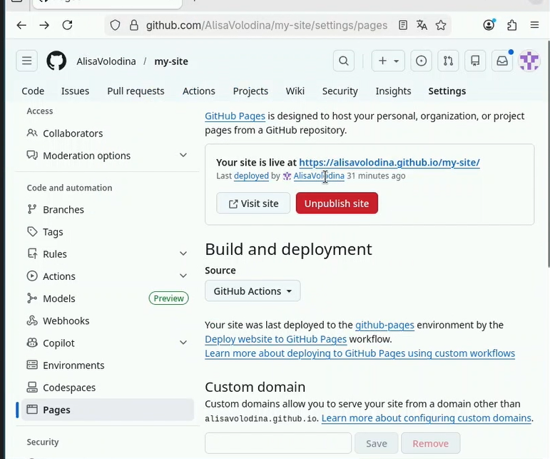
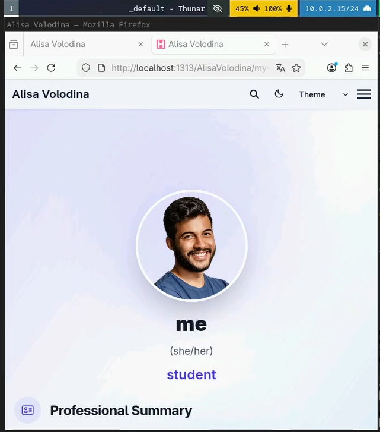

---
## Front matter
lang: ru-RU
title: Отчет по первому этапу ИП №1
subtitle: Операционные системы
author:
  - Володина Алиса Алексеевна
institute:
  - Российский университет дружбы народов, Москва, Россия

## i18n babel
babel-lang: russian
babel-otherlangs: english

## Formatting pdf
toc: false
toc-title: Содержание
slide_level: 2
aspectratio: 169
section-titles: true
theme: metropolis
header-includes:
 - \metroset{progressbar=frametitle,sectionpage=progressbar,numbering=fraction}
---

# Информация

## Докладчик

  * Володина Алиса Алексеевна
  * НКАбд-01-25, Студенческий билет: 1032253521
  * Российский университет дружбы народов

## Цель работы

Приобретение практических навыков установки операционной системы на виртуальную машину.

## Задание

1. Установка hugo

---

## Создание виртуальной машины

скачиваю hugo (рис. 1).

{width=60%}

##
 
создаю новый репозиторий (рис. 2).

{width=60%}

##

клонирую репозиторий (рис. 3).

{#fig-003 width=70%}

##

Настраиваю в файлах информацию о себе  (рис. 4).

{#fig-004 width=70%}

##

отправляю файлы в репозит(рис. 5).

{#fig-005 width=70%}

##

Создаю сайт(рис. 6).

{#fig-006 width=70%}

##

Откроем сайт(рис. 7).
 
{#fig-007 width=70%}
 
## Выводы

В ходе выполнения этого этапа работы я сделала первоначальную настройку сайта

:::
