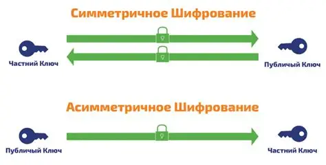
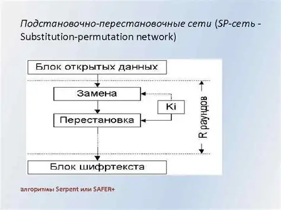
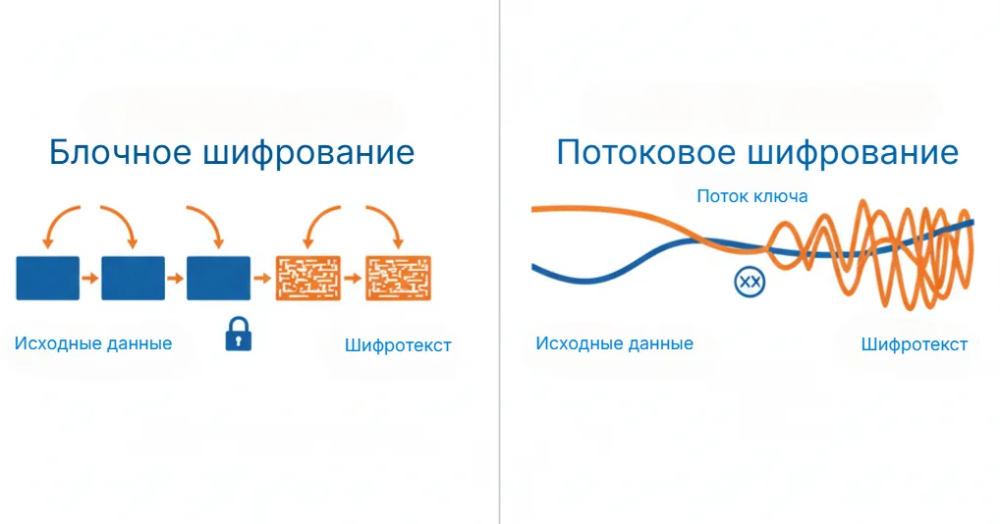
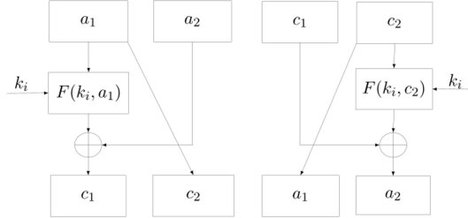
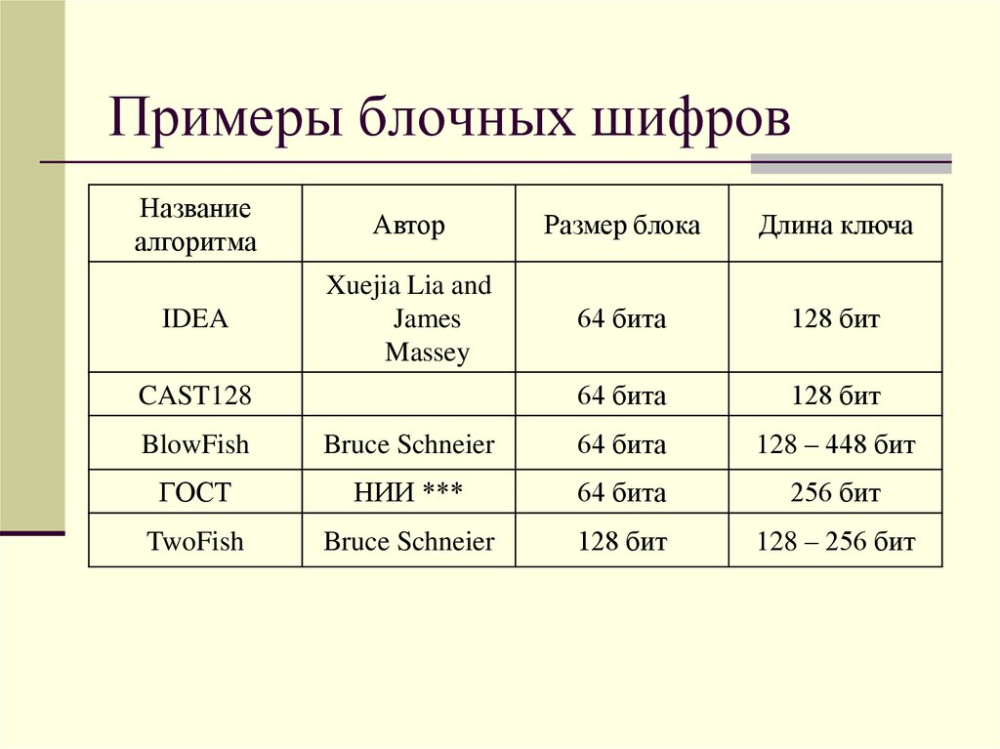

---
## Title
title: "Современные методы криптографии "
subtitle: "Архитектура компьютера"
license: "Володина Алиса Алексеевна"
---

## Докладчик

  * Володина Алиса Алексеевна
  * НКАбд-01-25
  * Российский университет дружбы народов им. П. Лумумбы
  * 1032253521
  
## Содержание

1) Вводная часть (актуальность, объект, предмет, новизна)

2) Цель, гипотеза, задачи исследования

3) Материалы и методы исследования

4) Содержание исследования

5) Анализ и практическая значимость

6) Заключение и выводы

## Вводная часть: Актуальность темы

Актуальность обусловлена стремительным развитием цифровых технологий и ростом угроз информационной безопасности:

Ежегодный рост кибератак на государственные и коммерческие структуры
Появление квантовых компьютеров, угрожающих существующим криптосистемам
Необходимость защиты данных в условиях цифровой экономики

## Вводная часть: Объект и предмет исследования

Объект исследования:
Современные криптографические системы и методы защиты информации.

Предмет исследования:
Классические, пост-квантовые и квантовые криптографические алгоритмы, их архитектурные особенности и области применения.

## Вводная часть: Научная новизна

Научная новизна работы:

Систематизация современных подходов к классификации криптографических методов
Анализ перспектив внедрения пост-квантовой криптографии в существующую IT-инфраструктуру
Выявление ключевых вызовов при переходе на пост-квантовые стандарты

## Вводная часть: Практическая значимость

Практическая значимость работы:

Обоснование необходимости миграции на пост-квантовые алгоритмы
Формирование рекомендаций по выбору криптографических решений в зависимости от задач
Понимание архитектурных принципов построения современных криптосистем

## Цель, гипотеза, задачи исследования

Цель исследования: Анализ современных методов криптографии и оценка перспектив их развития.

Гипотеза: Переход на пост-квантовые криптографические алгоритмы неизбежен в ближайшие 10-15 лет, и успешность этого перехода зависит от гибкости существующих архитектур.

Задачи:
Рассмотреть классические методы симметричного и асимметричного шифрования
Проанализировать архитектурные особенности блочных шифров (S-боксы, SP-сети, схема Фейстеля)
Изучить угрозы со стороны квантовых компьютеров
Исследовать перспективные пост-квантовые подходы (криптография на решётках)
Оценить вызовы при переходе на PQC

## Материалы, методы и теоретическая база

Материалы исследования:
Научные публикации по криптографии, Нормативно-техническая документация (ГОСТ, NIST), Открытые источники информации

Методы исследования:
Анализ научной литературы, Сравнительный анализ криптографических алгоритмов, Систематизация и классификация

Теоритическая база:

Современные исследования в области пост-квантовой криптографии

## Что такое крипография?

Криптография- наука о математических методах обеспечения конфиденциальности, целостности данных, аутентификации, шифрования.

## Традиционная криптография

Изначально криптография изучала методы шифрования информации- обратимого преобразования открытого текста в шифрованный.

Традиционная криптография образует ряд симметричных криптосистем: зашифрованние и расшифрованние проводятся с использованием одного и того же секретного ключа.

## Три ветви современной криптографии 

Современная криптография является динамично развивающейся областью, которая сочетает три направления: классическую, пост-квантовую и квантовую криптографию.

## Распространенные алгоритмы 

К числу распространённых алгоритмов относятся:

симметричные: DES, AES, ГОСТ 28147-89, ГОСТ 34.12-2018, Camellia, Twofish, Blowfish, IDEA, RC4 и другие;

асимметричные: RSA и Elgamal (Эль-Гамаль);

хеш-функции: SHA-2, SHA-3, ГОСТ Р 34.11-2012 («Стрибог»).

## Национальные стандарты

Во многих странах приняты национальные стандарты шифрования.

В США принят стандарт симметричного шифрования AES на основе алгоритма Rijndael с длиной ключа 128, 192 и 256 бит. Алгоритм AES пришёл на смену прежнему алгоритму DES, который теперь рекомендовано использовать только в режиме Triple DES.
В Российской Федерации действует стандарт ГОСТ 34.12-2015 с режимами шифрования блока сообщения длиной 64 («Магма») и 128 («Кузнечик») битов, и длиной ключа 256 бит. Также для создания цифровой подписи используется алгоритм ГОСТ Р 34.10-2012.

## Основные примитивы

Симметричное шифрование

Асимметричное шифрование 

{#fig-001 width=70%}

## Основные примитивы

Цифровые подписи

Хеширование

## S-боксы и нелинейность

S-бокс - узел замены, важнейший элемент SP-сетей: он обеспечивает нелинейность шифра, именно неленейность делает криптоанализ сложным.

## S-боксы и нелинейность

{#fig-001 width=70%}

## Виды симметричных шифров

Потоковые шифры
Блочные шифры

{#fig-003 width=70%}

## Потоковые шифры

Однообразный блокнот- при каждом шифровании заново используется новый ключ

## Блочные шифры и схема Фейстеля

Блочные шифры используют схему Фейстеля

{#fig-004 width=70%}

## Блочные шифры и схема Фейстеля

{#fig-005 width=70%}

## Линейный крипоанализ

Линейный криптоанализ - это вид атаки, позволяющий находить ключ шифрования путем анализа входных и выходных блоков данных.

## Перспективные направления криптографии:

Наиболее перспективным направлением криптографии на данный момент является постквантовая криптография. Постквантовая криптография (PQC) - это методы защиты информации, стойкие к атакам как классических, так и будущих мощных квантовых компьютеров

## Что такое постквантовая криптография (PQC)

Постквантовая криптография (Post-Quantum Cryptography, PQC) - это не один алгоритм, а совокупность криптографических алгоритмов, которые устойчивы к атакам как с использованием классических, так и квантовых компьютеров. Их принципиальное отличие заключается в том, что в основе лежат математические задачи, которые остаются сложными даже для квантового процессора.

## Криптография на решётках

Наиболее перспективным и универсальным считается направление криптографии на решётках. Разберем его подробно далее, так как именно оно, с высокой вероятностью, ляжет в основу цифровой безопасности.

Ключевые преимущества технологии:

Стойкость к квантовым атакам

Гибкость и универсальность

Высокая производительность

## Области применения PQC

Внедрение PQC - это не просто замена одного алгоритма на другой. Это масштабная миграция всей цифровой экосистемы.

Защищенные коммуникации

Цифровые подписи

Долговременное хранение данных

## Вызовы при переходе на PQC

Переход на постквантовую криптографию - сложнейшая задача. 

Основные вызовы включают:

Стандартизация 

Совместимость 

Криптографическая гибкость 

## Практическая значимость достигнутых результатов

Достигнутые результаты: Систематизирована классификация современных криптографических методов, Выявлены архитектурные принципы (S-боксы, SP-сети, схема Фейстеля), обеспечивающие криптостойкость, Обоснована неизбежность перехода на PQC

Практическая значимость:
Результаты могут быть использованы при проектировании защищенных информационных систем и планировании перехода на пост-квантовые стандарты.

## Заключение

Современные методы делятся на симметричные и асимметричные, а на практике используются их гибридные схемы. Ключевую роль в обеспечении стойкости шифров играют нелинейные S-боксы.
Развитие квантовых технологий теребует разработки постквантовых алгоритмов, в частности, на основе теории решёток, и открывает новые возможности с появлением квантовой криптографии.
Криптография остается динамично развивающейся областью, которая будет определять лицо информационной безопасности в ближайшие десятилетия.

## Список литературы{.unnumbered}

1. Криптография // Википедия. — URL: https://ru.wikipedia.org/wiki/%D0%9A%D1%80%D0%B8%D0%BF%D1%82%D0%BE%D0%B3%D1%80%D0%B0%D1%84%D0%B8%D1%8F (дата обращения: 29.03.2026).

2. Линейный криптоанализ : учеб.-метод. пособие / Казан. федер. ун-т. — 2025. — URL: https://dspace.kpfu.ru/xmlui/bitstream/handle/net/185431/F_UMP_Linejnyj_kript_2025.pdf (дата обращения: 29.03.2026).

3. Развитие квантовой криптографии: краткий обзор и библиометрический анализ. — URL: file:///home/aavolodina/Downloads/razvitie-kvantovoy-kriptografii-kratkiy-obzor-i-bibliometricheskiy-analiz.pdf (дата обращения: 29.03.2026).

4. [Название статьи] // Военный вестник. — URL: https://voenvestnik.ru/30ES925.html (дата обращения: 29.03.2026).

