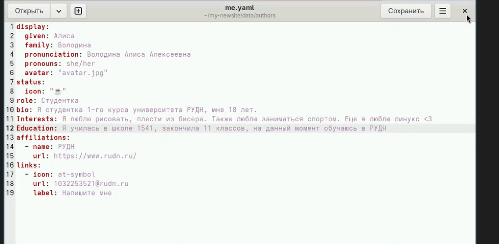
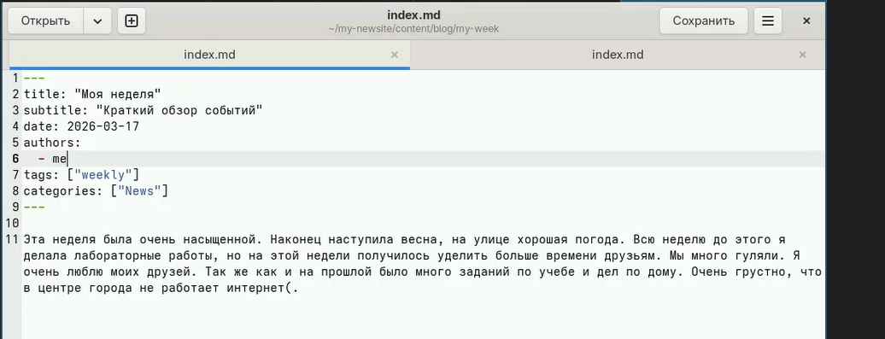
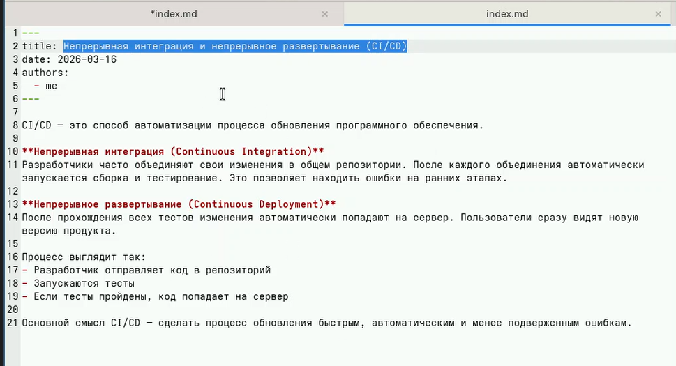
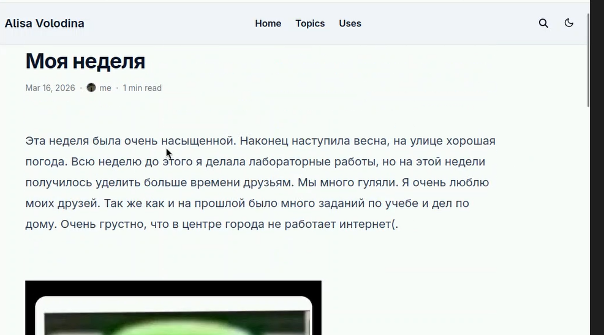
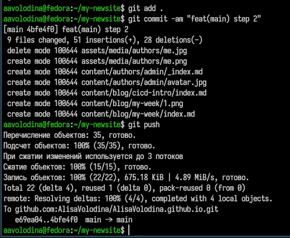

---
## Title
title: "Индивидуальный проект 2 этап"
subtitle: "Архитектура компьютера"
license: "Володина Алиса Алексеевна"
---

## Докладчик

  * Володина Алиса Алексеевна
  * НКАбд-01-25 
  * Российский университет дружбы народов им. П. Лумумбы
  * 1032253521

## Цель работы

Научиться редактировать информацию на сайте и делать публикации

## Задания

Разместить фотографию владельца сайта, Разместить краткое описание владельца сайта (Biography), Добавить информацию об интересах (Interests), Добавить информацию от образовании (Education), Сделать пост по прошедшей неделе, Добавить пост на тему по выбору: Управление версиями. Git/Непрерывная интеграция и непрерывное развертывание (CI/CD)

## Выполнение лабораторной работы

## Отредактируем информацию о себе 

{#fig-001 width=70%}

## Проверим изменения  

{#fig-002 width=70%}

## Заполним информацию для создания поста о прошедшей неделе

{#fig-003 width=70%}

## Заполним информацию для создания поста по теме "Непрерывная интеграция и непрерывное развертывание (CI/CD)" 

{#fig-004 width=70%}

## Проверим, как отобразились посты на сайте 

{#fig-005 width=70%}

## Проверим, как отобразились посты на сайте 

{#fig-006 width=70%}

## Проверим, как отобразились посты на сайте 

{#fig-007 width=70%}

## Отправляем изменения на github

{#fig-008 width=70%}

## Выводы

В ходе выполнения данного этапа индивидуального проекта я научилась редоктировать информацию на сайте и делать посты

