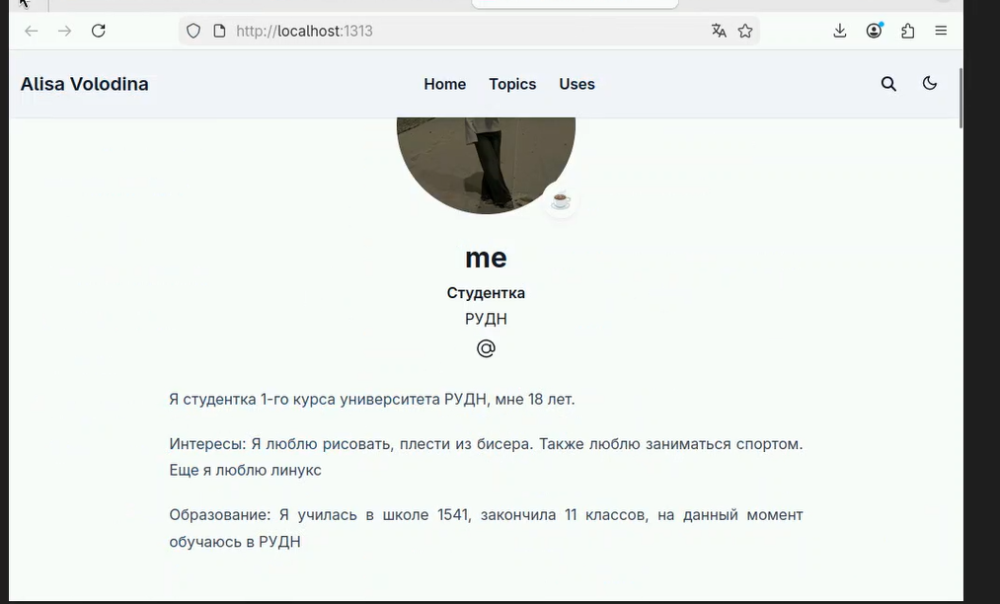
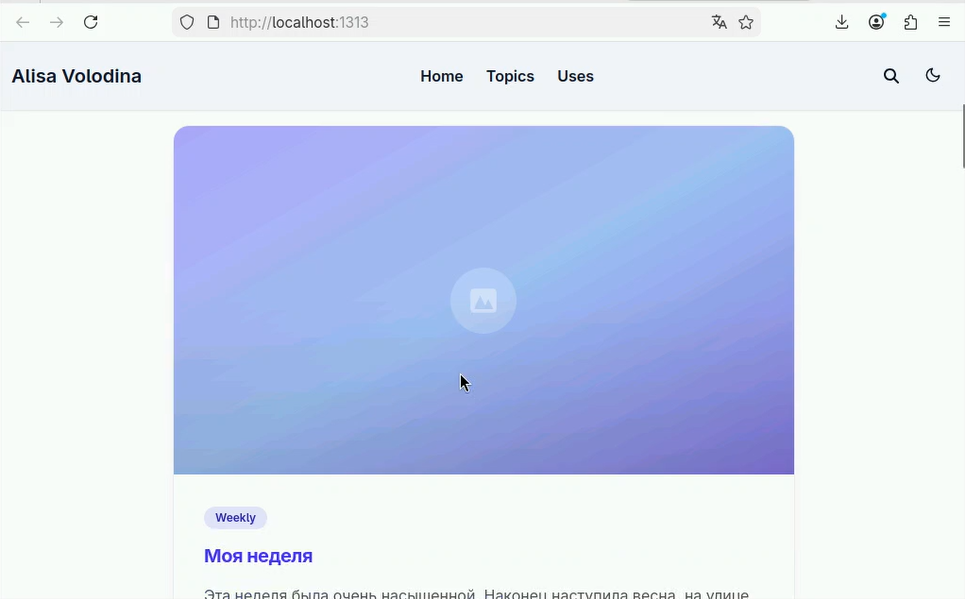
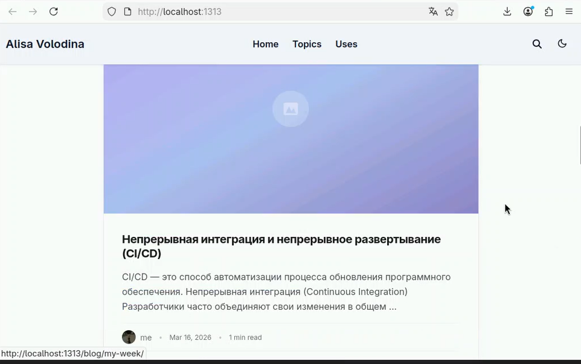

# Цель работы

Научиться редактировать информацию на сайте и делать публикации

# Задание

Разместить фотографию владельца сайта, Разместить краткое описание владельца сайта (Biography), Добавить информацию об интересах (Interests), Добавить информацию от образовании (Education), Сделать пост по прошедшей неделе, Добавить пост на тему по выбору: Управление версиями. Git/Непрерывная интеграция и непрерывное развертывание (CI/CD)

# Выполнение лабораторной работы

1) Отредактируем информацию о себе ([рис. @fig-001]).

{#fig-001 width=70%}

2)Проверим изменения ([рис. @fig-002]).

{#fig-002 width=70%}

3)Заполним информацию для создания поста о прошедшей неделе([рис. @fig-003]).

{#fig-003 width=70%}

4)Заполним информацию для создания поста по теме "Непрерывная интеграция и непрерывное развертывание (CI/CD)" ([рис. @fig-004]).

{#fig-004 width=70%}

5)Проверим, как отобразились посты на сайте ([рис. @fig-005]). ([рис. @fig-006]). ([рис. @fig-007]).

{#fig-005 width=70%}

{#fig-006 width=70%}

{#fig-007 width=70%}

6)Отправляем изменения на github ([рис. @fig-008]).

{#fig-008 width=70%}

# Выводы

В ходе выполнения данного этапа индивидуального проекта я научилась редоктировать информацию на сайте и делать посты

# Список литературы
