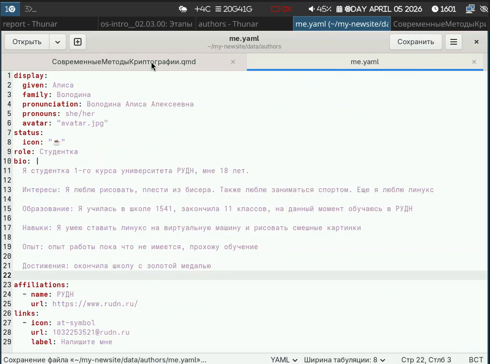
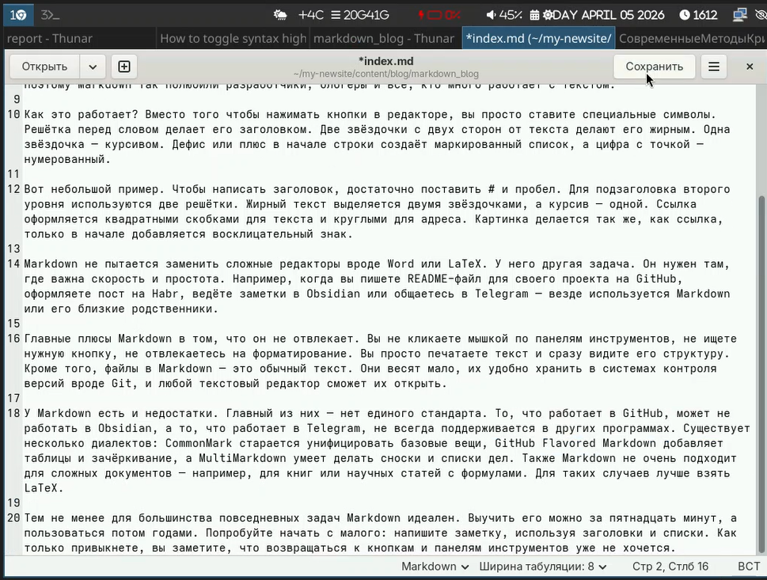
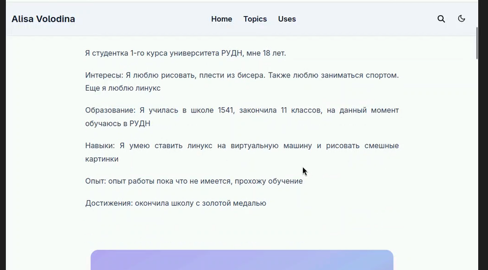
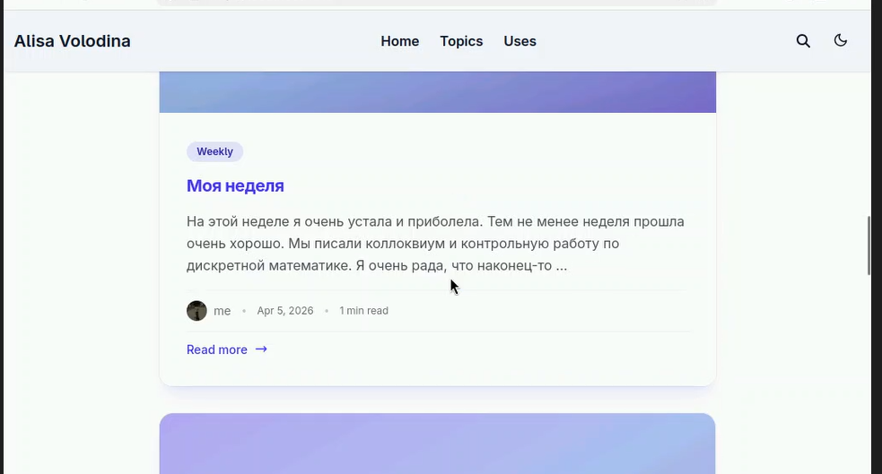

---
## Title
title: "Индивидуальный проект 3 этап"
subtitle: "Архитектура компьютера"
license: "Володина Алиса Алексеевна"
---

## Докладчик

  * Володина Алиса Алексеевна
  * НКАбд-01-25 
  * Российский университет дружбы народов им. П. Лумумбы
  * 1032253521
  
## Цель работы

Научиться редактировать информацию на сайте и делать публикации

## Задание

Добавить к сайту достижения: Список достижений, Добавить информацию о навыках (Skills), Добавить информацию об опыте (Experience), Добавить информацию о достижениях (Accomplishments). Сделать пост по прошедшей неделе. Добавить пост на тему по выбору: Легковесные языки разметки, Языки разметки. LaTeX, Язык разметки Markdown.

## Выполнение лабораторной работы

## Добавим список достижений

{#fig-001 width=70%}

## Добавим пост по прошедшей недели 

{#fig-002 width=70%}

## Добавим пост по теме Markdown 

{#fig-003 width=70%}

## Проверим изменения 

{#fig-004 width=70%}

## Проверим, как отобразились изменения на сайте 

{#fig-005 width=70%}

## Проверим, как отобразились изменения на сайте 

{#fig-006 width=70%}

## Проверим, как отобразились изменения на сайте 

{#fig-007 width=70%}

## Выводы

В ходе выполнения данного этапа индивидуального проекта я добавила свои достижения на сайт и сделала два новых поста

