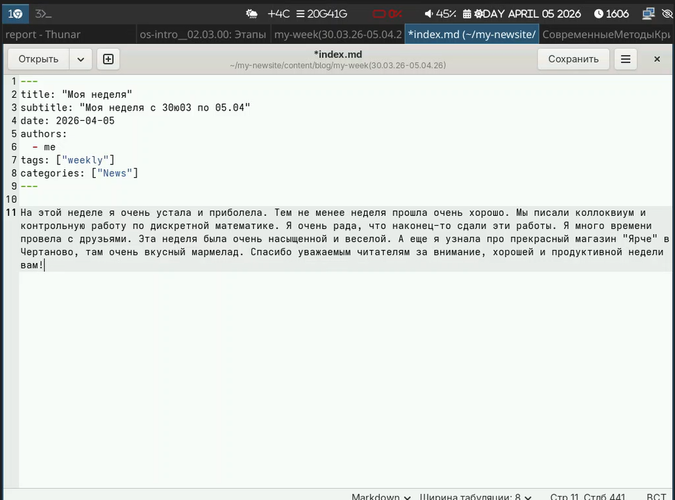
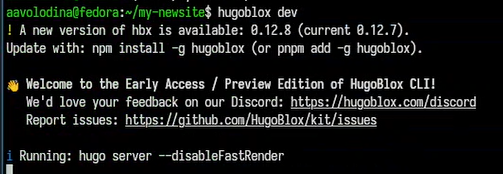
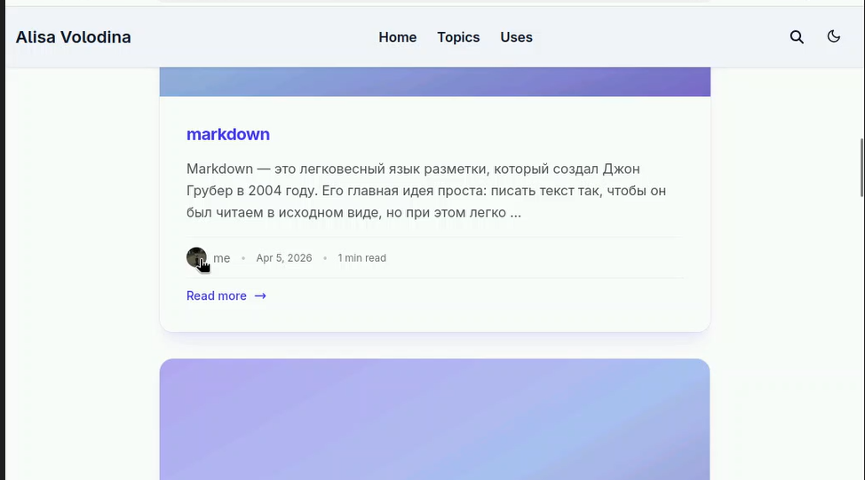

# Цель работы

Научиться редактировать информацию на сайте и делать публикации

# Задание

Добавить к сайту достижения: Список достижений, Добавить информацию о навыках (Skills), Добавить информацию об опыте (Experience), Добавить информацию о достижениях (Accomplishments). Сделать пост по прошедшей неделе. Добавить пост на тему по выбору: Легковесные языки разметки, Языки разметки. LaTeX, Язык разметки Markdown.

# Выполнение лабораторной работы

1) Добавим список достижений ([рис. @fig-001]).

{#fig-001 width=70%}

2) Добавим пост по прошедшей недели ([рис. @fig-002]).

{#fig-002 width=70%}

3) Добавим пост по теме Markdown ([рис. @fig-003]).

{#fig-003 width=70%}

4) Проверим изменения ([рис. @fig-004]).

{#fig-004 width=70%}

5)Проверим, как отобразились изменения на сайте ([рис. @fig-005]). ([рис. @fig-006]). ([рис. @fig-007]).

{#fig-005 width=70%}

{#fig-006 width=70%}

{#fig-007 width=70%}

# Выводы

В ходе выполнения данного этапа индивидуального проекта я добавила свои достижения на сайт и сделала два новых поста

# Список литературы
