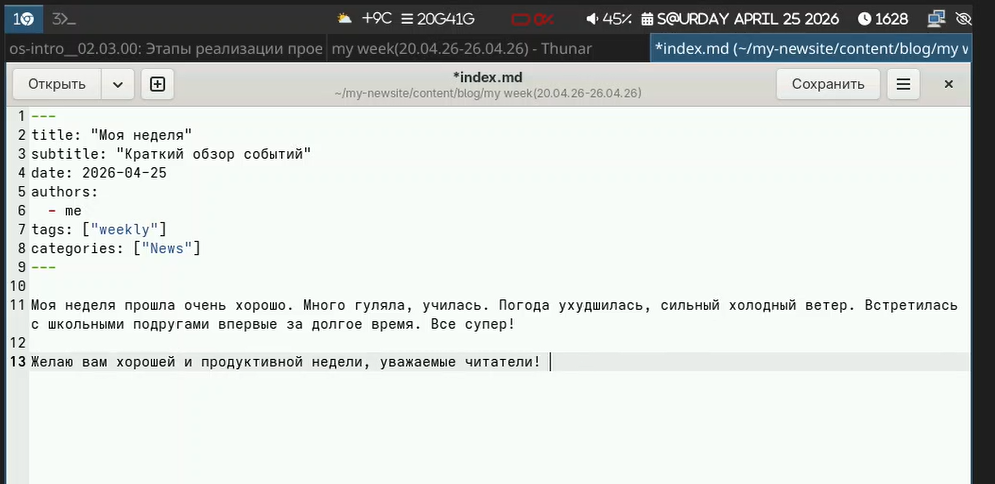
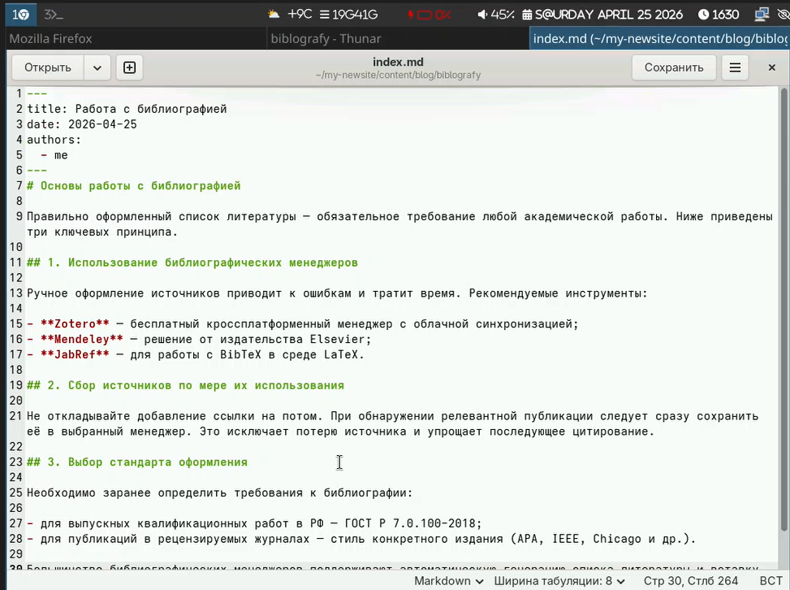
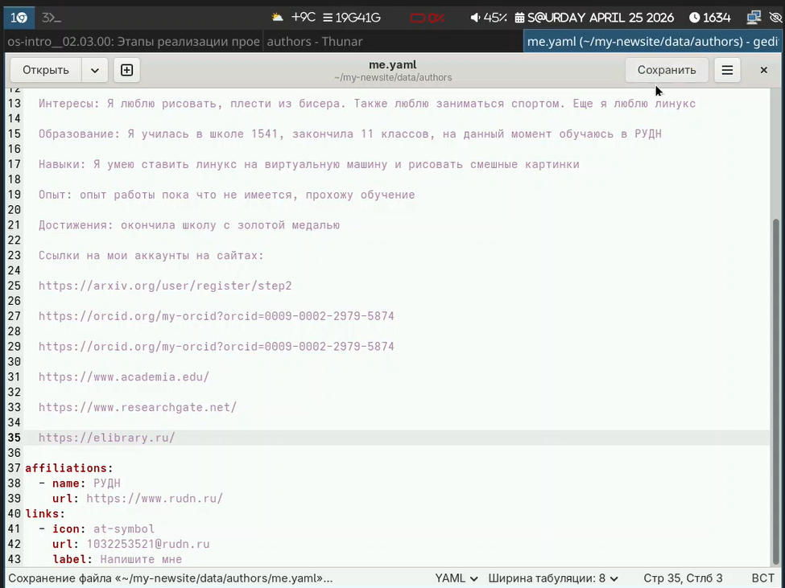
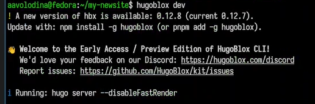
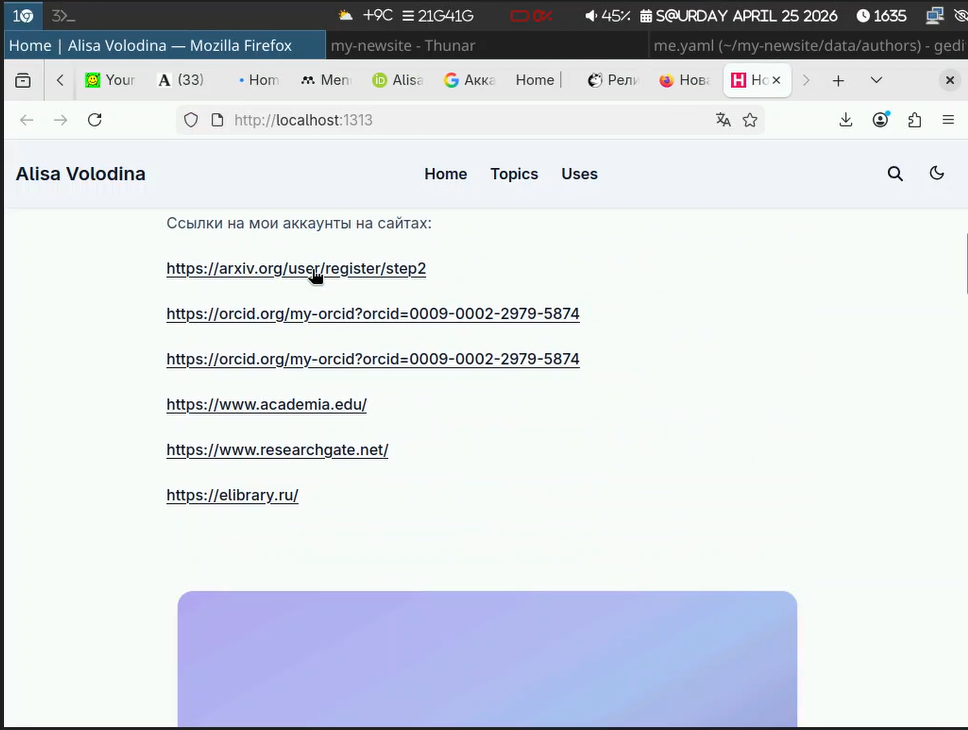
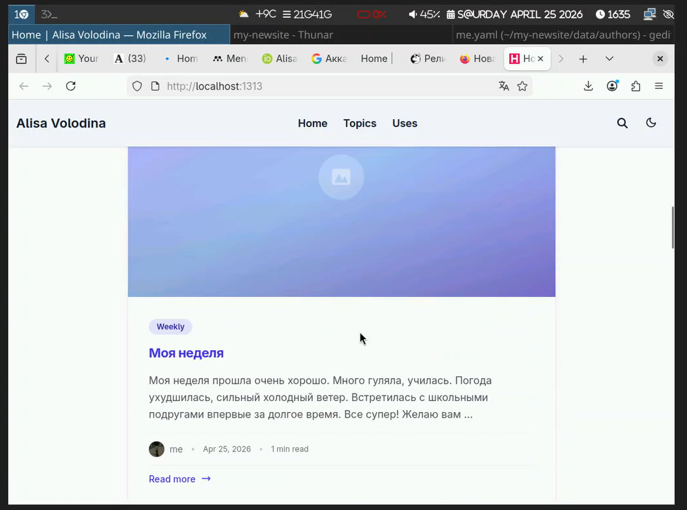
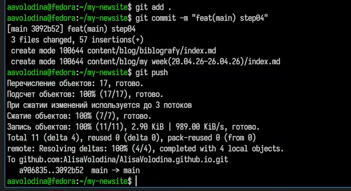

# Цель работы

Научиться редактировать информацию на сайте и делать публикации

# Задание

Добавить на сайт ссылки, сделать пост по прошедшей недели, сделать пост на тему по выбору (библиография)

# Выполнение лабораторной работы

1) Заполним файл с информацией по прошедшей неделе ([рис. @fig-001]).

{#fig-001 width=70%}

2) Заполним файл с текстом про библиографию ([рис. @fig-002]).

{#fig-002 width=70%}

3)Добавим ссылки([рис. @fig-003]).

{#fig-003 width=70%}

4) Проверим изменения ([рис. @fig-004]). ([рис. @fig-005]). 

{#fig-004 width=70%}

5)Проверим, как отобразились изменения на сайте ([рис. @fig-005]). ([рис. @fig-006]). ([рис. @fig-007]).

{#fig-005 width=70%}

{#fig-006 width=70%}

6)Отправим на github ([рис. @fig-007]).

{#fig-007 width=70%}

# Выводы

В ходе выполнения данного этапа индивидуального проекта я добавила ссылки на сайт и сделала два новых поста

